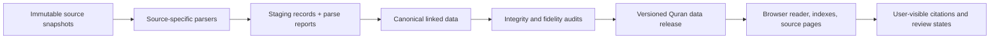

# Quran Research Platform: Implementation Plan

**Status:** Phase 0–6 implementation is built and machine-verified for local use
within the pinned Corpus Coranicum TEI scope. Human review of the full journey
and real screen-reader/device/printer behavior remains open. The site includes a searchable
18,000-record CC BY-SA 4.0 variant catalog, lazy detail shards, and a
source-linked reader for all 6,236 Cairo passages and their 77,432 source word
tokens. The full variant browser preserves all 30,112 direct TEI `persName`
entries across 18,000 variant records, with each exact label, native key,
source line, and documented authority alias kept separately. Candidate
variant links remain unreviewed. The full SQLite release remains local and is
not connected to external corpus storage.
**Goal:** build a navigable research platform for Quranic readings, textual
variation, manuscripts, and the sources that document them, with a data layer
whose provenance and transformations can be audited record by record.

## Current implementation checkpoint

- Phases 0–2: Corpus Coranicum source/rights inventory, deterministic local
  parsing, independent TEI fidelity checks, and a source-linked 24-record
  pilot are complete within their documented limits. Schema v3 carries a
  rights state on each Arabic/transcription and translation edition; all
  translation rows remain `needs_review` and are withheld from the browser.
- Phase 3: Read & Compare covers all 6,236 source verses from the pinned Cairo
  Arabic layer, with source line, containing verse-group locator, and 77,432
  word-token locators. Candidate variant material remains a clearly labeled
  subset of 3,492 passages and 34,163 source-located word links. An independent
  crosswalk confirms exact verse text and all candidate token text/locators.
  Automated Chromium checks cover all Quran project routes at a
  390px viewport, a single main landmark, Arabic language/direction attributes,
  exact visible source text with preserved TEI whitespace, and
  passage/reader-key preservation through candidate links. A route-wide DOM
  audit confirms that app links and interactive controls have accessible names.
  A production-output sweep checked 576 internal `href`/`src` references across
  all 11 Quran routes and found no missing local targets.
  The browser contrast audit reports zero failures for all 11 Quran routes in
  dark and light themes.
  A JavaScript-disabled check verifies source-linked variant preview and the
  complete analysis download remain available.
  The current 13-test Quran browser suite passes against v0.5.28. A focused
  contrast scan passes all 11 Quran routes in dark and light themes; a rendered
  overflow audit passes 320, 375, 414, and 768 px across those routes and both
  themes. Human screen-reader, physical-device, physical-printer, and user
  review of the complete journey remain open.
- Phase 4: the pinned Corpus Coranicum data is staged locally, and a
  source-anchored searchable catalogue covers its 2,322 manuscript records.
  It preserves all 192,295 TEI elements inside those records in 93 lazy shards;
  the selected-field catalogue remains a faster collection-wide search view.
  A per-file commentary index covers all 94,443 element nodes below `text/body`
  and all 850 `teiHeader` elements across 85 files, plus a separate searchable
  view of 37,358 text blocks.
  A separate intertext catalogue covers all 713 `msDesc` records with 9,452
  source-linked fields. A separate taxonomy browser preserves all 122 source
  categories; no record links are inferred because there are no `catRef`
  elements. A source-faithful concordance browser now covers 91,285 `<w>`
  records and 3,833,970 `<seg>` values in all 114 source files, preserving the
  same 42 ordered source fields per record. Additional ingestion beyond the
  pinned Corpus Coranicum source is outside the current scope. Deployed
  performance review remains open. The full
  18,000-record Variant Index catalog is deferred until search or a record
  deep link; it is not fetched for preview-only visits.
- Phase 5: schema v3 preserves every direct TEI `persName` reference in its
  own relation. The source-native analysis counts 30,112 label entries across
  17,986 distinct variant records, and separately lists the 14 records with
  no direct label. Each exact label and locator is retained; labels are not
  assumed to denote a person. The independent verifier recomputes all rows
  and the result hash from XML and SQLite. The source-anchored graph in the
  active release contains 113,131 edges, including 30,112 source-listed
  authority-reference edges and the 4,201 keyed bibliography occurrences
  added in v0.5.14. Earlier totals covered earlier graph versions. Other
  edge counts include
  34,163 candidate token locators, 15,977 explicit commentary Quran
  references, 14,959 other explicit TEI references, and 13,719 unreviewed
  commentary-to-Cairo passage locator candidates. Other explicit references
  retain their exact source ID, type, text, target, attributes, file hash, and
  line; exact publisher-coded `#TUK` targets gain a separate exact-record
  locator when the documented transform reaches a unique pinned intertext ID;
  the independent verifier confirms 146 resolved occurrences among 183,
  linking to 100 unique intertext records. The 36 absent IDs and one malformed
  target remain raw and unlinked; all original target strings stay unchanged.
  Other targets are not
  interpreted or resolved. Passage candidates retain the
  raw TEI target and become navigable only when a strict target pattern yields
  two IDs present in Cairo XML; their status remains unreviewed. Other target
  outcomes remain raw and unlinked. Every Cairo candidate edge carries the
  source `crosswalk.match_method` ID `cc-variant-n-to-cairo-xml-id-v1`; the UI
  retains its `candidate` review state and says it is not reviewed. Independent
  verification matches all 34,163 method/state/target tuples to canonical
  SQLite rows by variant record and word ordinal. Four of 30,940 TEI `ref` elements lack a
  target and remain inventoried with source locators. Bibliography keys remain
  unresolved because the export has no key-to-record crosswalk. Reviewed cross-source
  edges and joined analyses remain open. A whole-export audit records TEI link
  constructs as well: it found no `ptr`, `relation`, `link`, `linkGrp`,
  `listRelation`, `join`, or `joinGrp` elements, and four empty-text `anchor`
  elements; none is promoted to an edge. Builder and independent verifier
  require the complete 3,240-file XML set to equal the pinned SHA-256 inventory
  exactly. For the concordance, 37 of 42 field types now show pinned official
  English interface labels beside their exact source codes; five types without
  one-to-one locale entries remain raw. Field values remain verbatim, and no
  value-code glossary has been inferred. Bibliography keys remain unresolved
  as local records; pinned Corpus Coranicum website code supports external
  item-key URLs for 4,189 occurrences across 768 structurally valid keys. The
  12 empty/malformed occurrences remain raw and unlinked; external item content
  is not imported or verified.
- Phase 6: the complete schema-v3 CC-only SQLite artifact and local release
  manifest exist under ignored `scratch/`; immutable active site release
  v0.5.28
  includes the full variant catalog, two complete reader-reference indexes,
  passage index, 24 detail shards, 2,322-record
  manuscript index, reader-label analysis, 113,131 sharded graph edges, 37,358
  commentary text blocks, all 94,443 commentary body elements and 850 header
  elements, 192,295 manuscript TEI elements in 93 lazy shards, a 713-record
  intertext catalogue with 9,452 source-linked fields,
  the 122-category
  intertext taxonomy, the complete concordance package in 114 per-surah
  shards, and the complete Cairo Arabic reader layer. The manifest
  records schema version, previous-release hash, exact Quran script hashes,
  dirty-tree/base-commit status, and a hashed release note. Because the source
  worktree was dirty, `buildCommit` is explicitly null; the release is not
  attributed to an uncommitted commit. The complete SQLite artifact remains
  local; the app preview uses the manifest-verified static JSON release.
  External hosting and range testing are outside the current local-preview
  goal. The v0.5.28 release preserves the prior analysis package and the exact
  SQLite input hash recorded when that analysis was generated. Its manifest
  SHA-256 is `5761c5497296c0da3a6169f2acde0b30e3a428555b370b7b2f474f7708f48127`.
  v0.5.27 binds the reader-label analysis to SQLite release hash
  `b8137f47221fc3573775737d827f4999bf2f3b3389f495d4a658a415f2158aae`.
  v0.5.14 adds source-key bibliography references; v0.5.15 and
  v0.5.16 carry the repaired candidate-method provenance and consistent
  24-record preview. All earlier immutable releases remain available.
  External-host caching, transfer, and SQLite range behavior are deferred.
  Earlier immutable releases remain in the chain; production packaging stages
  only the assets declared by each release manifest and omits unmanifested
  residue.

See the phase-by-phase evidence and exceptions in
[PROGRESS.md](quran-platform/PROGRESS.md), parser details in
[DATA-PIPELINE.md](quran-platform/DATA-PIPELINE.md), and conservative choices
in [DECISIONS.md](quran-platform/DECISIONS.md). Source-layer and display-font
rights are tracked separately in [SOURCE-RIGHTS.md](quran-platform/SOURCE-RIGHTS.md)
and [ASSET-RIGHTS.md](quran-platform/ASSET-RIGHTS.md).

## Current scope

The active goal is the Quran platform built from the pinned Corpus Coranicum
TEI snapshot and the modules already implemented from it: Cairo reader and
text comparison, variant index, manuscript catalogue, commentary, intertexts
and taxonomy, concordance, and source-linked research graph. The supplied
Nasser JSON, Studies folder, and Shamela CSV are explicitly excluded from this
goal. Their provenance and rights are not completion gates; their historical
inventory and quarantine notes remain only as an audit trail. Do not ingest or
publish those materials as part of this scope. This excludes the supplied
Studies-folder documents as a research corpus; it does not remove the site's
Academic Studies module or its existing interface.

The active completion gates are faithful source coverage and provenance for
the pinned TEI release, transparent handling of unresolved TEI semantics,
local display of the implemented modules, and human review of the journeys.
External hosting, remote transfer, cache, and range-request checks are outside
the current goal. Local production packaging validates release manifests and
excludes undeclared files while preserving local release sources.

## Product definition

Build a **Quranic Texts and Readings Library** with four connected jobs:

1. Read and compare a passage across explicitly named editions and reading
   traditions.
2. Inspect each displayed difference and follow it to the source, edition,
   page, TEI record, or manuscript witness that supports the display.
3. Search and browse Corpus Coranicum commentary, intertexts, concordance, and
   manuscript catalogue records.
4. Reproduce derived comparisons and counts from named inputs and documented
   rules.

“Comprehensive” is a direction, not a claim at launch. The site should say what
it contains, what remains unprocessed, and which records have been checked. It
must not imply that every historical witness or reading tradition is covered
when the imported datasets do not establish that.

## Source inventory and what each source can support

These figures are an inventory of the supplied files, not assertions that the
records are complete or verified against editions.

| Source | Verified inventory | Use in the platform | Limits to preserve |
|---|---:|---|---|
| User-supplied Nasser JSON export — excluded | Historical private inventory: 6,236 verses, 14,983 variant records, 27,914 annotations | None in the active goal | Retained in audit records only; not a completion gate and not to be ingested or published in this scope. |
| User-supplied Quran Studies folder — excluded | Historical private inventory: 76 PDFs, one DOCX draft, and a rename manifest | None in the active goal | Retained in audit records only; not a completion gate and not to be ingested or published in this scope. |
| User-supplied Shamela category 5 CSV — excluded | Historical prior snapshot: 65,960 rows; exact supplied path currently absent | None in the active goal | Retained in audit records only; not a completion gate and not to be ingested or published in this scope. |
| Corpus Coranicum TEI export | Repository describes Cairo 1924 Quran transcription, a Talmon-based grammatical concordance, commentary, intertexts, manuscript descriptions for over 2,500 manuscripts, and variant readings with reader/source authority files | Main structured source for manuscript descriptions and an additional, independently attributed source for passages, variants, readings, and source links | Import the published TEI export, retain `xml:id`/`key` references, validate against its schema, and record its exact repository commit. A TEI manuscript record does not guarantee an image is public or reusable. CC BY-SA 4.0 applies to the TEI data; check image rights separately. |

### Source note and instruction boundary

The supplied `quran-textual-sources-knowledge-graphs.md` is research
documentation, not an instruction file for this implementation. Its scope
statement describes the graph report; it does not exclude future numerical
analysis from the platform. Its cautions about checking editions, separating
evidence types, and preserving duplicate/version relationships are useful
methodological recommendations and are adopted here because they protect
source fidelity.

## Data fidelity rules

These rules apply to ingestion, storage, display, search, and export.

1. **Raw inputs are immutable.** Preserve each received file or upstream
   snapshot byte-for-byte with SHA-256, file size, acquisition date, source URL
   or local path, repository commit/version, license record, and import-tool
   version. Never edit a downloaded source in place.
2. **Every transformation is explicit and reproducible.** Store original
   values alongside parsed values. Name and version each transform, such as
   Unicode normalization, diacritic removal, tokenization, transliteration,
   TEI extraction, or Arabic collation. A derived value must link to its input
   record and transform version.
3. **Display source text verbatim.** Normalized/search strings are separate
   fields and never replace displayed Arabic or source quotations. Do not
   generate or reconstruct Quranic Arabic. All displayed text must have a
   recorded source record and locator.
4. **Null means unknown.** Do not fill missing dates, authors, page numbers,
   readings, manuscript shelfmarks, or source attributions by guesswork. If a
   human adds a value, record who added it, when, why, and the evidence.
5. **A claim is not an observation.** Keep a source's reported reading,
   editorial text, manuscript observation, modern scholarly interpretation,
   and platform-computed comparison as separate records and evidence types.
6. **Never hide source disagreement.** Preserve conflicting forms and
   citations. An alignment or reconciliation is a view over the records, not a
   silent replacement of one source with another.
7. **Verification is a workflow state, not a verdict on a reading.** Use
   states such as `imported`, `parsed`, `locator_checked`, `text_collated`,
   `reviewed`, and `needs_review`, with reviewer and evidence. Do not imply
   that the platform is ranking readings as true or false.
8. **No lossy deduplication.** Retain source IDs and edition identities. Link
   duplicates, alternate versions, and same-title books; do not merge them
   unless equivalence has been demonstrated and recorded.
9. **Licenses travel with the data.** Track rights and required attribution for
   each source artifact, text layer, derived dataset, font, and image. Do not
   infer that a data license covers third-party facsimile images or the code
   surrounding a dataset.

## Canonical data model

Keep source-specific records intact in staging tables. Publish a canonical
layer that links to those records without discarding their native IDs or
fields.

| Entity | Minimum purpose and fields |
|---|---|
| `SourceArtifact` | File/repository snapshot, source URI/path, hash, version/commit, license, attribution, acquisition timestamp, parser version. |
| `Work` / `Edition` | Work identity separate from edition/publication identity; title as supplied, author/editor as supplied, publisher, date, language, edition statement, and evidence for curated metadata. |
| `SourceRecord` | Native source ID, source file, record type, raw payload pointer, source locator (including TEI `xml:id`/`key`), and parse status. |
| `Passage` | Chapter/verse locator plus numbering system and chosen text edition. Never assume verse numbering is interchangeable across systems. |
| `TextEdition` / `TextToken` | Edition policy, exact source text, original token boundaries/IDs, and separately stored derived tokens. Identify each edition and reading source distinctly. |
| `ReadingTradition` / `TransmissionRoute` | Reader, transmitter, route, region/period only where attested, native source labels, and links to the source records that define them. |
| `VariantAssertion` | Exact variant string or reading as a source reports it, passage/word target, source-native category, source-native flags, reading/route, and source record. Do not normalize unlike categories into one unsupported meaning. |
| `Attestation` | The source that attests a statement: work, edition, page/folio, volume, footnote, TEI source key, or CSV serial. Record whether it is a direct primary citation, a secondary report, or an unresolved locator. |
| `ManuscriptWitness` / `WitnessObservation` | Shelfmark, repository, support, script, date range and dating method, provenance, folio, image URI and its rights, observed text/marks, transcription layer, editor, and uncertainty. Separate catalogue metadata from direct observation. |
| `Concept` / `Relationship` | Controlled topic terms and typed relationships, with source and curator provenance. |
| `NormalizationProfile` / `ComparisonRun` | Input edition hashes, selection, exact operations and order, alignment version, output rows, and reproducible result hash. |
| `ReviewEvent` | Record reviewed, person, date, action, evidence consulted, outcome, and notes. Keep history append-only. |

### Variant taxonomy

Store source terminology verbatim and attach a normalized concept only when a
curator-reviewed mapping supports it. Candidate concepts include consonantal
rasm, spelling/orthography, dots, vocalization, phonetic realization,
morphology/word form, addition/omission/order, verse division, pause/waqf, and
paratextual marks. A difference can have more than one typed description. Do
not conflate a recitation difference with a manuscript spelling difference,
or an Abjad mark in a codex with a numerical property of Quranic wording.

## Ingestion and validation pipeline

### Stage 1: source registration

- Create a manifest entry before parsing any source.
- For Git repositories, record the full commit SHA, not just `main`.
- For local datasets, record the exact file hash and keep an untouched copy in
  a private/raw input location outside the application bundle and Git history.
- Record source statement, usage rights, attribution language, and whether the
  platform may redistribute the source, a derivative, or only a locator/link.
- For the Corpus Coranicum TEI, use the published
  [`corpus-coranicum-tei`](https://github.com/telota/corpus-coranicum-tei)
  export as the import target. The related
  [`corpus-coranicum-xml-raw-files`](https://github.com/telota/corpus-coranicum-xml-raw-files)
  repo explicitly says it is a website/editor working copy, not the published
  TEI export. The website/editor source code is optional reference material,
  not a runtime dependency.

### Stage 2: in-scope source parsing

- **TEI:** validate every XML file against the repository's Relax NG schema;
  preserve `xml:id`, `key`, responsibility statements, taxonomies, notes,
  bibliographies, facsimile/surface/graphic links, and source hierarchy. Fail
  on duplicate IDs, broken internal references, missing required fields, or
  schema errors; emit a machine-readable report for all exceptions.

The user-supplied Nasser export, Studies folder, and Shamela CSV are excluded
inputs. Do not inspect, ingest, parse, publish, or make their validation a
release gate. This does not remove the existing Academic Studies site module;
it only excludes the supplied Studies-folder files from the Quran data layer.

### Stage 3: cross-source matching

Crosswalks are separate, reviewable records. A match should include both source
IDs, locator, match method, comparison profile, evidence, reviewer, and state.

- Match TEI-internal references using TEI IDs and keys.
- Use chapter/verse as a candidate passage link only after recording the
  numbering scheme and edition.
- Compare Arabic strings using named profiles (exact Unicode, canonical
  Unicode, diacritics-insensitive, rasm-oriented, etc.); retain the exact
  compared strings and never let a normalized match overwrite either source.
- Automatic/fuzzy matches are candidates, not verified links. Require a
  source locator or human review before presenting a cross-source link as
  evidence.

## Data quality gates

No gate passes on a high-level “looks right” review alone. Every release must
produce a signed-off audit bundle containing source hashes, parser versions,
counts, exceptions, unresolved links, and test results.

### Gate A: inventory completeness

- Every input file/record is accounted for as imported, intentionally excluded
  with a reason, duplicate/alternate linked, or quarantined with a reason.
- Record counts match source inventories or differences are listed by ID.
- No duplicate native IDs within their documented namespace.
- All relationships either resolve or appear in an explicit unresolved-link
  report; no silent orphan filtering.

### Gate B: textual fidelity

- Byte/text-preservation fixtures compare stored source text with the original
  file after only documented decoding (no trimming, punctuation cleanup, bidi
  reordering, or normalization in the source field).
- Arabic tests cover combining marks, hamza/alif, Qurʾanic annotation marks,
  ligatures, whitespace, punctuation, RTL ordering, and mixed Arabic/Latin
  citations.
- UI rendering is checked against source excerpts; copy/export returns the
  exact source string unless the user explicitly asks for a named normalized
  representation.
- Every public variant has a visible path to its exact imported source record
  and a clear review state. If the export lacks a primary-source page locator,
  show that gap; do not label the record source-collated until the reference is
  checked in the cited work.

### Gate C: structural/source correctness

- TEI validates against the supplied schema and all ID/key references resolve.
- Source-native TEI fields and code values remain verbatim unless their meaning
  is documented by the pinned publisher source.

### Gate D: reproducibility and release integrity

- The same input hashes and parser versions build byte-identical canonical
  exports, apart from a documented timestamp field if one is required.
- All transformations emit machine-readable provenance.
- Each comparison/count can be rerun from named editions, selection, and
  normalization profile; include row-level differences, not only totals.
- Release manifest records schema version, sources/versions, licenses,
  parser/build commit, entity counts, test results, and previous release.
- Release URLs are immutable. A correction creates a new version and preserves
  the prior one for comparison/rollback.

### Gate E: rights and publication

- Attribution is present on source pages and data exports.
- CC BY-SA 4.0 obligations are reviewed for any adapted Corpus Coranicum TEI
  data; do not assume the license covers referenced manuscript images.
- Rights for the pinned TEI, translations, fonts, and each image are recorded
  independently. If redistribution is unclear, publish metadata/locators and
  link to the source instead of serving the content.
- No raw full-text corpus or unlicensed media is shipped in the application
  bundle or accidentally committed to Git.

## Storage and serving architecture

Use the existing HadithCritic static-first pattern, but publish a **separate,
versioned Quran dataset** with an independent schema, manifest, release
cadence, and license/provenance report. Do not add a request-time database to
the public corpus path.

Before choosing the final physical format, profile the pinned TEI release and
benchmark the actual reader workload. The likely target is a normalized
SQLite release with full-text indexes, chunked and queried in the browser over
the existing range-capable static data path. The app should load only records
needed for the selected passage/search. If the initial release can be served
better as smaller source-specific static indexes, keep the API and canonical
schema stable so the storage backend can change without changing the meaning
of records.

Keep staging databases, raw source payloads, extracted bulk text, and generated
indexes out of Git. Git should contain parsers, schemas, source
manifests, curated mapping/review records, tests, and compact release metadata.

## Site navigation and researcher workflow

Top-level Quran navigation should stay task-based and shallow:

1. **Read & Compare** — passage locator, edition/reading selectors, side-by-side
   or inline differences, and a source/evidence panel.
2. **Variant Index** — searchable/filterable table by passage, reading,
   transmission, source, and mapped/source-native variant type.
3. **Manuscripts** — catalogue and timeline/filter view with shelfmark,
   repository, dating range/method, cited passages, and image link where rights
   permit.
4. **Sources** — Corpus Coranicum source records and source-specific search
   with stable locators. The Academic Studies module remains part of the site,
   but the supplied Studies folder is not part of this Quran source layer.
5. **Methods & Data** — editions, numbering systems, normalization profiles,
  source coverage, license/attribution, data version, review policy, and known
  gaps.

For the reading experience, use the **word/phrase-focused reading view** and
separate advanced Variant and Principle exploration as interaction references.
Harvard's EvQ project description says its annotations expose transmitters,
sources, variant type, status, and audio. These are design cues only: reuse a
field or label only after verifying that the supplied export is the same
release and its values are documented. Do not assume its `status` codes or
classifications have a meaning just because the source interface displays a
similarly named field.

The default reading path should answer these questions without sending readers
to another page: **What differs? Who or what source reports it? Where can I
check it? How was this comparison formed?** A selectable difference opens a
focused evidence panel with original text, source locator, translated/context
notes where licensed, and related witnesses/readings. A second, denser table
view supports scanning many differences. A graph view is an advanced way to
follow relationships, not the default navigation surface.

Search may use separately stored normalized Arabic keys, but always returns
verbatim source snippets and identifies the search profile. Filters and labels
should expose the source term alongside any curated equivalent. Preserve RTL
and Arabic shaping, keyboard navigation, stable shareable passage URLs, and
source citations in print/export.

## Implementation phases and exit criteria

The current-scope statement above governs this roadmap. Nasser, Studies-folder,
and Shamela inputs are excluded; none of their import work is planned below.

### Phase 0 — Source authority, rights, and acquisition manifest

- Pin a Corpus Coranicum TEI commit; inspect schema, included directories,
  data license, image-link patterns, and attribution requirements.
- Record rights separately for TEI data, translations, and linked images.
- Hash all inputs and publish a source manifest and known-gaps register.

**Exit:** no dataset enters a public build without a known origin/version,
license state, and plan for attribution.

### Phase 1 — Canonical schema and source adapters

- Define the Corpus Coranicum staging schema and the canonical entities above.
- Implement deterministic TEI and bibliography parsers for in-scope sources.
- Produce parse reports and preserve all source fields and native identifiers.
- Build duplicate/version links and topic links as explicit reviewed records.

**Exit:** all source records reconcile to input inventories; every exception is
listed; repeated builds are deterministic.

### Phase 2 — Integrity audit and verified vertical slice

- Build a compact pilot that exercises different variation layers in the pinned
  source.
- Review each pilot item against its actual cited source; record unresolved
   source/page problems instead of filling them by inference.
- Test parsing, exact-text fidelity, crosswalk behavior, Arabic display, and
  comparison outputs end-to-end.

**Exit:** every item displayed in the pilot can be followed back to the exact
input record and citation; no automatic cross-source match is labeled verified.

### Phase 3 — Reader and source navigation

- Ship Read & Compare, Variant Index, source/evidence panel, and Methods & Data
  pages against the pilot release.
- Add deep links from passage ↔ variant ↔ reading/transmission ↔ source work /
  edition / locator.
- Preserve both passage selection and any source-native reader-key filter in
  the URL when moving between Read & Compare and Variant Index. Do not treat a
  source key as a cross-source reading-tradition mapping.
- Add accessibility, RTL, mobile, print, and shareable URL review.

**Exit:** a reader can navigate from a verse difference to its evidence and
back without losing the chosen passage or reading selections.

### Phase 4 — Corpus expansion and manuscript library

- Add Corpus Coranicum variant and manuscript records, keeping its TEI IDs,
  source keys, and separate attribution.
- Add facsimile viewers only where the image is reachable and its rights allow
  display; otherwise link out and show catalogue metadata.

**Exit:** all in-scope TEI source inventories reconcile; unresolved source
semantics and restricted linked materials are disclosed; the complete reader
and source modules load their release data in a local browser session. External
host performance is a later deployment task, not a local-preview completion
gate.

### Phase 5 — Research graph and reproducible analyses

- Expose typed links among source readings, witnesses, cited works, and claims.
- Index exact Corpus Coranicum bibliography-key occurrences as unresolved
  source evidence until a pinned bibliography crosswalk supports resolution.
- Add analysis tools only with an explicit input edition, selection,
  numbering convention, normalization profile, and row-level output.
- Keep hypotheses, source-reported facts, observations, calculations, and
  interpretations visually and structurally distinct.

**Exit:** each graph edge and result has provenance and can be inspected;
recalculation reproduces the published result.

### Phase 6 — Versioned public release

- Build immutable Quran-data artifacts separately from the site deployment.
- Run the full data audit, source coverage check, license check, and local
  browser checks against the manifest-verified release before the local preview
  is considered ready. Remote range-request testing is deferred until hosting
  is in scope.
- Publish a release note with coverage, revisions, known gaps, license notes,
  and source citation instructions. Preserve earlier data releases.

**Exit:** source IDs, counts, text-parity reports, broken-link reports, schema
validation, browser-query parity, and local module routes all pass and are
attached to the release.

## Definition of done for the data layer

The data layer is ready for a public claim of coverage only when:

- every in-scope input record is accounted for, with exclusions or unresolved
  states recorded;
- each public record retains source identity and version, plus the locator
  actually supplied (or an explicit missing-locator state);
- every displayed source string is exact and traceable;
- all transformations are named, versioned, tested, and reproducible;
- every cross-source link records how it was matched and its review state;
- source-native fields and code values are documented before being interpreted;
- missing or uncertain details remain visibly missing/uncertain;
- rights and attribution are tracked at the correct work/data/image level;
- searches and comparisons work in both directions from passage to evidence;
- a new release can be rebuilt and audited without modifying raw sources.

“Perfect” is enforced through these invariants and release reports; it is not a
claim that every historical question has been settled.

## Project constraints and source references

- HadithCritic is Astro 7, server-rendered/static-first, with no UI framework
  and an established client-side SQLite-over-range-request corpus pattern.
- The public data path should remain static and versioned; keep Quran data
  separate from the Hadith corpus to preserve independent source versions and
  release validation.
- Nasser exports, Quran Studies files, and the Shamela CSV are excluded from
  the current scope; historical audit notes do not authorize their ingestion.
- Corpus Coranicum TEI repository documents its TEI contents and CC BY-SA 4.0
  license: <https://github.com/telota/corpus-coranicum-tei>.
- Its raw XML working-copy repository says it is not the officially published
  TEI export: <https://github.com/telota/corpus-coranicum-xml-raw-files>.
- The official Corpus Coranicum site describes four database areas, while the
  TEI export README documents its own six data directories. Keep coverage
  claims tied to the pinned TEI export until a record-level crosswalk and
  rights mapping exist: <https://corpuscoranicum.org/en/about>.
- The TELOTA organization lists the TEI export, raw-files working copy, and
  website/editor application repositories:
  <https://github.com/orgs/telota/repositories>.
- Existing design references: <https://github.com/artshumrc/evq-designs> and
  <https://github.com/snesmaeili/qiraat-explorer>. Reuse interaction patterns
  only after checking the provenance/license of any code or data; do not treat
  prototype data as verified source content. The EVQ redesign separates a
  passage-focused Reading View from advanced variant/principle tables and
  source detail; use that split as a navigation pattern, while treating its
  HTML examples as mockups rather than evidence. Qiraat Explorer describes a
  static, no-backend workflow with passage/readers selection, highlighted
  differences, citations, morphology, and manuscript views. Its README labels
  the bundled 8-verse/53-reading dataset as a curated sample with zero readings
  yet scholarly-confirmed, so reuse its interaction and validation ideas only,
  never its Arabic strings, alignments, labels, or claims as source data.
