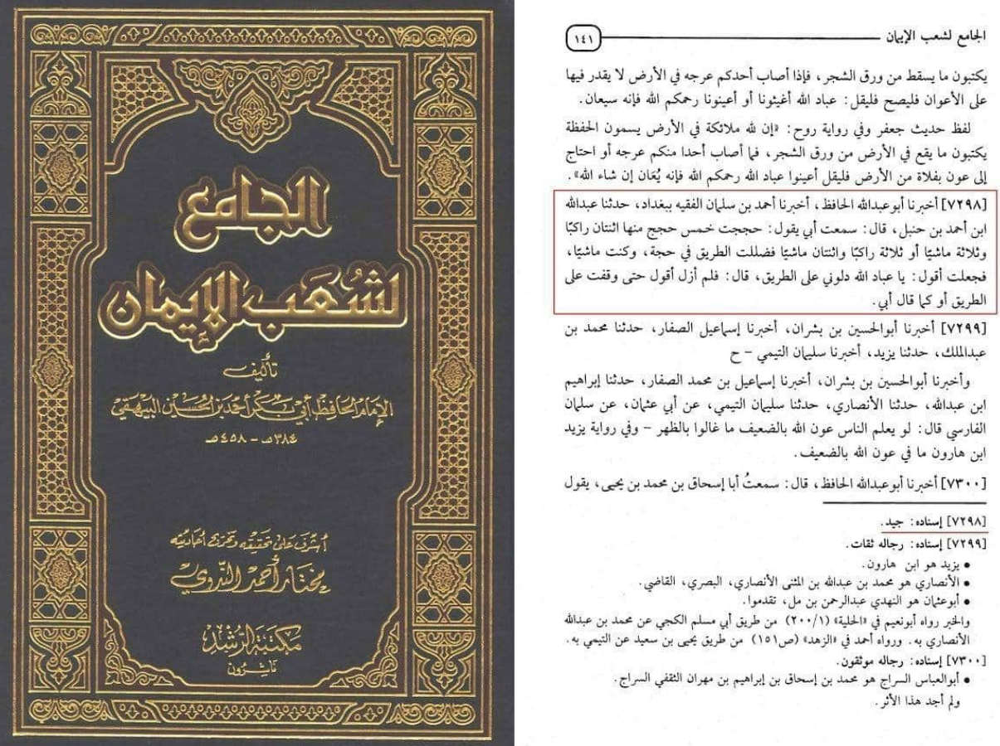
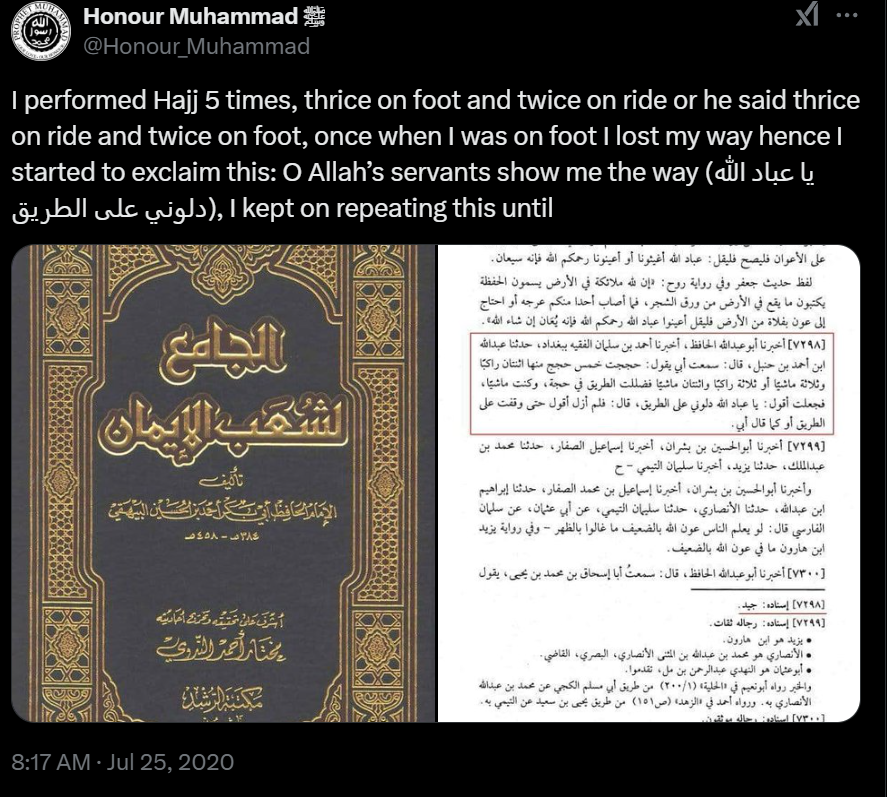
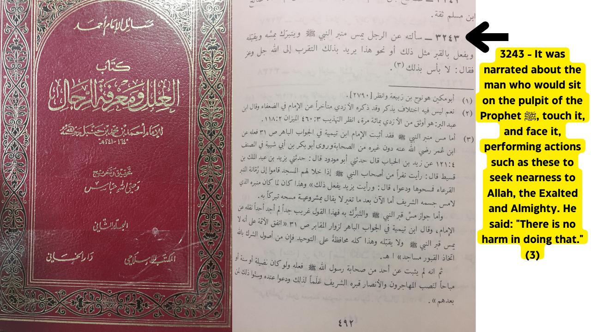
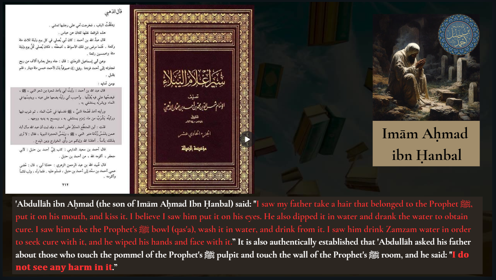

# Aḥmad b. Ḥanbal

***

**Imam Ahmad ibn Hanbal**\
Imam Ahmad ibn Hanbal (780–855 CE) was born in Baghdad. He was a renowned Islamic scholar and the founder of the Hanbali school of jurisprudence, one of the four major Sunni schools of law.

***

#### **Supplicating to Other Than God**

**Seeking Guidance Through Servants of Allah**\
Imam Ahmad narrated:\
*"<mark style="color:red;">**I performed five pilgrimages—two on foot and three riding, or three on foot and two riding. During one of the pilgrimages, I lost my way while traveling on foot. I began saying: ‘O servants of Allah, guide us to the path.’ I kept repeating this until I found the way**</mark>."*\
**Source**: <mark style="color:purple;">**Imām al-Bayhaqī in**</mark><mark style="color:purple;">**&#x20;**</mark>*<mark style="color:purple;">**Shuʿab al-Īmān**</mark>*<mark style="color:purple;">**, Vol. 6, Page 128, Hadith No. 7697**</mark>.

<figure><figcaption></figcaption></figure> <figure><figcaption></figcaption></figure>

***

<figure><figcaption></figcaption></figure>

<figure><figcaption></figcaption></figure>



**Tawassul (Intercession)**\
Imām Ahmad allowed tawassul (intercession) through the Prophet ﷺ alone, as well as other Prophets and pious individuals. For example:

Imām Ahmad replied when asked about touching the Prophet’s minbar or grave for blessings:\
*“<mark style="color:red;">**There is nothing wrong with it**</mark>.”*\
**Source**: <mark style="color:purple;">**al-**</mark><mark style="color:purple;">**`Ilalfīma`**</mark><mark style="color:purple;">**rifat al-rijāl (2:492)**</mark> by \`Abdullāh ibn Ahmad ibn Hanbal.

Al-Marwadi narrated from Imām Ahmad:\
*“<mark style="color:red;">**Let him use the Prophet as a means in his supplication to Allah**</mark>.”*\
**Source**: <mark style="color:purple;">**Al-Mardawi in**</mark><mark style="color:purple;">**&#x20;**</mark>*<mark style="color:purple;">**al-Insaf**</mark>*<mark style="color:purple;">**&#x20;**</mark><mark style="color:purple;">**(3:456)**</mark>.

***

**Using Imam ash-Shafiʿi as Intermediary**\
Imām Ahmad was known to supplicate using Imam ash-Shafiʿi as an intermediary. When his son ʿAbdullāh expressed astonishment, Imām Ahmad replied:\
*"<mark style="color:red;">**Al-Shafiʿi is like the sun for humanity and like well-being to the body**</mark>."*\
**Source**: <mark style="color:purple;">**Imām Yūsuf al-Nabhānī,**</mark><mark style="color:purple;">**&#x20;**</mark>*<mark style="color:purple;">**Shawāhid al-Ḥaqq fī al-Istighātha bi Sayyid al-Khalq**</mark>*<mark style="color:purple;">**, Page 166**</mark>.

***

**Hanbali Scholars on Tawassul and Istighātha**

**ʿAbd al-Bāqī al-Mawāhibī** (d. 1071): Performed tawassul and istighātha in poetry, saying:\
*“I seek your urgent help in removing our distress... And that our mistake be erased, O leader of Messengers!”*

**Ibn Badrān** (d. 1346): Affirmed that seeking aid with the Prophet ﷺ leads to apparent victory.

**Al-Sāmirī** (d. 616): Recommends saying:\
*“O Allāh, I turn to You through Your Prophet, the Prophet of Mercy. O Messenger, I turn to my Lord through you, seeking His forgiveness for my sins. O Allāh, I ask You by his right to forgive me.”*

**Al-Khalwatī** (d. 1088): Encouraged visitors to say:\
*“I have come to you, repenting from my sins, seeking your intercession with my Lord. Intercede for me, O interceder of the Ummah, and save me from Hellfire.”*

**Ibn al-Najjār** (d. 972): Permitted tawassul with righteous individuals, as mentioned in *Muntahā al-Irādāt*.

**Al-Buhūtī** (d. 1051): Mentioned the narration of *al-ʿUtbī* about seeking intercession with the Prophet ﷺ as a “benefit” in the book of Ḥajj in his work *Kashshāf al-Qināʿ*.

**Al-Saffārīnī** (d. 1188): Allowed tawassul.

**Al-Yūnīnī** (d. 726): Praised the book about *Istighāthah*, *Miṣbāḥ al-Ẓalām*.

***


