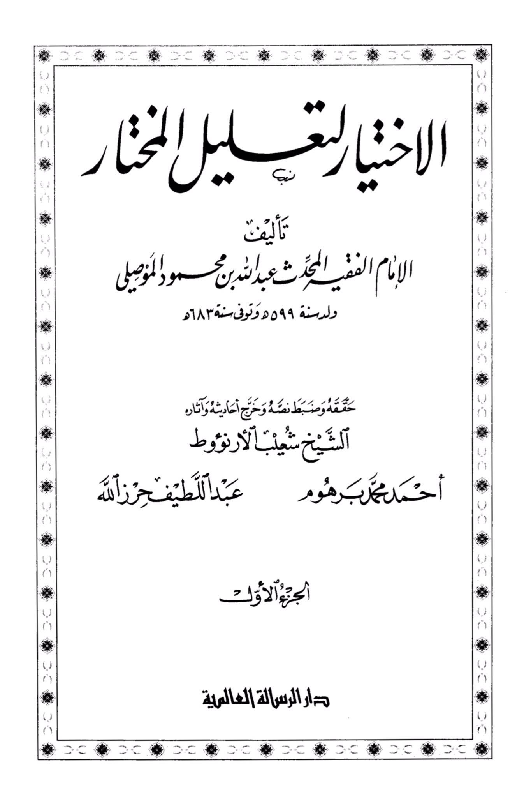
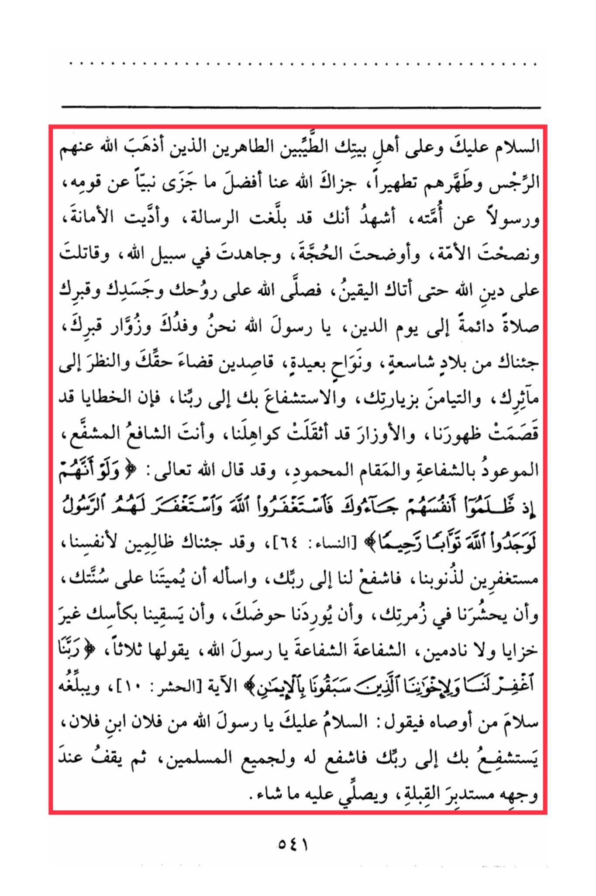
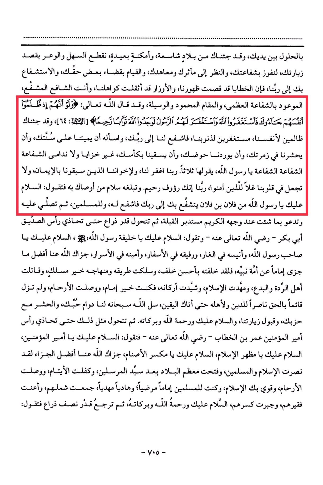

# Abū Ḥanīfah

“Then he (i.e. the visitor) stands at his head (peace and blessings of Allaah be upon him) as before and says: O Allaah, You said, and Your word is the truth: ‘And if they had come to You when they wronged themselves…’ the verse, and <mark style="color:red;">**we have come to You hearing Your word, obeying Your command, seeking intercession through Your Prophet to You**</mark>. ”

al-Mawṣilī (d. 683), the great Ḥanafī judge, says in “al-Ikhtiyār” that one should say the following during Ziyārah: “So intercede for us with your Lord...” then he mentions a very long statement, then: “Intercession! Intercession! Intercession O Messenger of Allāh!”

<figure><figcaption></figcaption></figure> <figure><figcaption></figcaption></figure>

al-Shurunbulālī (d. 1069), an important Ḥanafī Muḥaqqiq, in his explanation of Nūr al-Īḍāḥ which is the most memorized and most studied beginner Ḥanafī text, says the same thing as al-Mawṣilī

<figure><figcaption></figcaption></figure> <figure><figcaption></figcaption></figure>

