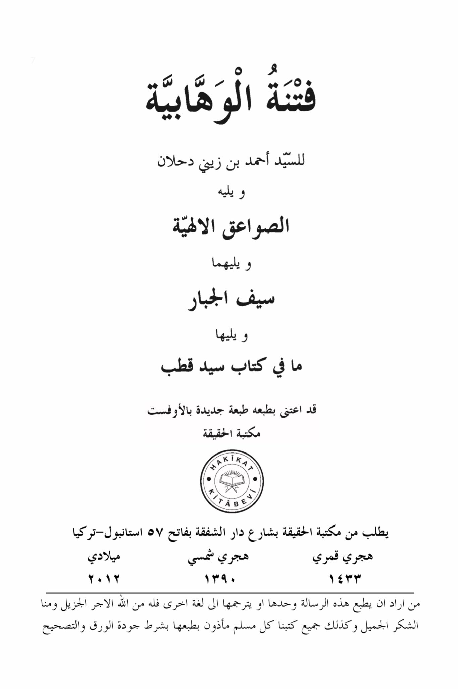
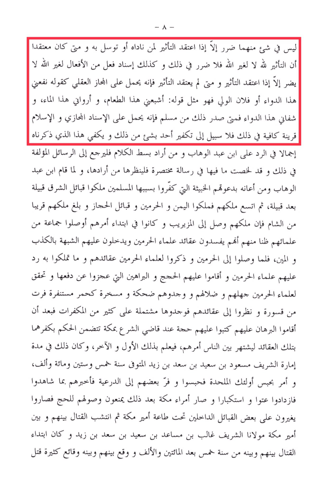

# Aḥmad Zaynī Daḥlān (d. 1304)

-7- <mark style="color:red;">**There is no harm in using talismans or amulets unless one believes in their effectiveness when invoked or sought through.**</mark> If one believes that the effectiveness is from Allah alone, then there is no harm in that. Similarly, attributing an action to someone other than Allah does not cause harm unless one believes in the effectiveness of that action. If one does not believe in the effectiveness, then it is considered metaphorical, like saying "This medicine benefits me" or "So-and-so saint helped me," which is similar to saying "This food satisfies me" or "This water quenches my thirst." When such statements are made by a Muslim, they are considered metaphorical attribution, and Islam serves as sufficient evidence in this regard. There is no way to declare someone as a disbeliever due to any of these practices. This general explanation suffices as a response to Ibn Abdul Wahhab. For those who seek further elaboration, they should refer to the detailed treatises on this topic. I have summarized the key points in a concise letter for those interested. <mark style="color:yellow;">**When Ibn Abdul Wahhab and his followers began spreading their malicious beliefs, which led to the excommunication of Muslims, they gained control over tribes in the eastern region, one after another.**</mark> Their influence expanded, and they ruled over Yemen, the two holy cities, and the tribes of the Hijaz. Their dominion extended close to the Levant. When their rule reached Al-Muzayrib, at the beginning of their reign, they dispatched a group to corrupt the beliefs of the scholars of the holy cities and cast doubt upon them with lies. They falsely accused their scholars of being unjust and corrupt. Upon reaching the holy cities and presenting their beliefs to the scholars there, the scholars refuted them with strong arguments that they could not counter. The ignorance and misguidance of the intruders became apparent, and they were ridiculed and mocked, like startled red camels fleeing from a lion. Upon examining their beliefs, it was found that they contained many blasphemous elements. After establishing the evidence against them, a legal ruling was issued in Mecca declaring their disbelief based on those beliefs, to make it known to all, both near and far. This occurred during the reign of Sharif Mas'ud bin Sa'id bin Sa'ad bin Zaid, who passed away in the year 1561 AH. He ordered the imprisonment of those atheists, and some of them fled to Ad-Diriyyah, where they reported what they had witnessed. This only fueled their arrogance and defiance. Subsequently, the rulers of Mecca prevented them from performing Hajj, and they began to incite conflict with tribes under the authority of the Amir of Mecca. This led to battles between them and our master, Sharif Ghaleb bin Masa'ad Sa'ad bin Sa'ad bin Zaid. The conflict began in the year 520 AH, and many casualties ensued between them.

"<mark style="color:purple;">**The Fitna of Wahhabism by Sayyid Ahmad bin Zaini Dahlan, followed by Divine Thunderbolts, followed by the Sword of the Mighty, and followed by what is in the book of Sayyid Qutb, which has been taken care of in a new edition by offset printing at Al-Haqqiqa Library**</mark>"

<figure><figcaption></figcaption></figure> <figure><figcaption></figcaption></figure>

