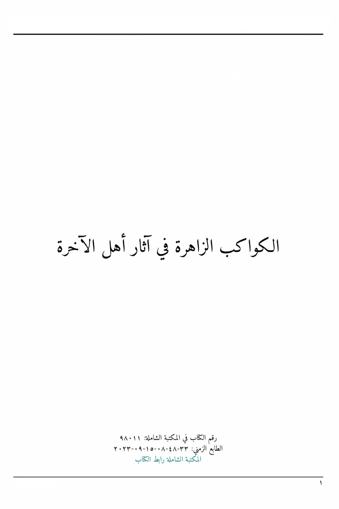
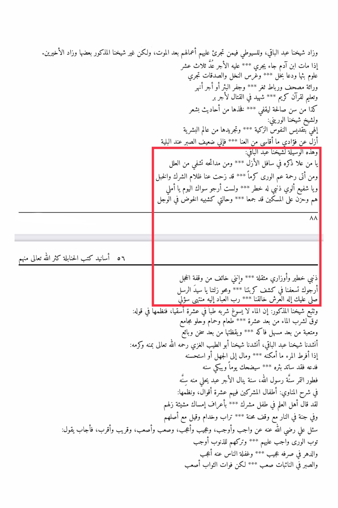

# ʿAbd al-Bāqī al-Mawāhibī (d. 1071)

Abd al-Bāqī al-Mawāhibī (d. 1071), a Ḥanbalī scholar, performs Tawassul and Istighāthah in his poetry: “I seek your urgent help in removing our distress... And that our mistake be erased, O leader of Messengers!” Narrated by his student Ibn ʿAwaḍ al-Maqdisī (d. >1180).

Our Sheikh Abdul Baqi increased, and Al-Suyuti concerning those who dare to do their deeds after death, but our mentioned Sheikh added some and the latter two increased. When a person dies, he comes running \*\*\* to him the reward counted as thirteen \*\*\* sciences he spread and called for charity and planted palm trees, and charity flows like an inheritance, a copy of the Quran and a tied neckband: and digging a well or the reward of rivers and teaching the Noble Quran \*\*\* a martyr in battle for the reward of goodness, so are the righteous deeds to be recorded, from the verses in poetry and to our Sheikh Al-Warini: \*\*\* My God, by sanctifying pure souls \*\*\* and stripping them from the world of humanity, erase from my heart the suffering I endure \*\*\* for I am weak in patience during calamities, and this is the means for our Sheikh Abdul Baqi: \*\*\* O one whose mention rose in the depths of eternity, and whose praises heal from ailments, and whoever receives the mercy of the uncle of the guardians generously \*\*\* the darkness of polytheism and ignorance has been removed from us, O intercessor who is concerned about my sin \*\*\* I hope only in you today, my hope and sorrow for the poor have gathered \*\*\* and my situation is like plunging into uncertainty 88 56 Isnads of the books of the Hanbalis, may Allah forgive my serious sins and burdens \*\*\* and I fear the moment of shame, I beg you to help us in relieving our distress \*\*\* and erasing our mistakes, O master of the messengers, may Allah's peace be upon you, the God of the Throne, our Creator \*\*\* the Lord of all beings, to Him is my ultimate request, and our mentioned Sheikh followed: It is not permissible to drink water as a cure in ten drinks, so he composed it in his saying: Abstain from drinking water after ten \*\*\* food, bath, and sweet intimacy \*\*\* and tiresome after ease, fruit and alertness after warmth, and the seller recited to us our Sheikh Abdul Baqi, recited to us our Sheikh Abu Al-Tayyib Al-Ghazali, may Allah have mercy on him, with his generosity and honor: If a person exceeds what he can handle and wealth to ignorance or considers it good \*\*\* his well will dry up, he will laugh one day and cry at the breaking of the fast, the tradition of the Messenger of Allah, a year in which a servant adorns himself with a year in explaining Al-Munawi: The children of polytheists have ten opinions about them, and he composed it: The scholars have said about a polytheist child \*\*\* with the customs of holding their wills and in paradise in the fire with a halt of trials \*\*\* dust and servants, and it is said with their origin. Ali, may Allah be pleased with him, was asked about what is obligatory and more obligatory, strange and stranger, difficult and more difficult, near and nearer, so he answered saying: \*\*\* Repentance is obligatory for them and leaving sins is more obligatory \*\*\* and the passing of time is strange and people's neglect of it is even stranger, and patience in the face of difficulties is difficult but missing out on rewards is even more difficult \*\*\*

"<mark style="color:purple;">**The shining planets in the traces of the people of the Hereafter Book number in the comprehensive library**</mark>"

<figure><figcaption></figcaption></figure> <figure><figcaption></figcaption></figure>

