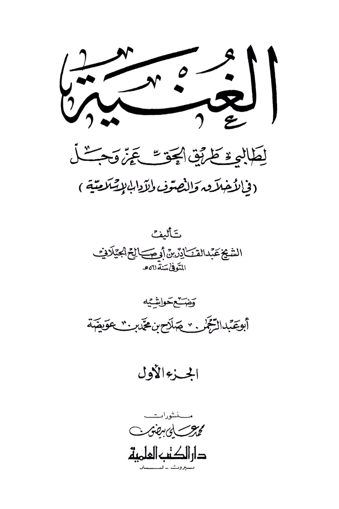
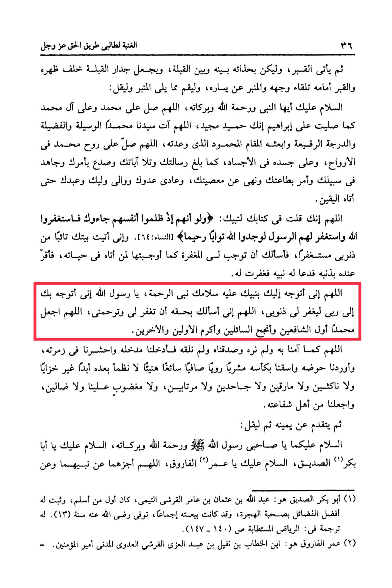

# ʿAbd al-Qādir al-Jīlānī (d. 561)

Then comes the wall of the grave, do not touch it or lean your chest against it, because that is the custom of the Jews. <mark style="color:red;">**Face the grave towards your face, stand up from where you were sitting, and say, "Peace be upon you, O Prophet, and the mercy and blessings of Allah**</mark>. O Allah, send blessings upon Muhammad and the family of Muhammad until the end of what you say in the final Tashahhud. Then say: O Allah, grant Muhammad the means, the virtue, the high rank, and the praised station that You have promised him. O Allah, send blessings upon his soul among the souls, and upon his body among the bodies, as he conveyed Your messages, recited Your verses, and fulfilled what was ordained to him with certainty. O Allah, You have said in Your Book to Your Prophet, peace be upon him: 'And if, when they wronged themselves, they had come to you, \[O Muhammad], and asked forgiveness of Allah, and the Messenger had asked forgiveness for them, they would have found Allah Accepting of repentance and Merciful.' And indeed, I have come to Your Prophet repentant and seeking forgiveness, so I ask You to make forgiveness obligatory for me as You made it obligatory for those who came to him during his lifetime. <mark style="color:red;">**O Allah, I turn to You through Your Prophet, the Prophet of mercy, O Messenger of Allah, I turn to you to seek forgiveness for my sins.**</mark> O Allah, I ask You by his right to forgive my sins. O Allah, make Muhammad the first to intercede, the most successful of those who seek, and the most honored among the first and the last. O Allah, as we believed in him without seeing him, and affirmed him without meeting him, <mark style="color:red;">**so admit us through his intercession,**</mark> gather us in his group, lead us to his Basin, and give us to drink from his Cup, a drink pure, refreshing, and pleasant, from which we will never thirst thereafter, without disgrace, fatigue, or intoxication, nor will we be criticized, lost, or astray, and make us among the people of his intercession.&#x20;

"<mark style="color:purple;">**The Riches for Seekers of the Path of Truth, Almighty in Ethics, Sufism, and Islamic Manners" authored by Sheikh Abdul Qadir ibn Abi Saleh al-Jilani, who passed away in the year 56 AH**</mark>"

<figure><figcaption></figcaption></figure> <figure><figcaption></figcaption></figure>

