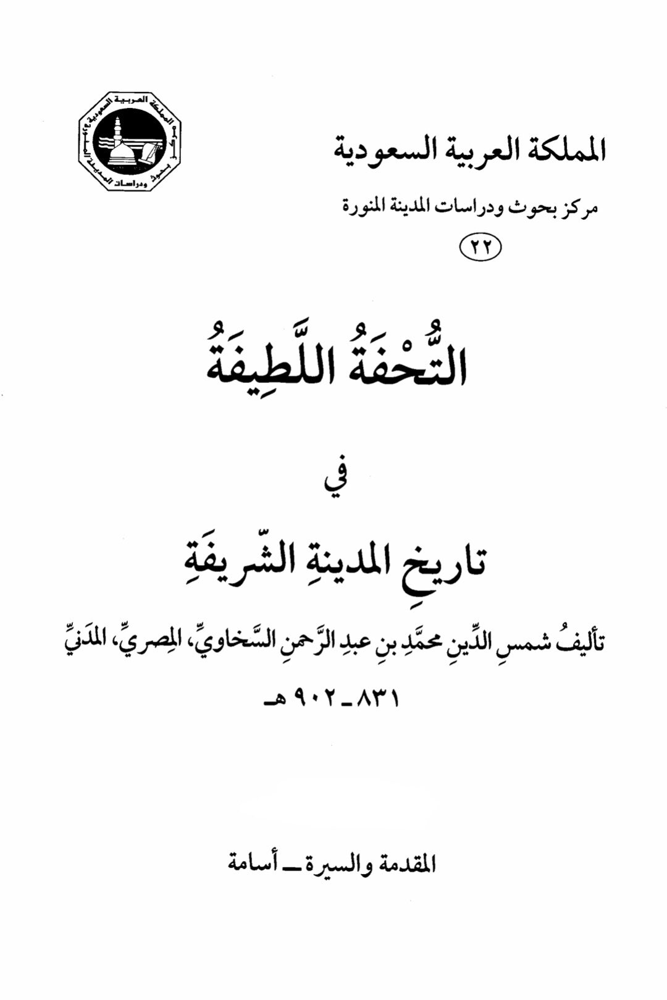
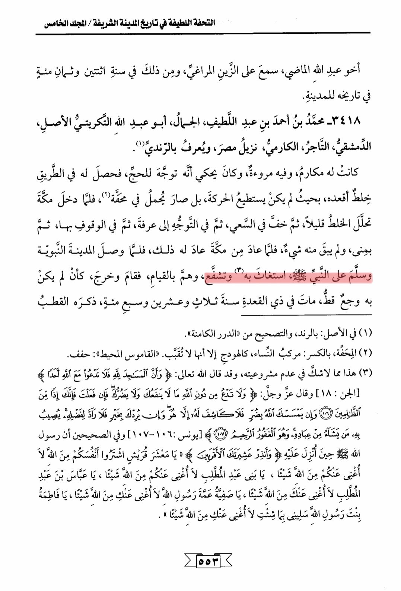

# Abū ʿAbd Allāh al-Takrītī (d. 723)

The beautiful masterpiece in the history of the noble city / Volume Five Brother Abdullah Al-Madi, heard about Al-Zain Al-Maraghi, and that was in the year two hundred and eighty in the city's history. 3418 - Muhammad bin Ahmed bin Abdul Latif, Al-Jamal, Abu Abdullah Al-Tikriti Al-Asal, Al-Dimashqi, the merchant, Al-Karmi, resident of Egypt, known as Al-Randi. He had virtues and courage, and he used to tell that he went for Hajj, and on the way, he got afflicted with a disease that paralyzed him, so he couldn't move and had to be carried in a litter. When he entered Mecca, the affliction eased a little, and he was able to walk lightly during the Sa'i, then in the direction towards Arafat, standing there, then in Mina, and nothing was left of the affliction. When he returned from Mecca, the affliction returned to him. When he reached the Prophet's city and greeted the Prophet, he sought his help and intercession, and as they were getting up, he stood and walked out, without any pain. He died in the month of Dhu al-Qi'dah in the year seven hundred and twenty-three. He was mentioned by Al-Qutb in the original: Al-Rand, and the correction is from "Al-Durar Al-Kamena." Al-Mahaffa, with a kasra: a compound of women, like the harem but not secluded. "Al-Qamus Al-Muhit": surrounded. This is undoubtedly not permissible, as Allah Almighty said: "And the mosques are for Allah (alone), so do not invoke anyone along with Allah." (Surah Al-Jinn: 18) And Allah Almighty said: "And do not invoke besides Allah that which neither benefits you nor harms you, for if you did, then indeed you would be of the wrongdoers." (Surah Yunus: 106-107) It is narrated in the Sahihayn that when the Messenger of Allah (peace be upon him) received the revelation, he said, "Warn your closest relatives. O Quraysh, buy yourselves from Allah, I cannot avail you anything against Allah. O sons of Abd al-Muttalib, I cannot avail you anything against Allah. O Abbas ibn Abd al-Muttalib, I cannot avail you anything against Allah. O Safiyyah, aunt of the Messenger of Allah, I cannot avail you anything against Allah. O Fatimah, daughter of the Messenger of Allah, ask me for whatever you wish, I cannot avail you anything against Allah." 553

"<mark style="color:purple;">**The exquisite masterpiece in the history of the noble city, authored by Shams al-Din Muhammad ibn Abdul Rahman al-Sakhawi**</mark>"

<figure><figcaption></figcaption></figure> <figure><figcaption></figcaption></figure>

