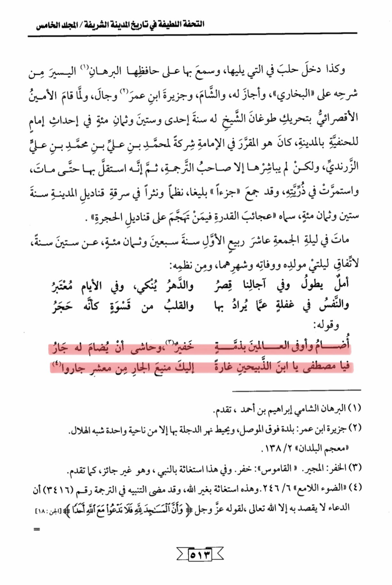

# Abū al-Fatḥ b. al-Burhān (d. 870)

The nice masterpiece in the history of the honorable city / the fifth volume, as well as Aleppo's entry in what follows it, and heard about it from its preserver, the easy proof from his explanation of Sahih al-Bukhari», and he approved it, and the Levant, and the island of Ibn Umar () and traveled, and when the secretary al-Aqsa moved the Sheikh's turban for him in the year one hundred and sixty-eight in establishing an imam for the Hanafis in the city, he was appointed in the imamate as a companion to Muhammad ibn Ali ibn Muhammad ibn Ali al-Zarandi, but only the translator took it up, then he carried it until he died and it continued in his descendants, and he collected a part eloquently, in verse and prose, about the theft of the lanterns of the city in the year six hundred and eighty, calling it "Wonders of Power in those who attacked the lanterns of the chamber." He died on the night of Friday, the tenth of Rabi' al-Awwal in the year seven hundred and eighty, at the age of sixty years, coinciding with the nights of his birth, death, and their month. Among his poetry: Hope prolongs and in our lifetimes it shortens, and time deceives, and in days it is considered, and the soul is heedless of what is intended for it, and the heart is as hard as a stone. And his saying: He is the most faithful of all creatures, and it is unlikely that a neighbor would wrong him. O Mustafa, O son of the sacrificers, a raid against you, the invincible neighbor, from the clan of neighbors. The proof of Sham Ibrahim ibn Ahmad, mentioned. The island of Ibn Umar is a town above Mosul, and the Tigris River surrounds it except from one direction resembling a crescent. Al-Mu'jam al-Buldan 2/138. The vigilant guard. The dictionary: guard. In this, seeking help from the Prophet, which is not permissible, as mentioned. "The Bright Light 246/6. This is seeking help from other than Allah, and it has been previously noted in translation number (3416) that supplication is intended only for Allah, as He says: "And the mosques are for Allah, so do not invoke with Allah anyone." \[Al-Jinn: 18]

"<mark style="color:purple;">**The exquisite masterpiece in the history of the noble city of Al-Madinah authored by Shams al-Din Muhammad ibn Abd al-Rahman al-Sakhawi**</mark>"

<figure><figcaption></figcaption></figure> <figure><figcaption></figcaption></figure>

