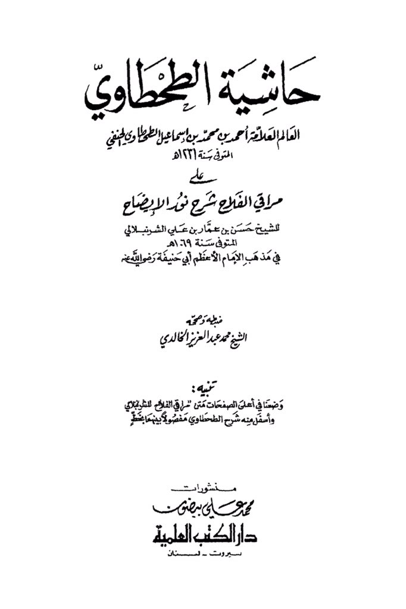
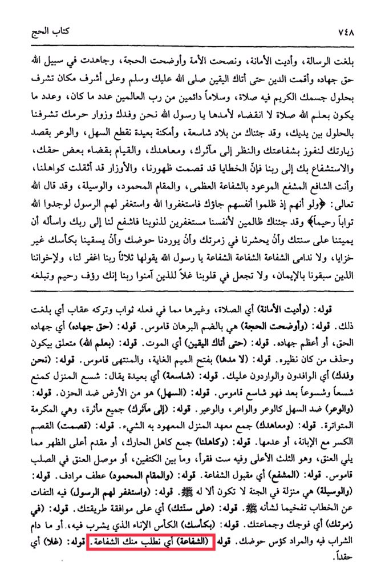

# al-Ṭaḥṭāwī (d. 1231)

<mark style="color:red;">**O Messenger of Allah, we are your delegation and visitors to your sanctuary**</mark>. We are honored by coming before you, and <mark style="color:red;">**we have come to you from vast lands and distant places, crossing plains and rugged terrain with the intention of visiting you to gain your intercession**</mark>, to behold your virtues and covenants, to fulfill some of your rights, <mark style="color:red;">**and to seek your intercession with our Lord**</mark>. Our sins have burdened our backs and our burdens have weighed heavily on our shoulders, <mark style="color:red;">**and you are the intercessor promised with great intercession and the praised station, and the means**</mark>. Allah the Almighty has said: "And if, when they wronged themselves, they had come to you, \[O Muhammad], and asked forgiveness of Allah, and the Messenger had asked forgiveness for them, they would have found Allah Accepting of repentance and Merciful." *<mark style="color:red;">**We have come to you as wrongdoers to ourselves, seeking forgiveness for our sins, so intercede for us with your Lord and ask Him to make us die upon your way,**</mark>* to gather us in your group, to admit us to your basin, and to give us to drink from your cup without any disgrace or regret. <mark style="color:red;">**Intercession, intercession, intercession, O Messenger of Allah.**</mark> Say it three times: "Our Lord, forgive us and our brothers who preceded us in faith and do not put in our hearts resentment toward those who have believed. Our Lord, indeed You are Kind and Merciful."...

<figure><figcaption></figcaption></figure> <figure><figcaption></figcaption></figure>

"<mark style="color:purple;">**The marginal notes of the scholar Al-Imam Al-Alama Ahmad bin Muhammad bin Ismail Al-Tahawi, Al-Hanafi**</mark>"
