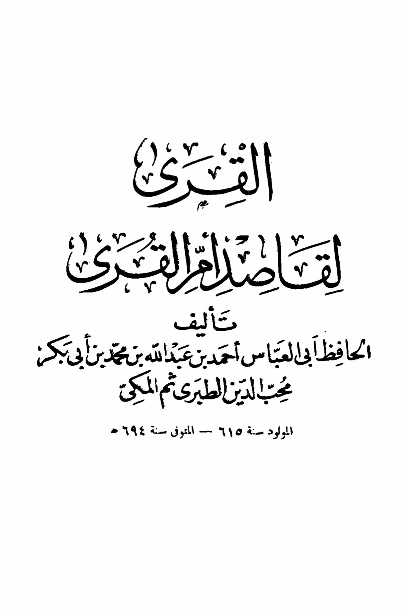
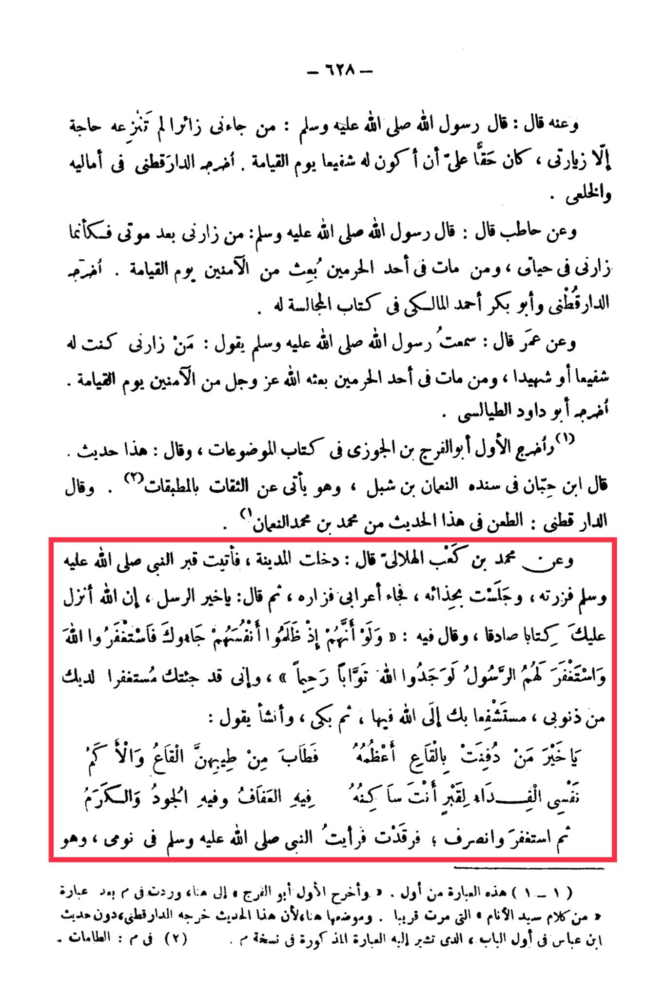

# al-Ṭabarī, Muḥibb al-Dīn (d. 694)

Narrated by Anas: The Messenger of Allah (peace be upon him) said, "Whoever comes to visit me, nothing motivated him except my visit, it is his right that I should intercede for him on the Day of Resurrection." Narrated by Ad-Daraqutni in his Amali and Al-Khalai. And from Hatib who said: The Messenger of Allah (peace be upon him) said, "Whoever visits me after my death, it is as if he visited me during my lifetime, and whoever dies in one of the two holy sanctuaries, he will be raised among the safe on the Day of Resurrection." Narrated by Ad-Daraqutni and Abu Bakr Ahmad Al-Maliki in his book Al-Majalisah. And from Umar who said: I heard the Messenger of Allah (peace be upon him) saying, "Whoever visits me, I will be his intercessor or witness, and whoever dies in one of the two holy sanctuaries, Allah will raise him among the safe on the Day of Resurrection." Narrated by Abu Dawood At-Tayalisi. The first to narrate it was Abu Al-Faraj ibn Al-Jawzi in the book Al-Mawdu'at, and he said: This is a fabricated hadith. Ibn Hibban mentioned in its chain An-Nu'man ibn Shabal, who is known for transmitting from trustworthy sources. Ad-Daraqutni said: The criticism of this hadith is from Muhammad ibn Muhammad An-Nu'man. And from Muhammad ibn Ka'ab Al-Hilali who said: I entered Al-Madinah, so I visited the Prophet's grave, sat by it, an Arab came and visited him, then said, "O best of messengers, Allah has revealed to you a true book, in which He said: 'And if, when they wronged themselves, they had come to you, \[O Muhammad], and asked forgiveness of Allah, and the Messenger had asked forgiveness for them, they would have found Allah Accepting of repentance and Merciful.' And here I have come to you seeking forgiveness for my sins, seeking your intercession to Allah for them." Then he wept and started saying, "O best of those buried in the earth, the most noble of them, the earth has become fragrant because of your fragrance. How I wish to ransom my soul for the grave where you reside, in it is chastity, generosity, and kindness. Seek forgiveness and depart." I slept and saw the Prophet (peace be upon him) in my dream, and he... (the text continues)

"<mark style="color:purple;">**The title of the book is "Al-Qura Li-Qasr" by the author Al-Hafiz Abu Al-Abbas Ahmad ibn Abdullah ibn Muhammad ibn Abi Bakn**</mark>"

<figure><figcaption></figcaption></figure> <figure><figcaption></figcaption></figure>

