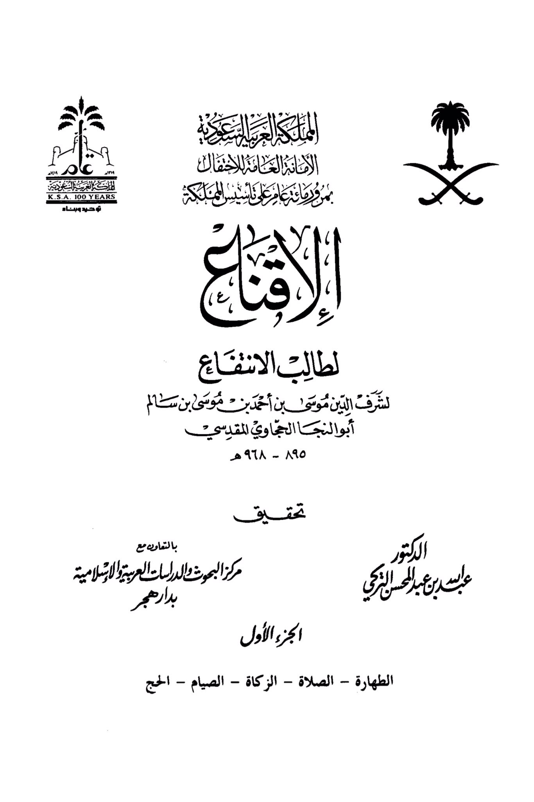
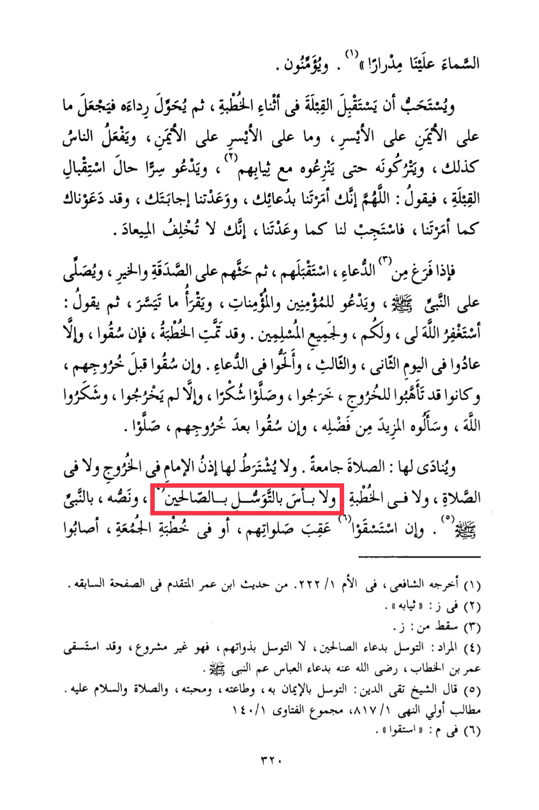

# al-Ḥajjāwī (d. 968)

The sky is above us, clear and bright. They believe and it is recommended to face the Qibla during the sermon, then to turn his garment so that what is on the right is on the left, and what is on the left is on the right, and people do the same. They leave it until they take it off with their clothes, and they secretly pray while facing the Qibla, saying: "O Allah, you have commanded us to supplicate to you, and you have promised to answer us. We have invoked you as you commanded us, so grant us as you promised, for you do not break your promise." When he finishes the supplication, he faces them, advises them on charity and goodness, sends blessings upon the Prophet, prays for the believers, reads what is easy for him, then says: "I seek forgiveness from Allah for me, for you, and for all the Muslims." The sermon is concluded. If it rains, they disperse, otherwise they return on the second day, the third day, and they continue to pray for rain. If it rains before they leave and they were prepared to go out, they go out, pray in gratitude, otherwise they do not go out, thank Allah, and ask for more of His bounty. If it rains after they have left, they pray. It is announced: "The prayer is congregation." It is not necessary to have the Imam's permission to go out, pray, or deliver the sermon. <mark style="color:red;">**There is no harm in seeking intercession through the righteous, specifically through the Prophet.**</mark> If they seek rain after their prayers or during the Friday sermon, and they are successful, this hadith was narrated by Imam Ash-Shafi'i in Al-Umm, and it is from the hadith of Ibn Umar mentioned earlier. In some versions, it is "his clothes." Omitted from some versions. The intended meaning is to seek intercession through the supplications of the righteous, not through their own beings, as that is not permissible. <mark style="color:red;">**Umar ibn Al-Khattab sought rain through the supplication of Abbas, the Prophet's uncle.**</mark> Sheikh Taqi ad-Din said: <mark style="color:red;">**Seeking intercession through faith in him, obedience to him, love for him, and sending blessings and peace upon him is permissible. This is from the obligations of the forbidden.**</mark>

"<mark style="color:purple;">**The General Secretariat of the Custodianship for celebrating the passing of 100 years since the birth of the Queen, the seeker of benefiting for the honor of the religion, Musa bin Ahmad bin Musa bin Salem Abu Al-Naja Al-Hajawi**</mark>"

<figure><figcaption></figcaption></figure> <figure><figcaption></figcaption></figure>

