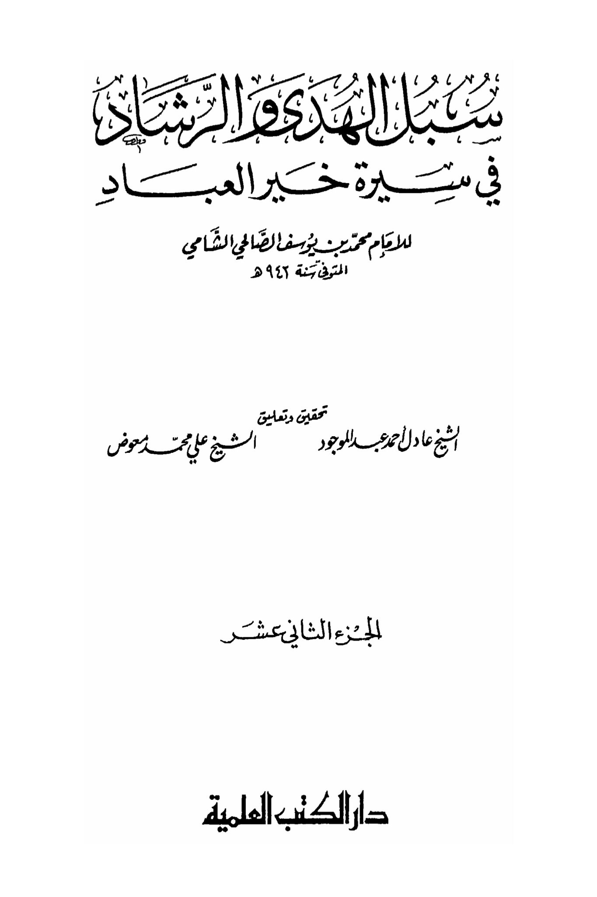
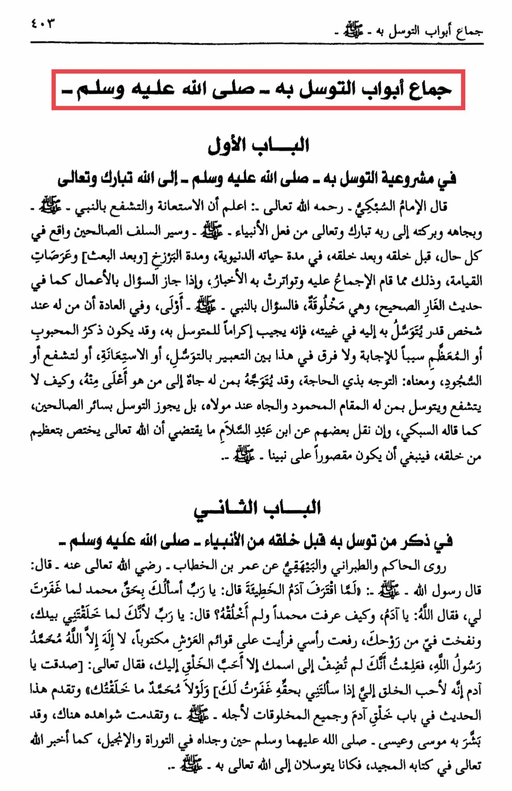

# al-Ṣāliḥī (d. 942)

<mark style="color:yellow;">Imam Ash-Shabki</mark> - may Allah have mercy on him - said: <mark style="color:red;">**Know that seeking help and interceding through the Prophet - peace be upon him - and by his status and blessings to his Lord, the Exalted and Glorified, is a practice of the prophets - peace be upon them - and the righteous predecessors in all circumstances, before his creation and after it, during his worldly life, and during the period of Barzakh \[and after resurrection] and the events of the Day of Judgment, and this is something that there is consensus on and is supported by reports**</mark>. And if it is permissible to ask through actions as in the authentic Hadith of the Cave, and these actions are created, then asking through the Prophet - - is more appropriate. <mark style="color:red;">**It is customary that if someone has a status with a person that can be used as a means of intercession in his absence, then he will respond out of honor for the one seeking intercession.**</mark> **Mentioning the beloved or the revered may be a reason for the response, and there is no difference in this regard between seeking intercession, seeking help, interceding, prostration, and their meanings: directing oneself with a need. It may be directed from someone with a status to someone higher than him**. <mark style="color:red;">**How can one not intercede and seek intercession through someone who has a praiseworthy status and honor with his Lord? It is permissible to seek intercession through all the righteous, as mentioned by As-Sabki.**</mark> Some have reported from Ibn Abdul-Salam that it implies that Allah Almighty has singled out the honor of His creation, so it is fitting that it is restricted to our Prophet. The second chapter in mentioning those who sought intercession through him before his creation from the prophets - peace be upon them - *<mark style="color:yellow;">**Al-Hakim**</mark>*, *<mark style="color:yellow;">**At-Tabarani**</mark>*, and *<mark style="color:yellow;">**Al-Bayhaqi**</mark>* narrated from Umar ibn Al-Khattab - may Allah be pleased with him - who said: The Messenger of Allah - peace be upon him - said: When Adam committed the sin, he said: "O Lord, I ask You by the right of Muhammad to forgive me." So Allah said: "O Adam, how do you know Muhammad when I have not created him yet?" Adam said: "O Lord, when You created me with Your hand and blew into me from Your soul, I raised my head and saw written on the pillars of the Throne, 'There is no god but Allah, Muhammad is the Messenger of Allah.' So I knew that You only associate the most beloved of creation to You." Allah said: "You have spoken the truth, O Adam. He is indeed the most beloved of creation to Me. If you had not mentioned Muhammad, I would not have created you." This hadith is mentioned in the chapter of the creation of Adam and all creatures for his sake. <mark style="color:red;">**Its evidence has been presented there, and it was foretold by Moses and Jesus - peace be upon them - when they found it in the Torah and the Gospel, as informed by Allah in His Noble Book. They used to seek intercession with Allah through him.**</mark>

"<mark style="color:purple;">**The Paths of Righteous Guidance in the Biography of the Best of Servants, Muhammad ibn Yusuf al-Salhi al-Shami**</mark>"

<figure><figcaption></figcaption></figure> <figure><figcaption></figcaption></figure>

