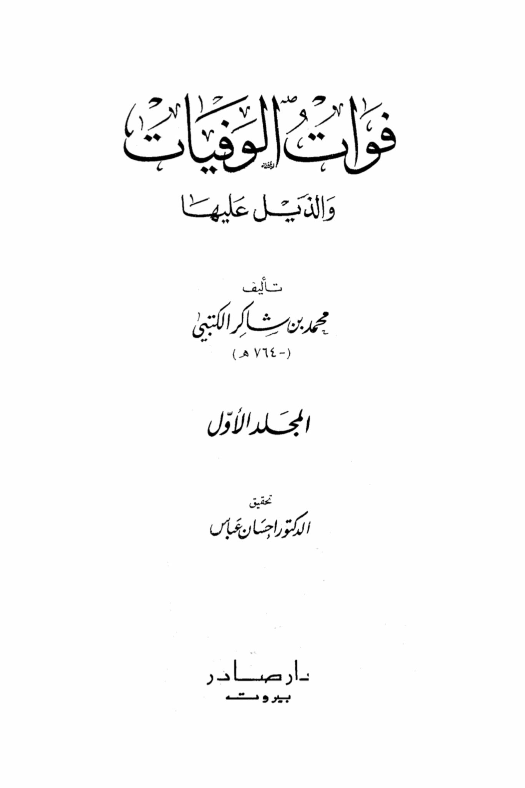
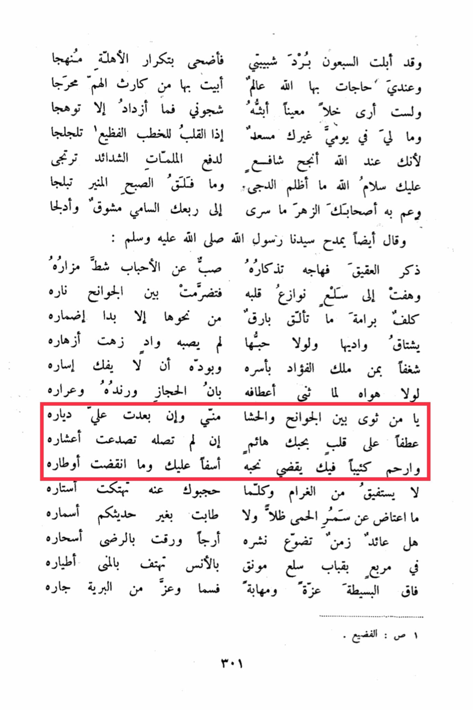

# al-Ṣarṣarī (d. 656)

The seventy have worn out my youth, so I resorted to repeating the phases as a method. And I have needs in which Allah is aware, I have spent sleepless nights in distress. I see no relief except in expressing my sorrows, which only intensifies my anguish. There is nothing to bring me joy in my day except you, when my heart trembles at the dreadful speeches. May Allah grant success to the intercessor in warding off calamities and hardships, seeking peace from you. How dark is the night and how bright is the shining morning! Your companions are overwhelmed by your charm, longing for your noble presence. You praised our Prophet, peace be upon him, mentioning the agate stone that stirred his memory, pouring out his love for his beloved ones. His heart was inflamed with passion, igniting a fire between his ribs. He was entrusted with a mission that shone brighter than any other, revealing his hidden feelings. He longed for its valley, and if not for his love, he would not have been struck by a wound that bloomed like flowers, yearning for the one who captured his heart. He desired not to be freed from its captivity, for if not for his love, he would not have inclined his neck to the Hijaz and its surroundings. O you who dwell between the ribs and the chest, even if you are far from your abode, if you do not reach it, its walls will crumble out of affection for you. Have mercy on the lovesick heart that longs for you, and forgive the sorrowful one who has fallen for you. His bonds will never be broken. He will not awaken from this love, and every time they try to keep you away from him, his barriers will be torn apart. No shade can replace the warmth of his fever, and no conversation can soothe his longing like yours. Is there a return to the time when his spread was delightful, hoping for the satisfaction of his magical nights? In the domes of Salaa, guided by intimacy, they chant in the sky, in the square of simplicity, the pride of his birds. Majesty and honor in the heavens, neighbors of the wilderness. Page: Al-Fadi' 301.

"<mark style="color:purple;">**by Muhammad ibn Shakir al-Kutbi**</mark>"

<figure><figcaption></figcaption></figure> <figure><figcaption></figcaption></figure>

