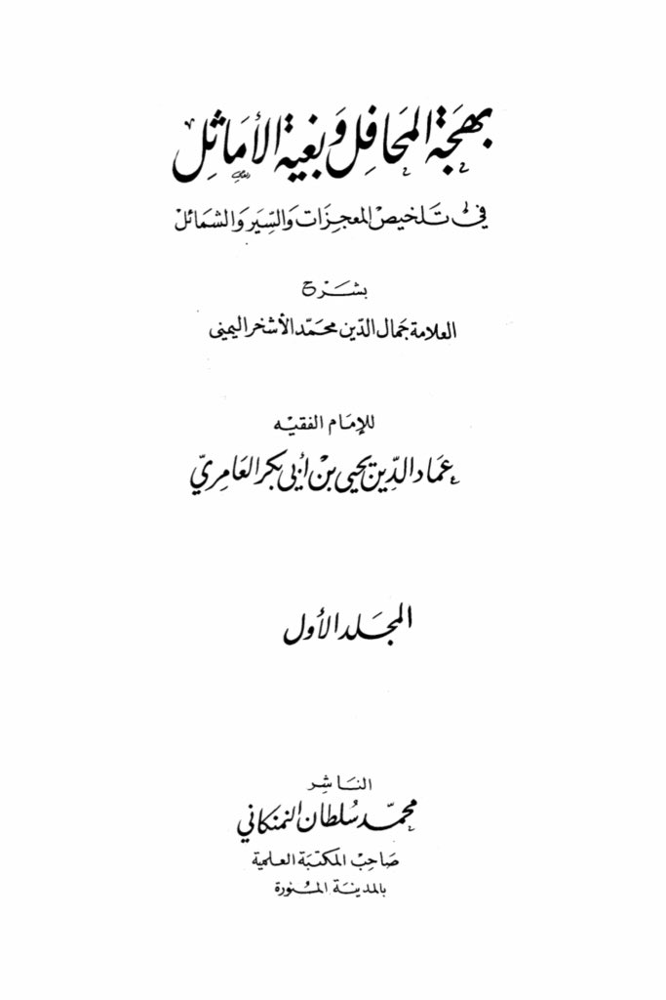
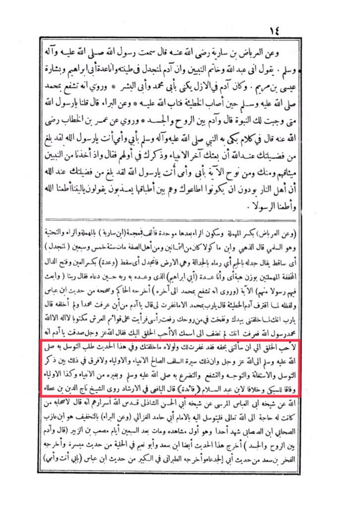

# al-Ashkhar (d. 991)

Narrated by Al-Arbaad bin Sariyah (may Allah be pleased with him), he said: I heard the Messenger of Allah (peace and blessings be upon him and his family) saying, "Verily, I am the servant of Allah and the seal of the prophets. Adam was created from clay and I am the fulfillment of the covenant of my father Ibrahim and the glad tidings of Isa, son of Maryam. Adam was known in the beginning as the father of Muhammad and the father of mankind. It is narrated that he interceded with Muhammad (peace be upon him) when he committed a sin and repented to Allah. And Al-Bara' said, 'O Messenger of Allah, when was prophethood made obligatory for you?' He said, 'While Adam was between the soul and the body.' It is narrated from Umar ibn Al-Khattab (may Allah be pleased with him) that the Prophet (peace and blessings be upon him and his family) wept in his speech saying, 'By my father and mother, O Messenger of Allah, you have reached such a high status with Allah that He sent you as the last of the prophets and mentioned you at the beginning of them.' And when we took the covenant from the prophets, and from you, and from Nuh, the verse by my father and mother, O Messenger of Allah, you have reached such a high status with Allah that the people of the Fire wish to obey you while they are being punished within it. They say, 'We wish we had obeyed Allah and obeyed the Messenger.' And about Al-Arbaad bin Sariyah, with a kasrah on the hamzah and a sukoon on the ra' followed by a hamzah, and a fathah on the alif in the letter mim, and a jeeem in the letter dad, meaning he threw him with argumentation, and it is the earth that he threw. And 'adah with a kasrah on the 'ayn and a fathah on the dal, the two hamzahs are silent, with the weight of "hiba," meaning 'and I am also a fulfillment of the promise to my father Ibrahim, whom his Lord promised with Husayn, so he supplicated and said, 'Our Lord, and send among them a messenger from among them,' the verse. And it is narrated that he interceded with Muhammad until the end. Al-Hakim narrated it and authenticated it from the hadith of Ibn Abbas, and its wording is when Adam committed the sin, he said, 'O Lord, by Muhammad, will You not forgive me?' He said, 'O Adam, how did you know Muhammad, whom I have not yet created?' He said, 'O Lord, when You created me with Your hand and blew into me from Your soul, I raised my head and saw written on the pillars of the Throne, "There is no god but Allah, Muhammad is the Messenger of Allah." So I knew that You would not join any name with Yours except the most beloved of creation to You.' Allah, the Exalted, said, 'You have spoken the truth, O Adam. He is indeed the most beloved of creation to Me. If it were not for him, I would not have created you.' In this hadith, the Prophet (peace and blessings be upon him) sought intercession with Allah, the Exalted, and this is the way of the righteous predecessors, the prophets, and the saints, and there is no difference in that between mentioning intercession, seeking help, turning, interceding, and supplicating with him, peace and blessings be upon him, and with other prophets, as well as the saints, surpassing Al-Subki and contradicting Ibn Abdul Salam. Al-Yafi'i said in Al-Irshad that the Sheikh Taj al-Din ibn Ata' Allah narrated from his Sheikh Abu al-Abbas al-Mursi from his Sheikh Abu al-Hasan al-Shadhili, may Allah sanctify their secrets, that he said to his companions, 'Whoever has a need to Allah the Exalted, let him seek intercession with the Imam Abu Hamid al-Ghazali.' And about Al-Bara', with a tashkeel, he is the unmarried son of the companion Ibn al-Musabbih who witnessed the Battle of Uhud and it was his first battle, and he died after seventy days. Musab bin al-Zubair said, 'Adam was between the soul and the body.' This hadith was also narrated by Ibn Saad and Abu Nu'aim in Al-Hilyah from the hadith of Maisarah, and Al-Fakhr bin Saad narrated it from the hadith of Abu al

"<mark style="color:purple;">**The Glad Tidings of the Sign, Beauty of Religion, Muhammad Al-Ashkar Al-Yamani**</mark>"

<figure><figcaption></figcaption></figure> <figure><figcaption></figcaption></figure>

