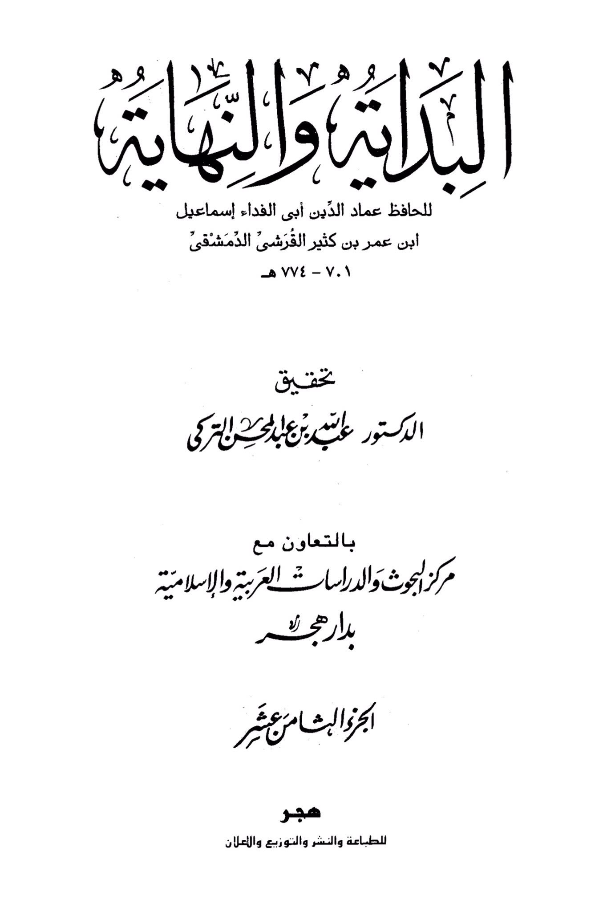
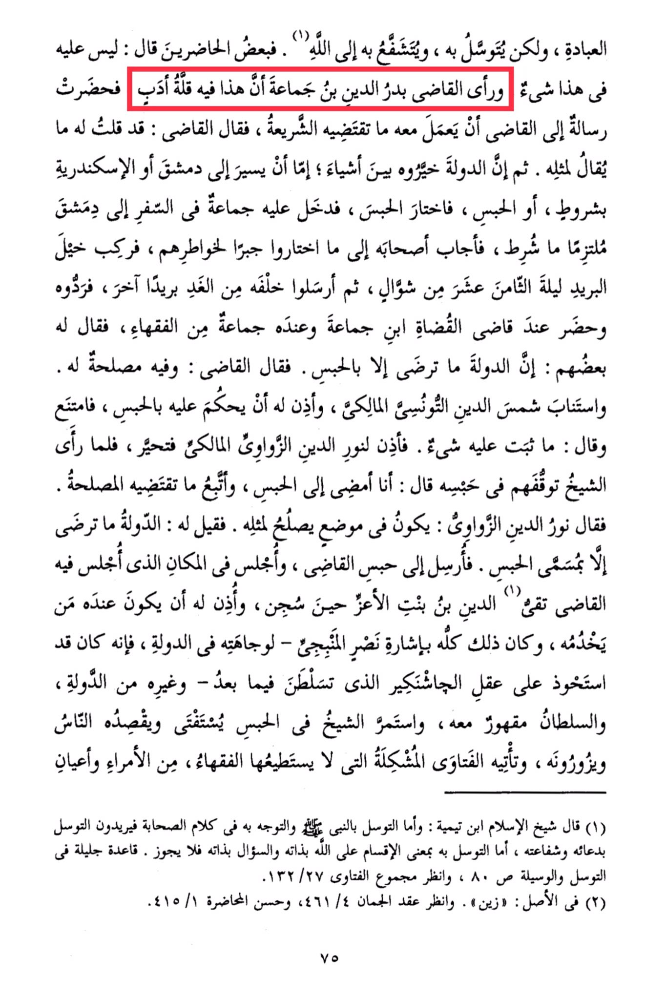

# al-Badr b. Jamāʿah (d. 733)

(1) He worships, but seeks intercession through it, and seeks mediation through it to Allah. <mark style="color:red;">**Some of those present said: There is nothing wrong with this. But the judge, Badr al-Din ibn Jamaa'a, saw that this showed a lack of respect**</mark>. So a message was sent to the judge to act according to what the Sharia requires. The judge said: I have already told him what should be said to someone like him. Then the state gave him a choice between three things: either to travel to Damascus or Alexandria under certain conditions, or imprisonment. He chose imprisonment. A group came to him while he was preparing to travel to Damascus, adhering to the conditions. His companions insisted on what they had chosen, so he rode the postal horse on the night of the eighteenth of Shawwal. The next day, another group was sent after him, but they returned him. He appeared before the judge of judges, Ibn Jamaa'a, accompanied by a group of scholars. Some of them said: The state only accepts imprisonment. The judge said: It is in his best interest. Shams al-Din al-Tunsi, the Maliki, was consulted, and he allowed him to be sentenced to imprisonment. However, he refused, saying: Nothing has been proven against him. Then, Nur al-Din al-Zawawi, the Maliki, was consulted, and he hesitated. When the sheikh saw their hesitation in his imprisonment, he said: I agree to imprisonment and will follow what is in the best interest. Nur al-Din al-Zawawi said: It should be in a place suitable for someone like him. It was said to him: The state only accepts the term "imprisonment." He was sent to the judge's prison and sat in the same place where Tqi al-Din ibn Bint al-Aziz sat when he was imprisoned. He was allowed to have someone to serve him, all by the indication of Nasr al-Manbij - due to his prominence in the state, as he had gained control over the mind of Jashnakir, who later ruled - and others from the state. The sultan was displeased with him, and the sheikh continued to be consulted and sought by people while in prison. He received complex fatwas that even the scholars could not handle, from princes and dignitaries. (1) Sheikh al-Islam Ibn Taymiyyah said: As for seeking intercession through the Prophet and turning to him, in the words of the companions, they mean seeking intercession through his supplication and mediation. But seeking intercession through him in the sense of dividing Allah by His essence and asking Him by His essence is not permissible. A noble principle in seeking intercession and means, see Al-Qaida Al-Jalila in seeking intercession and means, p. 80, and refer to Majmu' al-Fatawa 132/27. (2) Originally: "Zayn". See Aqd al-Juman (461/4) and Hasan al-Muhadara 415/1.

"<mark style="color:purple;">**The Beginning and the End by Hafiz Imad al-Din Abu al-Fida Ismail ibn Umar ibn Kathir al-Qurashi al-Dimashqi \_ VVE - V.1 Edited by Dr. Ali ibn Abdulhay al-Turki in collaboration with the Center for Arab and Islamic Studies at Dar Hajar, Part Eighteen, Hajar for Printing, Publishing, Distribution, and Advertising.**</mark>"

<figure><figcaption></figcaption></figure> <figure><figcaption></figcaption></figure>

