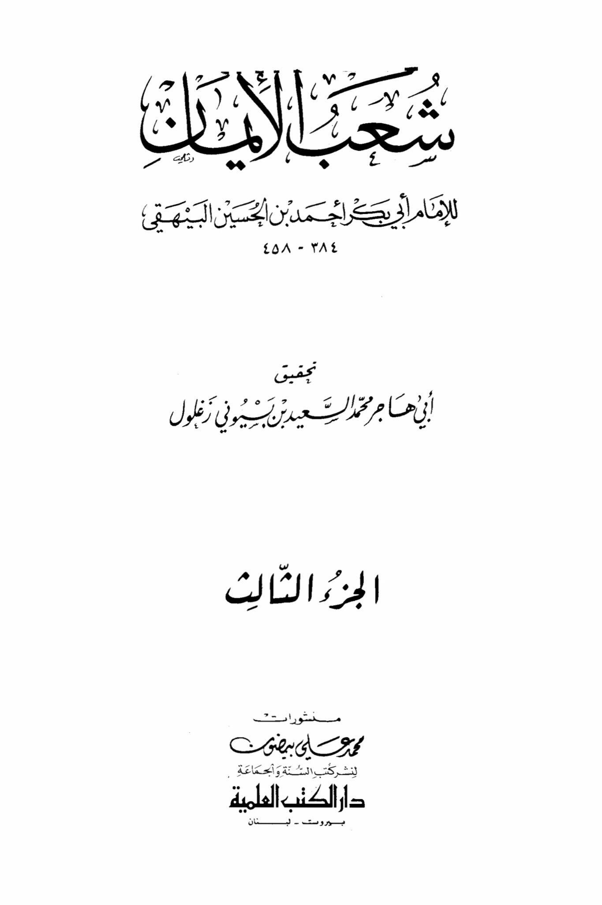
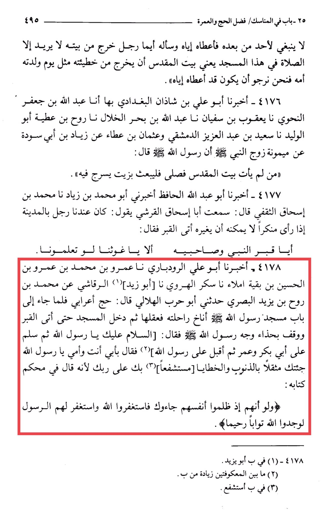

# al-Bayhaqī (d. 458)

Chapter on Rituals/Virtue of Hajj and Umrah 495: His son was born to him, and it was not appropriate for anyone after him, so he gave it to him, and he asked him, "Which man leaves his house only to pray in this mosque," meaning the Sacred Mosque, "to leave his sins like the day his mother gave birth to him, so we hope that he has given it to him." 4176 - Abu Ali ibn Shadhan al-Baghdadi informed us, Abdullah ibn Ja'far al-Nahwi narrated to us, Ya'qub ibn Sufyan narrated to us, Abdullah ibn Bahr al-Khallaal narrated to us, Ru'uh ibn Atiyyah Abu al-Waleed narrated to us, Saeed ibn Abdul Aziz al-Damascene narrated to us, and Uthman ibn Atiyyah narrated from Ziyad ibn Abi Suda from Maymunah, the wife of the Prophet (peace be upon him), that the Messenger of Allah (peace be upon him) said: "Whoever does not come to the Sacred Mosque and prays, let him send oil in which to anoint himself." 4177 - Abu Abdullah al-Hafiz informed us, Abu Muhammad ibn Ziyad narrated to me, Muhammad ibn Ishaq al-Thaqafi said: I heard Abu Ishaq al-Qurashi saying: There was a man in our city, when he saw something wrong that he could not change, he went to the grave and said: "O grave of the Prophet and his companions, can you not help us if you only knew." 4178 - Abu Ali al-Rudbari informed us, Amr ibn Muhammad ibn Amr ibn al-Husayn ibn Baqiyah al-Ma'la narrated to us, Sukr al-Harawi narrated to us, Abu Zaid al-Raqashi narrated to us from Muhammad ibn Ru'uh ibn Yazid al-Basri, Abu Harb al-Hilali told me: "A Bedouin performed Hajj, and when he reached the gate of the Prophet's Mosque, he tied his camel, then entered the mosque until he reached the grave and stood at the head of the Prophet's shoe and faced him, saying: 'Peace be upon you, O Messenger of Allah,' then greeted Abu Bakr and Umar, then turned to the Prophet and said: 'By my father and mother, O Messenger of Allah, I have come to you burdened with sins and mistakes, seeking your intercession with your Lord, because He said in His decisive Book: 'And if they had wronged themselves, they would have come to you, then asked forgiveness of Allah, and the Messenger asked forgiveness for them, they would have found Allah Accepting of repentance, Merciful.'" (1) In B, it is Abu Yazid. (2) Between the two brackets, an addition from (3) In B, it is "interceding."

"<mark style="color:purple;">**"I have researched for Imam Abu Bakr Ahmad ibn Al-Hussein Al-Bayhaqi**</mark>"

<figure><figcaption></figcaption></figure> <figure><figcaption></figcaption></figure>

