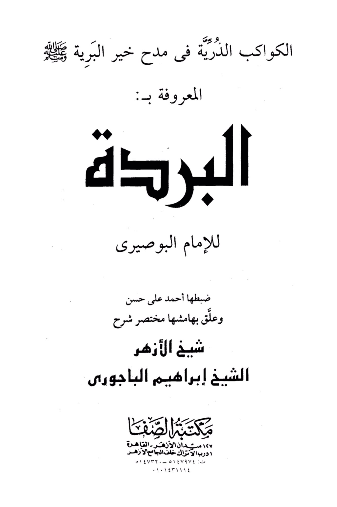
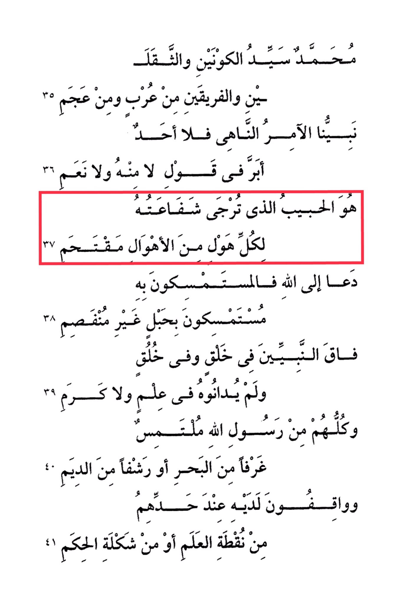

# al-Būṣīrī (d. 696)

Muhammad is the master of the two worlds and the two weights, the one who belongs to the Arabs and the non-Arabs. Our Prophet, the one who commands and forbids, there is none who surpasses him in saying no or yes. He is the beloved one whose intercession is hoped for in every distress. He called to Allah, so those who hold onto him are holding onto an unbreakable rope. He surpassed all the prophets in creation and character, and they did not match him in knowledge or nobility. All of them seek refuge with the Messenger of Allah, like rooms from the sea or sips from the ocean, standing before him at their limits, from the point of knowledge or the form of wisdom.

"<mark style="color:purple;">**Al-Burda," by Imam Al-Busiri**</mark>"

<figure><figcaption></figcaption></figure> <figure><figcaption></figcaption></figure>

