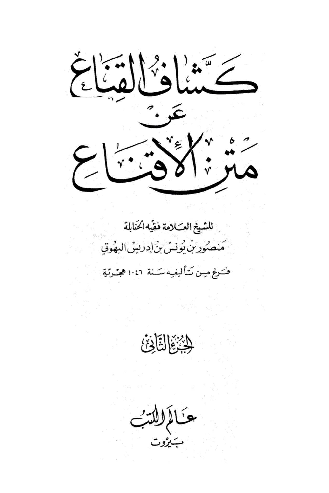
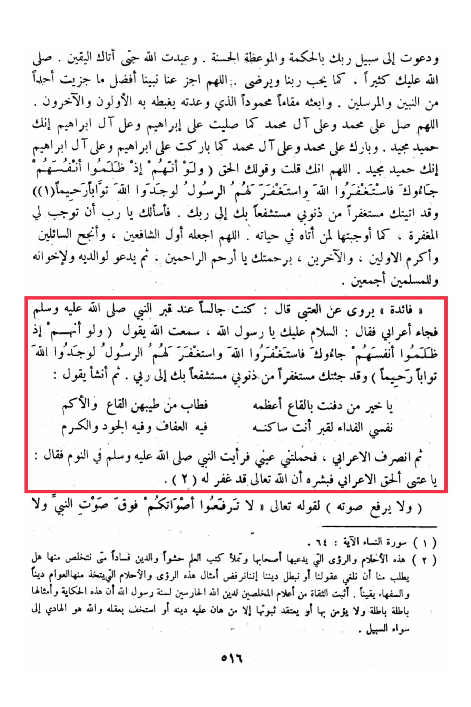

# al-Buhūtī (d. 1051)

<mark style="color:red;">**I have come to You seeking forgiveness for my sins, seeking Your intercession with Your Lord.**</mark> So I ask You, O Lord, to grant me forgiveness as You have granted it to those who came to You in their lifetime. <mark style="color:red;">**O Allah, make him the first intercessor**</mark>, grant success to the seekers, and honor the early and later generations with Your mercy, O Most Merciful of the merciful. Then pray for his parents, his brothers, and all Muslims. A benefit: It is narrated that Al-·Attab said: "<mark style="color:red;">**I was sitting by the Prophet's grave, peace be upon him, when a Bedouin came and said, 'Peace be upon you, O Messenger of Allah.**</mark> I heard Allah say, 'And if, when they wronged themselves, they had come to you, \[O Muhammad], and asked forgiveness of Allah, and the Messenger had asked forgiveness for them, they would have found Allah Accepting of repentance and Merciful.' <mark style="color:red;">**So I have come to you seeking forgiveness for my sins, seeking your intercession with my Lord**</mark>.' Then he began reciting: '<mark style="color:red;">**O best of those buried in the depths, the fragrance of your grave is pure, my soul is the ransom for the grave where you reside, in it is chastity, generosity, and kindness**</mark>.' Then the Bedouin left, and I fell asleep and saw the Prophet, peace be upon him, in my dream saying, 'O ·Attab, go and give glad tidings to the Bedouin that Allah the Most High has forgiven him.' (This is a dream and should not be taken as a religious belief.)" (End of the narration) "And do not raise your voices above the voice of the Prophet, and do not be loud to him." (Quran 49:2) These dreams and visions claimed by their proponents, filling the books of knowledge with falsehood and corrupting the religion, when will we be rid of them? Are we being asked to erase our minds or abandon our religion? We reject such visions and dreams that the common people take as religion and the ignorant as certainty.&#x20;

<figure><figcaption></figcaption></figure> <figure><figcaption></figcaption></figure>

"<mark style="color:purple;">**The title of the book is "The Unveiler of Conviction at the Meter of Persuasion" by the eminent scholar and Hanbali jurist Mansur bin Yunus bin Idris al-Buhuti**</mark>"
