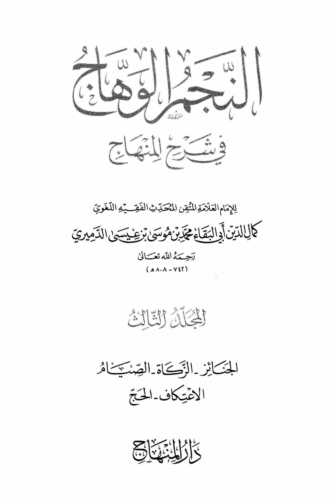
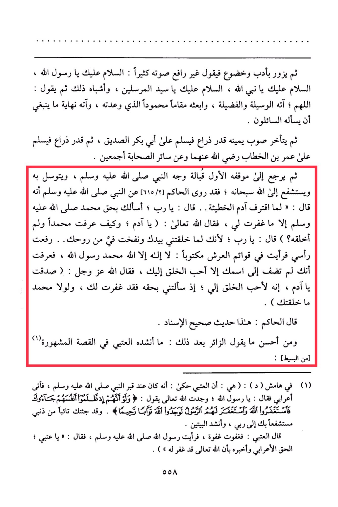

# al-Damīrī (d. 808)

al-Damīrī (d. 808), says that it is recommended to do Tawassul and Tashaffuʿ through the Messenger  during Ziyārah, cites the narration of al-Ḥākim about the Tawassul of Ādam , and says that what is mentioned in the narration of al-ʿUtbī is the best thing one can say.

Then he visits with respect and humility, speaking in a low voice: "Peace be upon you, O Messenger of Allah, peace be upon you, O Prophet of Allah, peace be upon you, O Master of the Messengers," and similar phrases. Then he says: "O Allah, grant him the means and virtues, and raise him to the praised position that You have promised him, and grant him the end that is fitting for him to be asked for." Then he turns slightly to his right, about an arm's length, and greets Abu Bakr Al-Siddiq, then about an arm's length to greet Umar ibn Al-Khattab, may Allah be pleased with them both and all the companions. Then he returns to his original position facing the face of the Prophet, peace and blessings be upon him, and intercedes and seeks mediation with Allah. Al-Hakim narrated from the Prophet, peace and blessings be upon him, that he said: "When Adam committed the sin... he said: 'O Lord, I ask You by the right of Muhammad, peace be upon him, except what You have forgiven me.' So Allah, the Most High, said: 'O Adam, how did you know about Muhammad when I had not created him?' Adam said: 'O Lord, when You created me with Your own hand and breathed into me of Your spirit... I raised my head and saw written on the pillars of the Throne: There is no god but Allah, Muhammad is the Messenger of Allah. So I knew that You would not add anyone's name next to Yours except the most beloved of creation to You.' Allah, the Mighty and Majestic, said: 'You have spoken the truth, O Adam. He is indeed the most beloved of creation to Me. When you asked Me by his right, I forgave you. If it were not for Muhammad, I would not have created you.'" Al-Hakim said: This is a hadith with a sound chain of narration. And among the best things the visitor can say afterwards is what Al-A'tabi mentioned in the famous story: (1) \[from Al-Basit]: (1) In the margin (d): (It is that Al-A'tabi narrated: He was at the Prophet's grave, and a Bedouin came and said: 'O Messenger of Allah, I found Allah, the Most High, saying: "And when they wrong themselves, they come to you, then seek forgiveness from Allah and the Messenger seeks forgiveness for them, they would have found Allah to be the Accepting of repentance, Merciful." So I have come to you repenting from my sin, seeking your intercession with my Lord." And Al-Basit recited the two verses, Al-A'tabi said: Then I dozed off, and I saw the Messenger of Allah, peace be upon him, who said: 'O A'tabi, the Bedouin has spoken the truth, and I inform you that Allah, the Most High, has forgiven him.'") 558

"<mark style="color:purple;">**The Illuminating Slaughter and Explanation of the Path of the Imam, the Scholar, the Meticulous, the Hadith Scholar, the Jurist, the Linguist Kamal al-Din Abu Bakr Muhammad ibn Musa ibn Isa al-Damiri**</mark>"

<figure><figcaption></figcaption></figure> <figure><figcaption></figcaption></figure>

