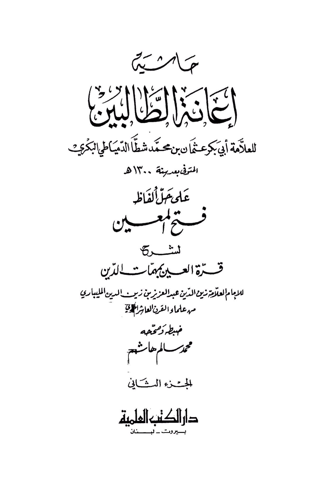
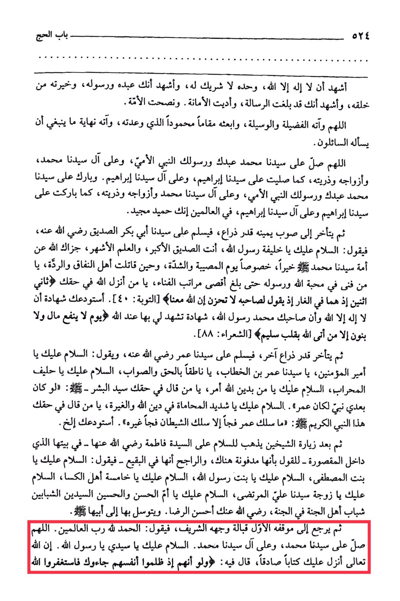

# al-Dimyāṭī (d. 1300)

"Peace be upon you, O Commander of the Believers, our master Umar ibn Al-Khattab. O speaker of truth and correctness, peace be upon you, O protector of the sanctuary, peace be upon you, O one for whom Allah decreed, the one of whom the best of mankind said, 'If there were to be a prophet after me, it would be Umar.' Peace be upon you, O strong in defense of the religion of Allah and in jealousy. The one about whom the noble prophet, peace be upon him, said, 'Whenever Umar takes a path, Satan takes a different path.' I entrust you with... \[the text continues]. After visiting the two companions, he goes to greet Lady Fatimah, may Allah be pleased with her, in her house within the enclosure, to acknowledge that she is buried there, although it is more likely that she is buried in Al-Baqi'. He says: <mark style="color:red;">**"Peace be upon you, O daughter of the Chosen One, peace be upon you, O daughter of the Messenger of Allah, peace be upon you, O fifth of the People of the Cloak, peace be upon you, O wife of our master Ali Al-Murtada, peace be upon you, O mother of Hasan and Husayn, our two young masters, the youth of the people of Paradise in Paradise.**</mark> May Allah be pleased with you with the best of pleasure, and may you intercede for us with your father Allah." Then he returns to his initial position facing the noble face, saying: "Praise be to Allah, the Lord of the worlds. <mark style="color:red;">**O Allah, bestow blessings upon our master Muhammad and the family of our master Muhammad. Peace be upon you, O my master, O Messenger of Allah**</mark>. Indeed, Allah has revealed to you a true Book, in which He said: 'And when they wrong themselves, they come to you, then seek forgiveness from Allah...' \[Quran...]."

"<mark style="color:purple;">**A commentary on "Lughat al-Thalibin" by the scholar Abu Bakr Uthman ibn Muhammad Shatta al-Dimyati al-Bakri**</mark>,"

<figure><figcaption></figcaption></figure> <figure><figcaption></figcaption></figure>

