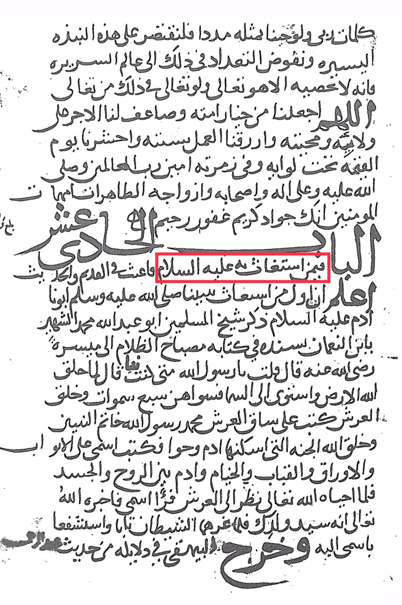
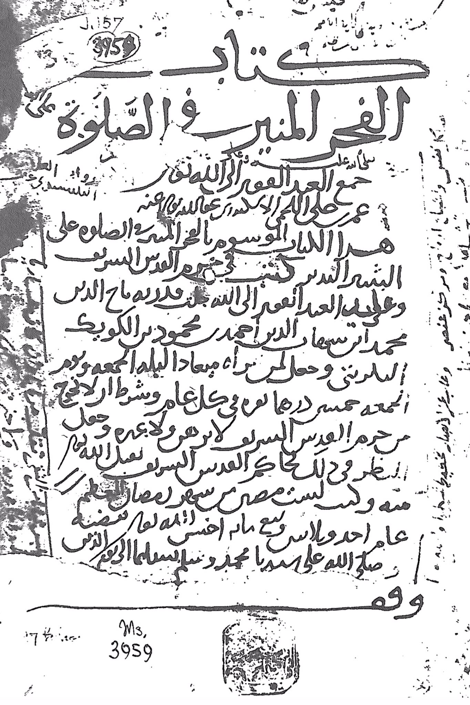

# al-Fākihānī (d. 734)

The words of my Lord, even if we are like him, let us shorten this brief summary and delve into the enumeration in the world of expertise, for it is only the Almighty who can count it, and even if He is exalted in that, let us be among His chosen ones and double the reward for our loyalty and love for Him. May we perform our work with sincerity and be gathered on the Day of Resurrection under His banner and in His group, secure with His signs. May Allah bless him and his family, companions, and pure wives, the mothers of the believers. You are generous, forgiving, merciful. He is the most generous of all who seek His help. Peace be upon him, the sender of knowledge and wisdom. Know that the first one to seek help from Allah was our father Adam, peace be upon him. Mentioned by the leader of the Muslims, Abu Abdullah Muhammad, the martyr, son of Numan, in his book "<mark style="color:red;">**The Lamp of Darkness" to Maysarah**</mark>, may Allah be pleased with him. He said, "I asked, what did the Messenger of Allah say to me?" He said, "When Allah created the earth and rose to the sky, He created seven heavens and created the throne. He wrote on the leg of the throne, 'Muhammad is the Messenger of Allah, the Seal of the Prophets.' And Allah created Paradise, in which He placed Adam and Eve, and He wrote my name on the pillars, leaves, domes, and tents of Paradise, and Adam between the soul and the body. When Allah revived him, he looked at the throne and saw my name. So Allah informed him that he is the master of your offspring in the west. He sought intercession through my name, and the pen wrote it in his evidences from the hadith of Malik."

"<mark style="color:purple;">**the Extinction of Religion, Muhammad Atar Sahar Al-Din, Ahmed Mahmoud Bar Kuwait Al-Bawanti,**</mark>"

<figure><figcaption></figcaption></figure> <figure><figcaption></figcaption></figure>

