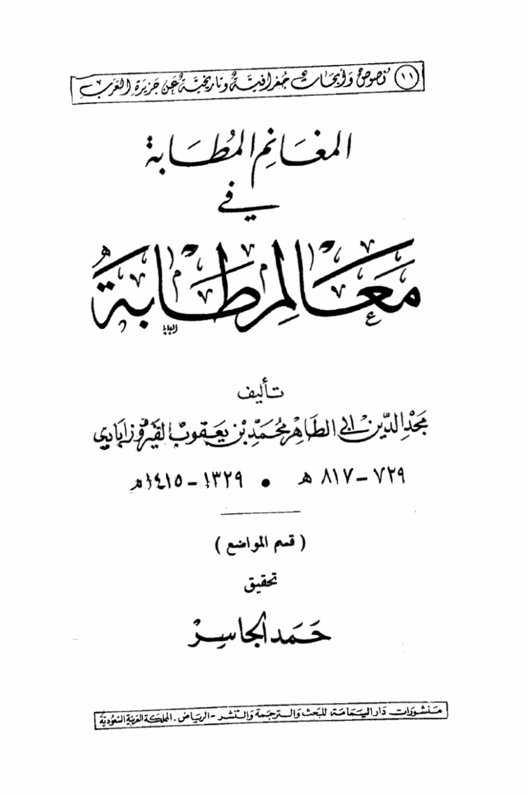
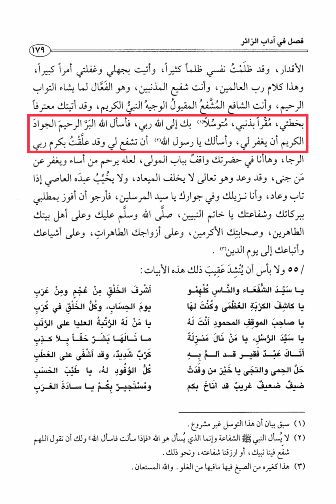

# al-Fayrūzābādī (d. 817)

Chapter on the etiquette of the merciful visitor, 179. I have wronged myself greatly, and I have come with my ignorance and negligence a great matter. This is the speech of the Lord of the worlds, and you are the intercessor of the sinners, and He is the one who does what He wills, the Acceptor of repentance, and you are the intercessor, the accepted, the noble Prophet. I have come to you confessing my mistake, acknowledging my sin, seeking refuge in you to Allah, my Lord. So, I ask Allah, the Most Kind, the Most Merciful, the Generous, to forgive me, and I ask you, O Messenger of Allah, to intercede for me, as I have attached my hopes to the generosity of my Lord. Here I am standing at the door of the Lord, hoping that He will have mercy on those who have erred and forgive those who have sinned, for He has promised, and He does not fail in His promise, nor does He disappoint His repentant servant when he returns. I am your guest and in your presence, O Master of the Messengers. I hope to attain my request through your blessings and intercession, O Seal of the Prophets. May Allah's peace and blessings be upon you and upon your pure family, your noble companions, your pure wives, your followers, and your followers until the Day of Judgment. And it is not a problem to recite the following verses after that: O Master of intercessors and of all people, the most honorable of creation from both non-Arabs and Arabs. O reliever of great distress, on the Day of Reckoning, and all of creation is in distress. O one with the highest rank above all ranks, what no human has truly attained without severe distress, and he has healed the affliction. O praised one in the honored position, you are for him, O Master of the Messengers, O one who has attained a station. A poor servant has come to you seeking refuge in you, O best of those whom all delegations have visited. O pure one, a weak, stranger guest has sought refuge in you. It has been mentioned earlier that this form of seeking intercession is not permissible. Seeking refuge in you, O masters of the Arabs. The Prophet (peace be upon him) is not asked for intercession, but rather the one who is asked is Allah. So, if you ask, then ask Allah. And you may say, "O Allah, let your Prophet intercede for us, or grant us his intercession, and the like." This is like other phrases that contain exaggeration. And Allah is the one sought for help.

"<mark style="color:purple;">**Texts and geographical and historical descriptions from the Arabian Peninsula, the spoils of war in Ma'latiba, authored by Bajad al-Din al-Tahir Muhammad ibn Ya'qub al-Firuzabadi**</mark>"

<figure><figcaption></figcaption></figure> <figure><figcaption></figcaption></figure>

