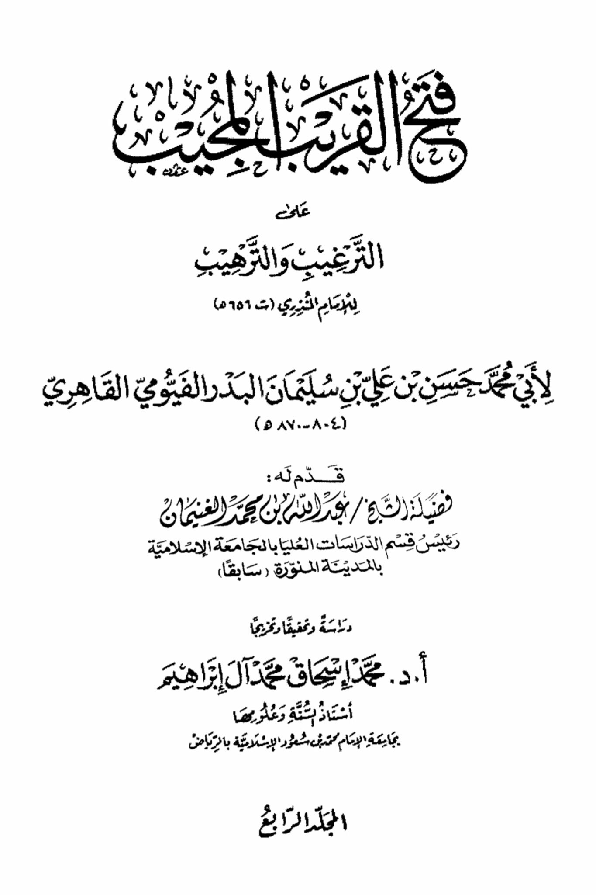
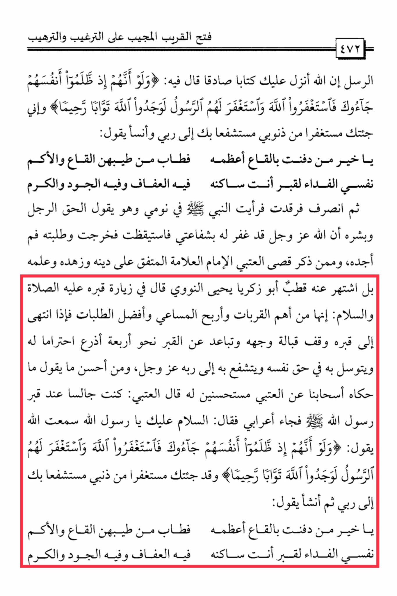

# al-Fayyūmī (d. 870)

The Close and Responsive Opener to Encouragement and Deterrence, the Messengers. Indeed, Allah has revealed to you a truthful Book in which He says: "And if, when they wronged themselves, they had come to you, \[O Muhammad], and asked forgiveness of Allah, and the Messenger had asked forgiveness for them, they would have found Allah Accepting of repentance and Merciful." And I have come to you seeking forgiveness for my sins, seeking intercession through you to my Lord. And Anas said: O best of those buried in the depths, the most magnificent of them, blessed is the fragrance of the depths and the camphor. My soul is the ransom for the grave where you reside, in it is chastity, generosity, and nobility. Then I fell asleep and saw the Prophet (peace be upon him) in my dream saying: "The man spoke the truth, and I give him glad tidings that Allah, the Almighty, has forgiven him through my intercession." I woke up, went out, and searched for him, but I did not find him. And among those mentioned is Qais al-'Atabi, the Imam, the knowledgeable one, committed to his religion and asceticism, renowned for his piety. Abu Zakariya Yahya al-Nawawi said in visiting his grave, may peace and blessings be upon him, that it is one of the most important acts of worship, the most rewarding endeavors, and the best of pursuits. When he reached his grave, he stood facing his face, keeping a distance of about four arms' lengths out of respect for him. He implored him for the sake of himself and sought his intercession with his Lord, the Almighty. And among the best things to say, as narrated by our companions from al-'Atabi, approved by him, he said: I was sitting by the grave of the Messenger of Allah (peace be upon him) when a Bedouin came and said: Peace be upon you, O Messenger of Allah. I heard Allah say: "And if, when they wronged themselves, they had come to you, \[O Muhammad], and asked forgiveness of Allah, and the Messenger had asked forgiveness for them, they would have found Allah Accepting of repentance and Merciful." And I have come to you seeking forgiveness for my sins, seeking intercession through you to my Lord. Then he began to say: O best of those buried in the depths, the most magnificent of them, blessed is the fragrance of the depths and the camphor. My soul is the ransom for the grave where you reside, in it is chastity, generosity, and nobility.

"<mark style="color:purple;">**A dissertation on the use of persuasion and intimidation by Imam al-Khayri (d. 5656) by Abu Muhammad Hasan ibn Ali ibn Sulaiman al-Badr al-Fayoumi al-Qahir**</mark>"

<figure><figcaption></figcaption></figure> <figure><figcaption></figcaption></figure>

