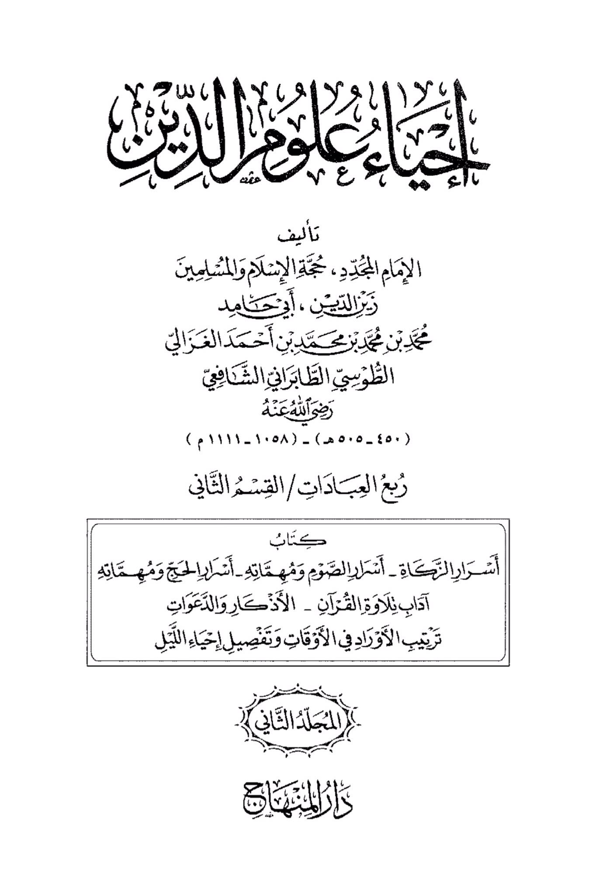
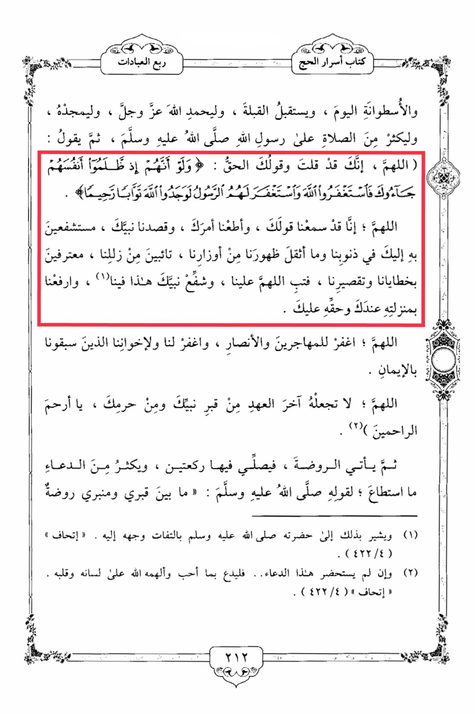

# al-Ghazālī (d. 505)

The book of the secrets of Hajj is a quarter of worship, and the cylinder today, and faces the Qibla, and praises Allah Almighty, and glorifies Him, and increases in sending blessings upon the Messenger of Allah, peace and blessings be upon him, then he says: "O Allah, indeed, You have said the truth in Your saying: 'And if, when they wronged themselves, they had come to you, \[O Muhammad], and asked forgiveness of Allah, and the Messenger had asked forgiveness for them, they would have found Allah Accepting of repentance and Merciful.' <mark style="color:red;">**O Allah, indeed, we have heard Your saying, obeyed Your command, and followed Your Prophet, seeking his intercession for us with You in our sins and the burdens that weigh heavily upon us, repenting from our mistakes, confessing our sins and shortcomings**</mark>. So forgive us, O Allah, and <mark style="color:red;">**let Your Prophet intercede for us, and raise us with his status before You**</mark>. O Allah, forgive the emigrants and the helpers, and forgive us and our brothers who preceded us in faith. O Allah, do not make it the last covenant from the grave of Your Prophet and from Your sanctuary, O Most Merciful of the merciful.' Then he comes to the Rawdah, and prays two units of prayer in it, and increases in supplication as much as he can, for the Prophet, peace and blessings be upon him, said: 'Between my grave and my pulpit is a garden,' indicating his presence by turning his face towards it."

"<mark style="color:purple;">**In the field of religious sciences, authored by the Imam Al-Muhaqqiq, the Proof of Islam and Muslims, Zain al-Din, Ayyad Muhammad ibn Muhammad ibn Muhammad ibn Ahmad Al-Ghazali Al-Qusy Al-Tabarani Al-Shafi'i**</mark>"

<figure><figcaption></figcaption></figure> <figure><figcaption></figcaption></figure>

Commentary:

#### 1. **Misapplication of Quran 4:64:**

The invocation makes use of Quran 4:64, which refers to seeking forgiveness from God and the Prophet asking for forgiveness during his lifetime. The verse explicitly addresses people who approach the Prophet while he is alive, and it does not extend to a posthumous practice of seeking intercession at his grave. This distinction is essential, as stretching the verse to imply the Prophet's ongoing role after death misinterprets its intended context.

* **Context of 4:64:** The verse refers to individuals who wrong themselves and come to the living Prophet for him to ask God for their forgiveness. This is a direct act involving the Prophet’s living intercession, which ceased upon his death. Quran 5:109-111 emphasizes that, after death, prophets no longer have knowledge of what their followers do, undermining the notion of continued intercession after death.

#### 2. **Intercession and the Role of the Prophet:**

While this supplication reflects a common practice among some Muslims, the belief that the Prophet continues to intercede posthumously contradicts clear Quranic principles.

* **Quran 35:14** states that those who are called upon after death cannot hear the prayers of the living, and even if they could, they would not be able to respond. This negates the idea that visiting the Prophet’s grave and seeking his intercession for forgiveness is effective. The emphasis in Islam is always on seeking forgiveness directly from God, as *only* God has the power to forgive sins (Quran 3:135, 39:53).
* The Prophet's role as an intercessor, while significant during his lifetime, does not continue after his death, as made clear in the Quranic narrative.

#### 3. **Hadith about the Rawdah:**

The hadith referenced in the supplication, which mentions "between my grave and my pulpit is a garden from the gardens of Paradise," is often used to justify visiting the Rawdah and praying there. While this hadith is authentic and encourages reverence for this specific area of the Prophet’s mosque, it does not imply that seeking intercession from the Prophet or offering supplications directed toward him posthumously is a valid practice.

* **T**he Prophet himself did not encourage his followers to seek his intercession or direct prayers to him after his death. Instead, he consistently emphasized monotheism (tawhid) and the direct worship of God.

#### 4. **Contradictions with Monotheism (Tawhid):**

The practice of seeking intercession from the Prophet after his death risks undermining the principle of *tawhid*, the core tenet of Islam, which mandates worship and supplication to God alone. This practice of invoking the Prophet at his grave can shift the focus away from God and toward the Prophet, blurring the lines between veneration and supplication, which should be directed only to God.

* **Quranic Emphasis on Direct Worship of God:** The Quran repeatedly emphasizes that believers should call upon God alone for their needs and forgiveness (Quran 2:186, 39:44). Engaging in practices where the Prophet is asked to intercede posthumously conflicts with this message and can lead to an imbalance in the understanding of Islamic monotheism.

#### Conclusion:

The supplication and practice of seeking intercession from the Prophet at his grave, invoking Quran 4:64, distorts the original context of the verse and contradicts core Quranic teachings. The Prophet’s intercession was limited to his lifetime, and seeking forgiveness must always be directed toward God alone. The belief in posthumous intercession misguides believers from the direct worship and repentance that Islam prescribes. It is vital to adhere to the clear Quranic guidance on seeking forgiveness directly from God, maintaining the focus on *tawhid*, the unshakable belief in the oneness of God.
