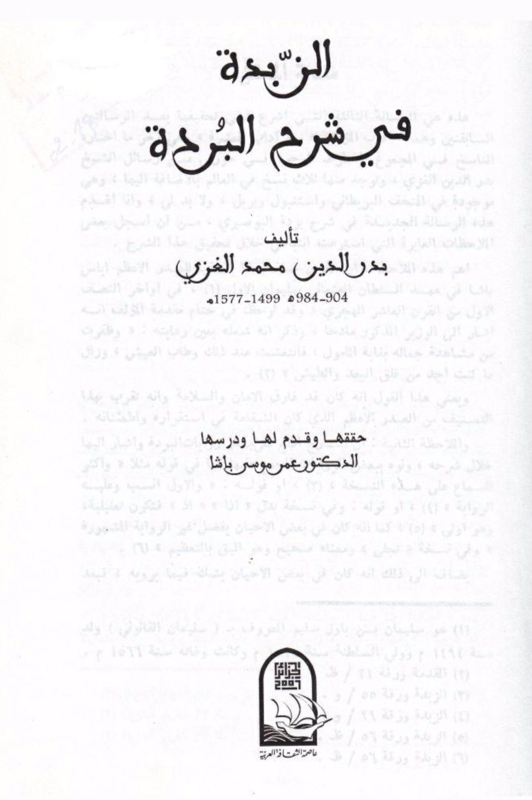
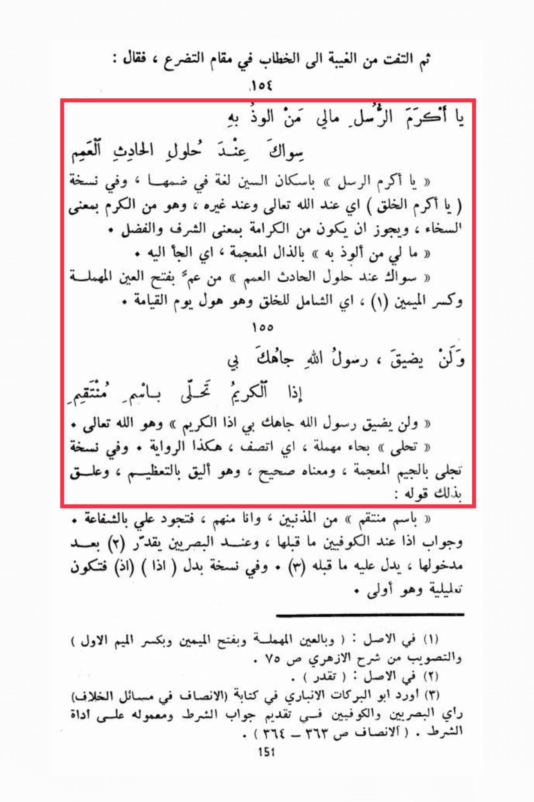

# al-Ghazzī, Badr al-Dīn (d. 984)

Then he turned from gossip to address in a supplicating manner, saying: "O most noble of messengers, I have no one to seek refuge with except you when the great calamity occurs. O most noble of messengers" with a soft 's' in pronunciation, and in some versions "O most noble of creation" (meaning in the sight of Allah and others, and it is from generosity, and it may also mean honor and virtue. I have no one to seek refuge with" with a soft 'z', meaning to turn to you when the great calamity occurs" from 'am with a fatha on the 'ayn and a kasra on the mim, meaning encompassing all of creation, which is the horror of the Day of Resurrection and it will not be constricted, O Messenger of Allah, your status with me will not be diminished when the noble one adorns himself with the name of the Avenger. And in some versions, it is manifested with a hard 'g', and its meaning is correct, and it is more appropriate for exaltation. He added: "with the name of the Avenger" for the sinners, and I am one of them, so grant me your intercession." The response to 'if' is according to the Kufans before it, and according to the Basrans it is estimated after its occurrence, as indicated by what precedes it. In some versions, instead of 'if', it is 'when', which would be explanatory and more appropriate. (1) In the original: "with a soft 'ayn and a fatha on the mim and a kasra on the first mim." The correction is from the explanation by Al-Azhari on page 75. (2) In the original: "it is estimated." (3) Abu Al-Barakat Al-Anbari mentioned in his book "Al-Insaf" in the matters of dispute the opinions of the Basrans and the Kufans regarding the precedence of the response to the condition and its effect on the instrument.

"<mark style="color:purple;">**The two preceding sections of the book "Sharh al-Burdah" by Badr al-Din Muhammad al-Ghazzi**</mark>"

<figure><figcaption></figcaption></figure> <figure><figcaption></figcaption></figure>

