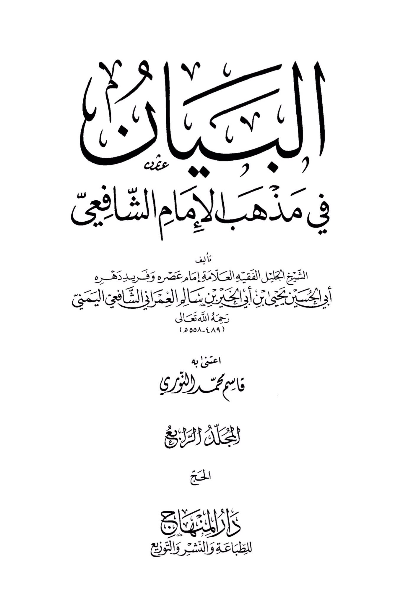
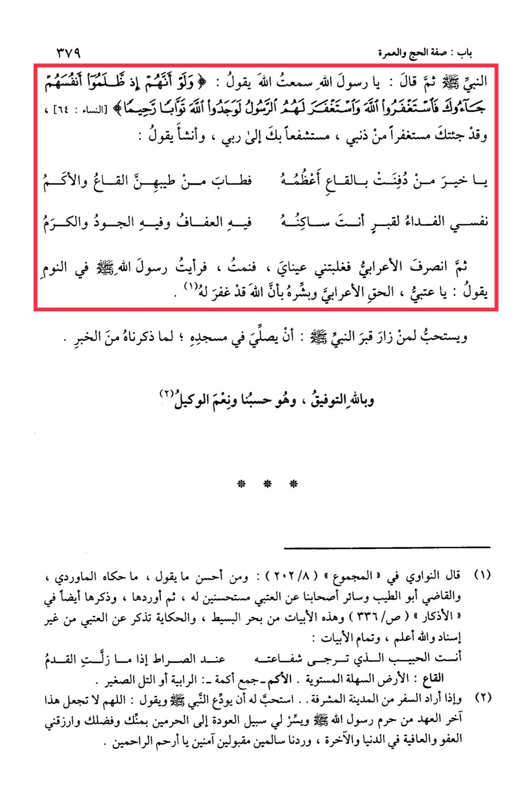

# al-ʿImrānī (d. 558)

"O Messenger of Allah, I heard Allah saying: 'And if, when they wronged themselves, they had come to you, \[O Muhammad], and asked forgiveness of Allah, and the Messenger had asked forgiveness for them, they would have found Allah Accepting of repentance and Merciful.' \[Quran 4:64] And <mark style="color:red;">**I have come to you seeking forgiveness for my sin, seeking your intercession with my Lord**</mark>." Then he recited: "O best of those buried in the valley, its greatness is enhanced by your presence. The valley and the hills are made fragrant by your goodness. <mark style="color:red;">**My soul is a ransom for the grave where you reside**</mark>, in it is chastity, generosity, and nobility." The Bedouin then left, and my eyes grew heavy, so I slept. I saw the Prophet · in my dream saying: "O 'Atabi, convey the truth to the Bedouin and give him glad tidings that Allah has forgiven him." It is recommended for whoever visits the Prophet's grave · to pray in his mosque, as mentioned in the narration. Success is from Allah, and He is Sufficient for us, and the best Disposer of affairs. (1) <mark style="color:purple;">**Al-Nawawi said in Al-Majmu'**</mark> (202/8): "Among the best things to say is what <mark style="color:purple;">**Al-Mawardi narrated**</mark>, and <mark style="color:purple;">**Qadi Abu al-Tayyib**</mark> and our companions narrated from 'Atabi, considering it good. Then he mentioned it and also included it in the <mark style="color:purple;">**Adhkar**</mark> (p. 336). These verses are from <mark style="color:purple;">**Bahr al-Basit**</mark>, and the story is mentioned from 'Atabi without a chain of narration, and Allah knows best. The completion of the verses: You are the beloved whose intercession is hoped for at the Bridge, when the foot slips. Al-Qa'a: flat, level ground. Al-Akm - plural of Akma: hills or small hills. (2) And when one intends to travel from the honored city \[Madinah]... <mark style="color:red;">**it is recommended for him to bid farewell to the Prophet**</mark> · and say: 'O Allah, do not make this the last visit to the sanctuary of the Messenger of Allah ·. Make easy for me the path to return to the two sanctuaries with your grace and favor, grant me forgiveness and well-being in this world and the Hereafter, and return us safely, accepted, and secure, O Most Merciful of the merciful.'"

"<mark style="color:purple;">**The Statement in the School of Imam Shafi'i is a work by the esteemed scholar, the jurist, the unique of his time, Abu al-Hasan Yahya bin Abu al-Khair bin Salim al-Umari al-Shafi'i al-Yemeni**</mark>"

<figure><figcaption></figcaption></figure> <figure><figcaption></figcaption></figure>

