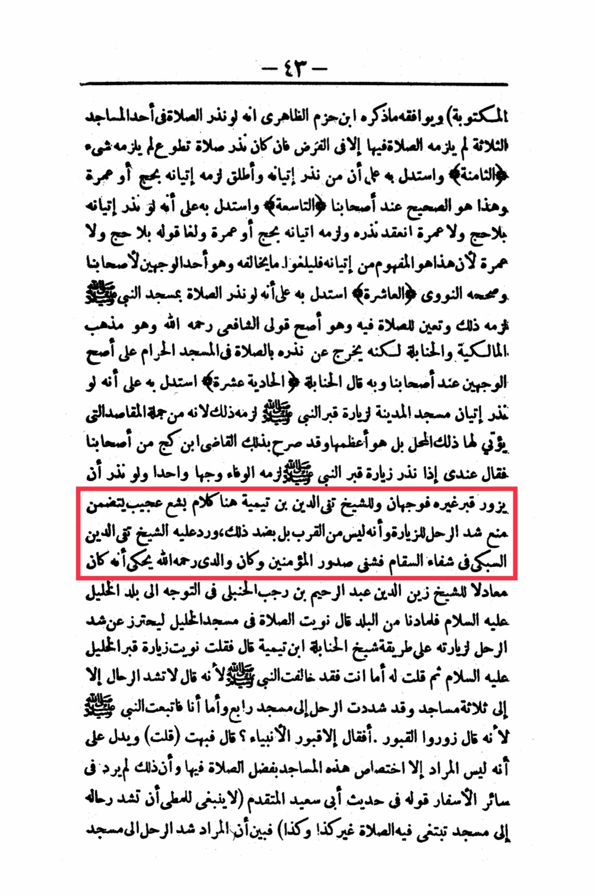

# al-ʿIrāqī, Zayn al-Dīn (d. 806)

The written and Ibn Hazm Al-Zahiri mentioned that if someone vows to pray in one of the three mosques, he is not obligated to pray there except in the case of a debt. If he vowed to pray a voluntary prayer, he is not obligated to do anything. The eighth and he argued that whoever vows to perform Hajj or Umrah, he is obligated to do so, and this is the correct opinion according to our scholars. He also argued that if someone vows to visit the Prophet's Mosque without specifying Hajj or Umrah, his vow is valid and he is obligated to perform Hajj or Umrah. His statement of not specifying Hajj or Umrah is invalid because this is the intended meaning of his vow, so they should invalidate anything that contradicts it, which is one of the two opinions of our scholars, and Al-Nawawi confirmed it. The tenth, he argued that if someone vows to pray in the Prophet's Mosque, he is obligated to do so and prepare for the prayer there, which is the most correct opinion according to Imam Shafi'i, may Allah have mercy on him, and it is the doctrine of the Maliki and Hanbali schools, but it deviates from the vow by praying in the Haram Mosque, according to the most correct opinions of our scholars. The Hanbali school of thought stated that if someone vows to visit the Prophet's grave in the Mosque of the Prophet for the purpose of visiting the Prophet's grave, then he is obligated to fulfill that vow in one way, and if he vows to visit the grave of someone else, there are two ways. Sheikh Taqi al-Din ibn Taymiyyah has some strange and terrible words here, including prohibiting traveling for the purpose of visiting graves, which is not considered an act of piety, but the opposite. Sheikh Taqi al-Din Al-Subki responded to him in "Healing the Sick Hearts of the Believers," and my late father, may Allah have mercy on him, used to narrate that he was a companion of Sheikh Zain al-Din Abdul Rahim ibn Rajab al-Hanbali in traveling to the land of Hebron, peace be upon him. When we arrived in the city, he said, "I intend to pray in the Mosque of Hebron to avoid traveling for the purpose of visiting it, following the method of Sheikh Ibn Taymiyyah." I said, "I intend to visit the grave of Hebron, peace be upon him." Then I said to him, "You have contradicted the Prophet because he said, 'Do not travel except to three mosques,' and you have traveled to a fourth mosque, while I followed the Prophet because he said, 'Visit the graves.' Did he mean the graves of the prophets?" He was speechless, indicating that the intention was to specify these mosques for the virtue of praying in them, and this was not mentioned in other travels. His statement in the hadith of Abu Sa'id Al-Muqaddam (It is not appropriate for a traveler to travel to a mosque seeking to pray there, other than such and such) shows that the intention is to travel to the mosque.

"<mark style="color:purple;">**The book "Tahrir al-Sharib in Explaining al-Ta'rib" is an explanation of the text known as "Taqrib al-Asanid wa Tartib al-Masanid" by the unique Imam, the eminent scholar of his time, the preserver of his era**</mark>"

<figure><figcaption></figcaption></figure> <figure><figcaption></figcaption></figure>

