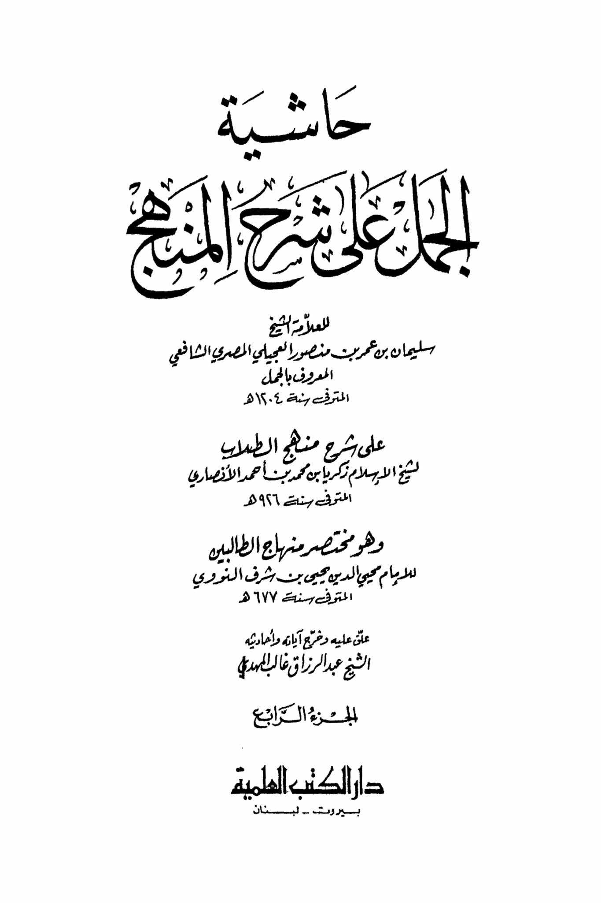
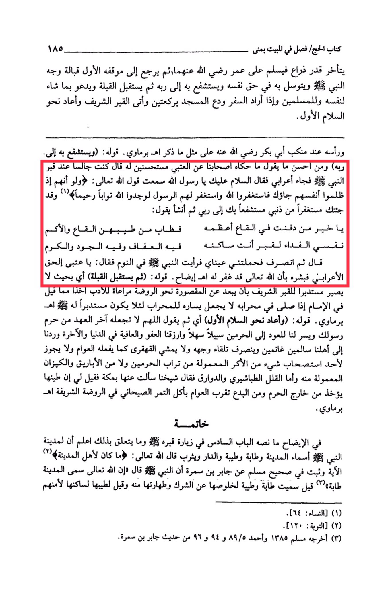

# al-Jamal (d. 1204)

Book of Hajj/ Chapter on Staying in Mina 110. He delays as much as an arm's length, greets Umar, may Allah be pleased with them both, then returns to his initial position facing the Prophet's face, peace be upon him, and intercedes on his behalf, seeking his intercession with his Lord. Then he faces the Qibla, supplicates for himself and for the Muslims as he wishes, and when he intends to travel, he bids farewell to the mosque with two units of prayer, then approaches the noble grave and repeats the initial greeting. His head is at the shoulder of Abu Bakr, may Allah be pleased with him, as mentioned by al-Barmaqi in his statement: "And he intercedes on his behalf to his Lord." One of the best things to say is what our companions narrated from al-Atbi, approved by him, who said, "I was sitting by the Prophet's grave when a Bedouin came and said, 'Peace be upon you, O Messenger of Allah. I heard the saying of Allah the Almighty: 'And if, when they wronged themselves, they had come to you, \[O Muhammad], and asked forgiveness of Allah, and the Messenger had asked forgiveness for them, they would have found Allah Accepting of repentance and Merciful.' (Quran 4:64). So, I have come to you seeking forgiveness for my sins, interceding through you to my Lord." Then he began to say, "My soul, O best of those buried in the depths, the greatest of them are the stems of your fragrant plants, the depths and the hills are the ransom for the grave where you reside, in it is chastity, generosity, and nobility." He then left, and my eyes carried me to see the Prophet in a dream saying, "O Atbi, the Bedouin spoke the truth, so give him glad tidings that Allah the Almighty has forgiven him." Al-Isharah: His statement, "Then he faces the Qibla," meaning in a way that he does not turn his back to the noble grave by moving away from the enclosure towards the Rawdah, out of respect, taking into account what is said about the Imam when he prays in his mihrab, not placing his left side towards the mihrab so as not to turn his back to it. Al-Barmaqi: His statement, "And repeats the initial greeting," meaning then he says, "O Allah, do not make it the last covenant for the one prohibited from your Messenger's sanctuary, and make it easy for us to return to the two sanctuaries, and grant us forgiveness and well-being in this world and the Hereafter, and return us to our families safe and victorious." He then turns away towards his face and does not walk backward like the foolish, nor is it permissible for anyone to take anything from the sacred soil of the two sanctuaries, nor from the containers and pitchers made from it. As for the small chalk pieces and the small containers, our sheikh said, "I asked about them in Mecca, and I was told that their clay is taken from outside the sanctuary." And from the innovations is the common people's approach of eating the Suhani dates in the noble Rawdah. Al-Barmaqi: Conclusion of the clarification, as stated in the sixth chapter on visiting his grave and related matters, know that the Prophet's city has various names: Al-Madinah, At-Tabah, At-Tayyibah, Ad-Dar, and Yathrib. Allah the Almighty said, "It is not for the people of the city." (Quran 9:120). And it is confirmed in Sahih Muslim from Jabir bin Samurah that the Prophet said, "Indeed, Allah the Almighty named it At-Tabah." It was said that it was named At-Tabah and At-Tayyibah due to its purity from polytheism and its cleanliness from it, or it was said for its goodness because of its inhabitants' safety. (1) \[Quran 4:64]. (2) \[Quran 9:120]. (3) Narrated by Muslim 1385, Ahmad 89/5, 94, and 96 from the hadith of Jabir bin Samurah. Al-Madinah.

"<mark style="color:purple;">**The marginal notes on the explanation of the product by the scholar Sheikh Sulaiman bin Omar bin Mansour Al-Ajili Al-Masri Al-Shafi'i, known as Al-Jamal,**</mark>"

<figure><figcaption></figcaption></figure> <figure><figcaption></figcaption></figure>

