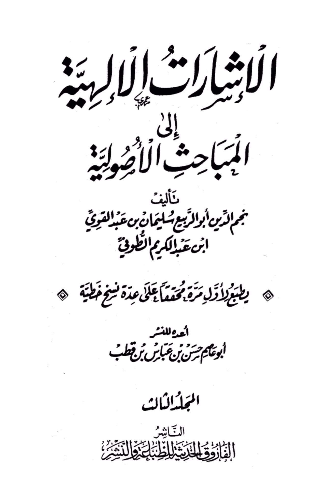
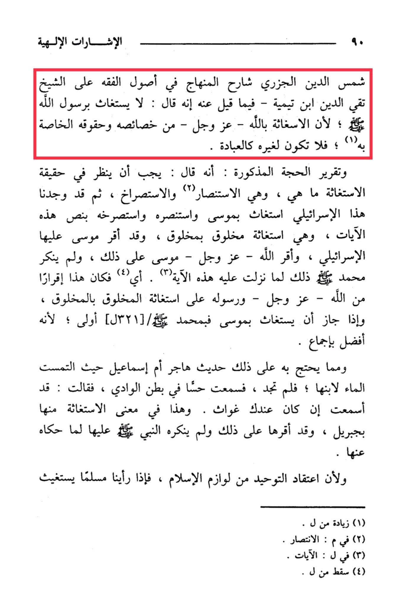

# al-Jazarī, Shams al-Dīn (d. 711)

The divine signs of Shams al-Din al-Jazari, the explainer of the curriculum in the fundamentals of jurisprudence, on Shaykh Taqi al-Din Ibn Taymiyya - it is said about him that he said: "<mark style="color:yellow;">One should not seek help from the Messenger of Allah, because seeking help from Allah - exalted be He - is one of His unique attributes and rights, so it should not be directed to anyone else like worship."</mark> <mark style="color:red;">**And the clarification of the mentioned proof: that he said: "It must be examined what the reality of seeking help is, which is seeking support, calling for help, and crying out for help.**</mark> Then we found this Israelite seeking help from Moses and seeking support and calling out to him with the text of this, and Moses affirmed it with the verses, and it is seeking help from a creature by a creature - the Israelite, and Allah affirmed that for Muhammad when this verse was revealed to him. So, this was an affirmation - exalted be He - by Moses on that, and neither Allah nor His Messenger denied seeking help from a creature by a creature. <mark style="color:red;">**And if it is permissible to seek help from Moses, then seeking help from Muhammad is more fitting, because he is superior by consensus.**</mark> And one of the proofs for this is the narration of Hajar, the mother of Isma'il, when she sought water for her son and did not find any, then she heard a sound in the valley, so she said: 'You have been heard if you have any help,' and this is in the sense of seeking help from him, and the Prophet affirmed it for her and did not deny it when Jibril narrated it from her. And since believing in the oneness of Allah is a necessary part of Islam, if we see a Muslim seeking help, it is an increase in faith."

"<mark style="color:purple;">**The signs indicate that the manuscript "Al-Isharat ila al-Mabahith al-Awdaniyya" by Najm al-Din Abu al-Rabi' Sulaiman ibn Abdul Qawi ibn Abdul Karim al-Tuqi is being printed for the first time, edited on several manuscript sources prepared for publication by Abu Ayyim Hasan ibn Abbas ibn Qutb in the third volume. Publisher: Al-Faruq al-Haditha for Publishing and Distribution**</mark>."

<figure><figcaption></figcaption></figure> <figure><figcaption></figcaption></figure>

