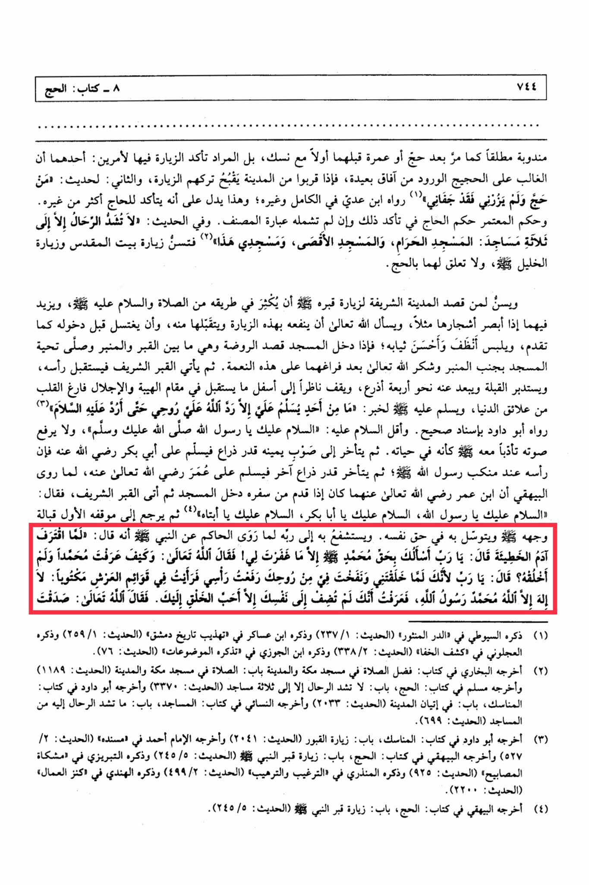

# al-Khaṭīb al-Shirbīnī (d. 977)

Upon entering the mosque, they should head towards the Rawdah, which is between the grave and the pulpit, and offer the mosque's greeting next to the pulpit. After completing the prayers, they should thank Allah for this blessing. Then they should approach the noble grave, facing his head, turn towards the Qibla, stand about four arms' lengths away, look down with reverence and awe, emptying their hearts from worldly distractions. <mark style="color:red;">**They should greet him, saying: "Peace be upon you, O Messenger of Allah, may the peace and blessings of Allah be upon you."**</mark> They should not raise their voices as if he were still alive. Then they should move to their right about an arm's length and greet Abu Bakr, then move back another arm's length and greet Umar. It is reported that Ibn Umar used to enter the mosque upon returning from a journey, <mark style="color:red;">**visit the Prophet's grave, and say: "Peace be upon you, O Messenger of Allah, peace be upon you, O Abu Bakr, peace be upon you, O my father.**</mark>" Then they should return to their original position facing his face, supplicate for themselves, and seek his intercession with their Lord.&#x20;

"<mark style="color:purple;">**The meaning of the need for understanding the meanings of the words of the curriculum by Sheikh Shams al-Din Muhammad ibn al-Khatib al-Shirbini**</mark>"

<figure><figcaption></figcaption></figure> <figure><figcaption></figcaption></figure>

