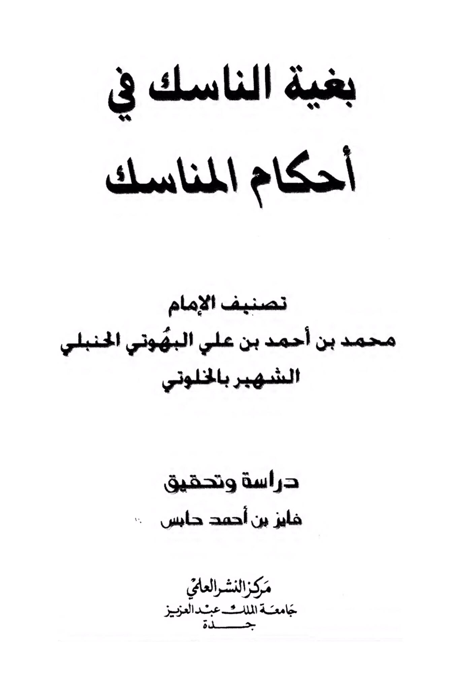
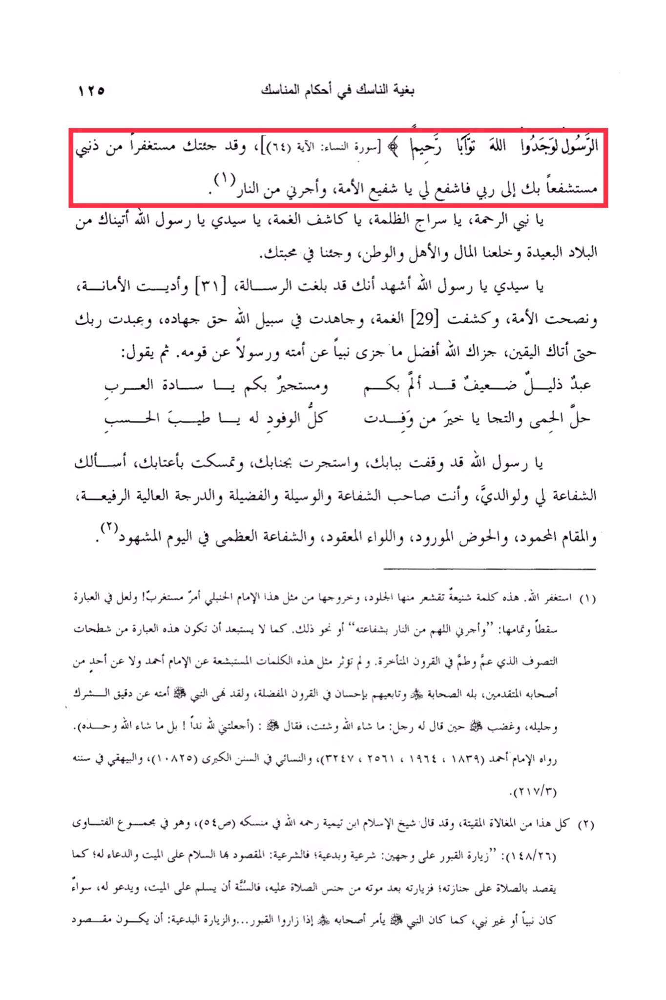

# al-Khalwatī (d. 1088)

al-Khalwatī (d. 1088), a Ḥanbalī Faqīh, recommends the visitor to say “I have come to you, repenting from my sins, seeking your intercession with my Lord, so intercede for me, O interceder of the Ummah, and save me from hellfire”.

The purpose of the ascetic in the rulings of the rituals, the Messenger found Allah Forgiving, Merciful \[Surah An-Nisa: Verse 64], and I have come to you seeking forgiveness, seeking refuge in you to my Lord, so intercede for me, O intercessor of the Ummah, and save me from the Fire. My sins, O Prophet of Mercy, O lamp in the darkness, O dispeller of gloom, O my master, O Messenger of Allah, we have come to you from distant lands, leaving behind wealth, family, and homeland, and we have come in your love. O my master, O Messenger of Allah, I bear witness that you have conveyed the message, and fulfilled the trust, advised the Ummah, dispelled the gloom, strived in the cause of Allah with true jihad, worshipped your Lord until certainty came to you. May Allah reward you with the best reward that a prophet has been rewarded for his nation and a messenger for his people. Then he says: A humble and weak servant who has been afflicted and seeks refuge in you, O leaders of the Arabs, the sanctuary has been violated, and the plea for help, O best of all delegations to whom all delegations turn, O pure one, O Messenger of Allah, I stand at your door, seek refuge in your presence, hold onto your threshold, I ask you for intercession for me and my parents, as you are the possessor of intercession, means, virtue, high rank, praised station, the Basin of Abundance, the Ensign tied, the great intercession on the Day of Resurrection. This is a terrible statement that makes the skin crawl, and its coming from such an Imam of the Hanbali school is surprising! Perhaps there is a mistake in the expression and its completion: "And grant me deliverance from the Fire, O Allah, through his intercession or something similar. It is not unlikely that this expression is from the Sufism that prevailed in the later centuries. Such appalling words have not been attributed to Imam Ahmad or any of his early companions, nor to the Companions of Allah and their followers in the favored centuries. The Prophet · forbade his Ummah from the minutiae and exaggeration of polytheism, and he was angry when a man said to him: "Whatever Allah wills and you will," so he said: "(Have you made me a partner with Allah? No, whatever Allah wills alone)." Narrated by Imam Ahmad (1839, 1964, 2561, 3247), and An-Nasai in his Sunan Al-Kubra (10825), and Al-Bayhaqi in his Sunan (217/3). All of this is detestable exaggeration, and Shaykh al-Islam Ibn Taymiyyah, may Allah have mercy on him, said in his book on rituals (p. 54), and it is in the collection of his fatwas (148/26): "Visiting graves has two aspects: legitimate and innovative; the legitimate aspect is to greet the deceased and supplicate for him, as one intends by praying for his funeral; visiting him after his death is similar to praying for him, so it is Sunnah to greet the deceased and supplicate for him, whether he is a prophet or not, as the Prophet of Allah used to instruct his companions when they visited the graves... and the innovative visit: when the intention is to

"<mark style="color:purple;">**The book "The Seeker's Quest in the Rulings of Rituals" by Imam Muhammad bin Ahmad bin Ali al-Buhuti al-Hanbali, known as al-Khalwati**</mark>"

<figure><figcaption></figcaption></figure> <figure><figcaption></figcaption></figure>

