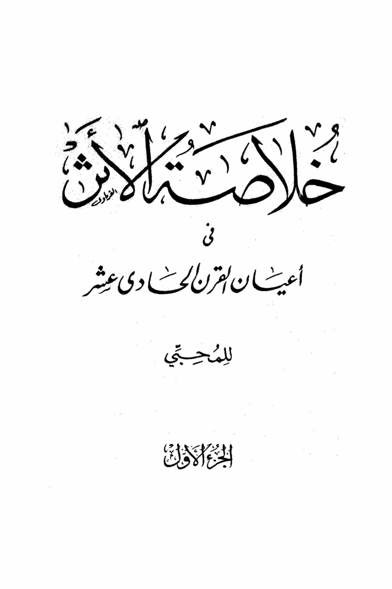
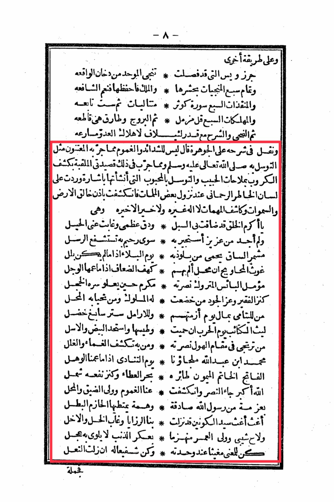

# al-Laqqānī (d. 1041)

al-Laqqānī (d. 1041), author of the famous “Jawharah al-Tawḥīd”, says: “There is nothing that has been tried when one is in a state of hardship more successful than Tawassul through the Prophet ”. He then narrates a poem of his, containing Tawassul and Istighāthah.

In another way, Jirz and Yass, which have been separated, save the monotheist from the smoke of reality and complete the seven saviors by crowding them. And the king, preserve them, what a great intercessor and the seven openings, Surah Al-Kawthar, consecutive, then followed by Surah Al-Tawbah and the seven destroyers, say Al-Muzzammil, then the constellations and the morning star are cutting through, then the morning light and the relief with a measure of thousands for the destruction of the enemy in haste. And in its explanation, he said, "There is no hardship or distress that the caretakers have experienced, like seeking intercession through the Prophet, peace and blessings be upon him." And among what has been experienced in that is my poem entitled "The Unveiling of Sorrows through the Ways of the Beloved and Seeking Intercession with the Beloved," which I composed with a signal that came to the tongue of the compassionate heart when some calamities descended, and it was revealed by the permission of the Creator of the heavens and the earth, the Revealer of secrets, there is no god but Him, and there is no goodness except His goodness. O Most Generous of creation, my paths have become narrow, my bones are breaking, and the means have disappeared from me, and I find no one to seek refuge with except the Merciful, through whom the messengers intercede, the one with bared legs who protects those who seek refuge with him on the Day of Distress, when there is no one else to turn to. The Ghaus of the desperate, the one who protects from the calamities, there is no god but Him, and there is no goodness except His goodness. O Most Honored of creation, my paths have become narrow, my bones are breaking, and the means have disappeared from me, and I find no one to seek refuge with except the Merciful, through whom the messengers intercede, the one with bared legs who protects those who seek refuge with him on the Day of Distress, when there is no one else to turn to. The Ghaus of the desperate, the one who protects from the calamities, there is no god but Him, and there is no goodness except His goodness. O Most Honored of creation, my paths have become narrow, my bones are breaking, and the means have disappeared from me, and I find no one to seek refuge with except the Merciful, through whom the messengers intercede, the one with bared legs who protects those who seek refuge with him on the Day of Distress, when there is no one else to turn to. The Ghaus of the desperate, the one who protects from the calamities, there is no god but Him, and there is no goodness except His goodness. O Most Honored of creation, my paths have become narrow, my bones are breaking, and the means have disappeared from me, and I find no one to seek refuge with except the Merciful, through whom the messengers intercede, the one with bared legs who protects those who seek refuge with him on the Day of Distress, when there is no one else to turn to. The Ghaus of the desperate, the one who protects from the calamities, there is no god but Him, and there is no goodness except His goodness. O Most Honored of creation, my paths have become narrow, my bones are breaking, and the means have disappeared from me, and I find no one to seek refuge with except the Merciful, through whom the messengers intercede, the one with bared legs who protects those who seek refuge with him on the Day of Distress, when there is no one else to turn to. The Ghaus of the desperate, the one who protects from the calamities, there is no god but Him, and there is no goodness except His goodness. O Most Honored of creation, my paths have become narrow, my bones are breaking, and the means have disappeared from me, and I find no one to seek refuge with except the Merciful, through whom the messengers intercede, the one with bared legs who protects those who seek refuge with him on the Day of Distress, when there is no one else to turn to. The Ghaus of the desperate, the one who protects from the calamities, there is no god but Him, and there is no goodness except His goodness. O Most Honored of creation, my paths have become narrow, my bones are breaking, and the means have disappeared from me, and I find no one to seek refuge with except the Merciful, through whom the messengers intercede, the one with bared legs who protects those who seek refuge with him on the Day of Distress, when there is no one else to turn to

"<mark style="color:purple;">**Al-Faryawi in the Annals of the Eleventh Century for Enthusiasts Part One**</mark>"

<figure><figcaption></figcaption></figure> <figure><figcaption></figcaption></figure>

