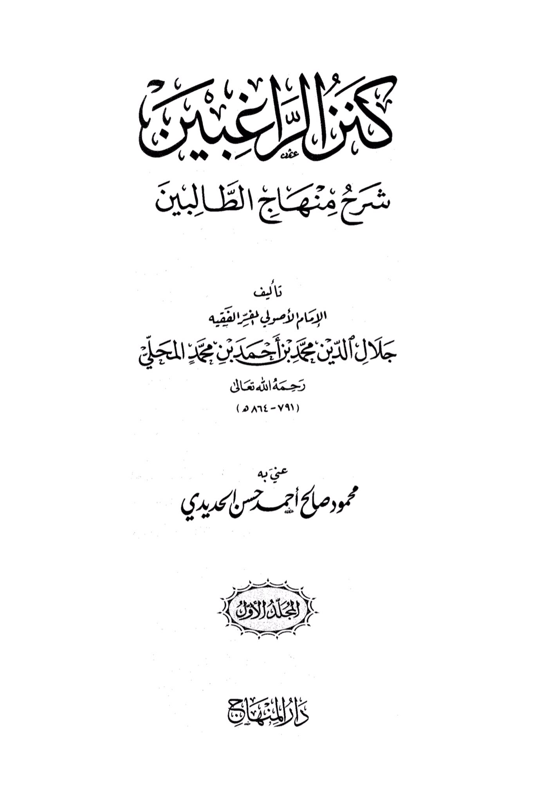
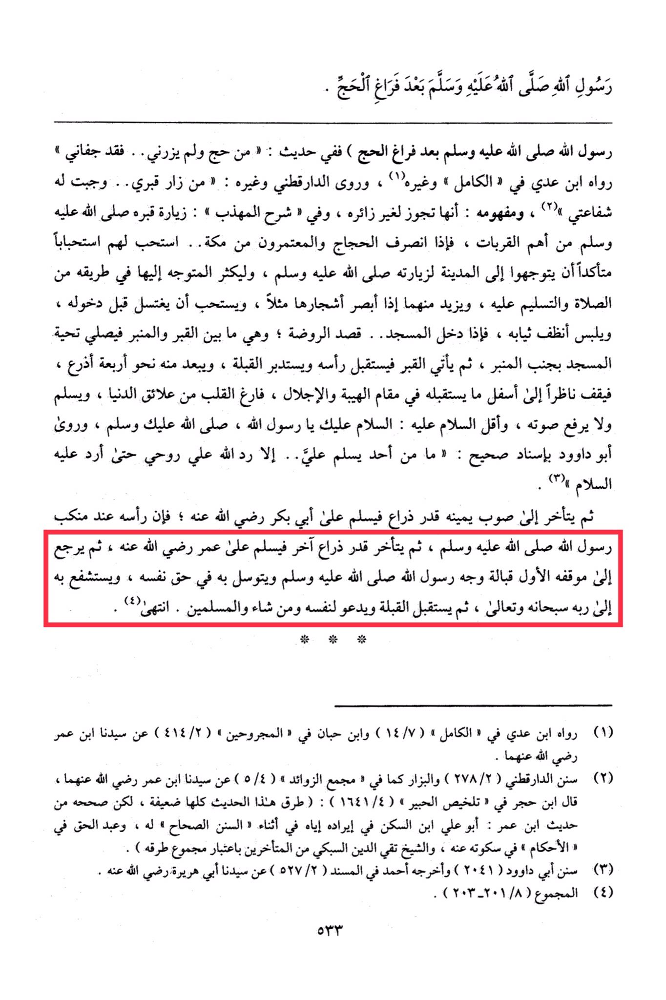

# al-Maḥallī (d. 864)

&#x20;It is recommended to perform ablution before entering, wear clean clothes, and upon entering the mosque, head towards the Rawdah (the area between the Prophet's grave and the pulpit). There, one should <mark style="color:red;">**offer the greeting of the mosque next to the pulpit, then approach the grave facing his head, turn towards the Qibla, and stand about four arms' length away, looking down in a position of reverence and awe, with a heart free from worldly distractions**</mark>. <mark style="color:red;">**Greet him without raising your voice, saying, "Peace be upon you, O Messenger of Allah, may the peace and blessings of Allah be upon you**</mark>." Abu Dawood reported with a sound chain of narration, "Whenever someone sends greetings upon me, Allah returns my soul to me so I can respond to them." <mark style="color:red;">**Then, move slightly to the right and greet Abu Bakr, may Allah be pleased with him, whose head is by the shoulder of the Messenger of Allah, peace and blessings be upon him. Then, move another arm's length to the right and greet Umar, may Allah be pleased with him. Return to the initial position facing the Prophet, peace and blessings be upon him, and seek his intercession for yourself**</mark>, supplicate to Allah for yourself and for all Muslims. This is the end of the text.

"<mark style="color:purple;">**The Treasure of the Rich: An Explanation of the Path of the Seekers, authored by the eminent scholar and jurist Jalal al-Din Muhammad ibn Muhammad al-Mahalli al-Fayyumi**</mark>"

<figure><figcaption></figcaption></figure> <figure><figcaption></figcaption></figure>

