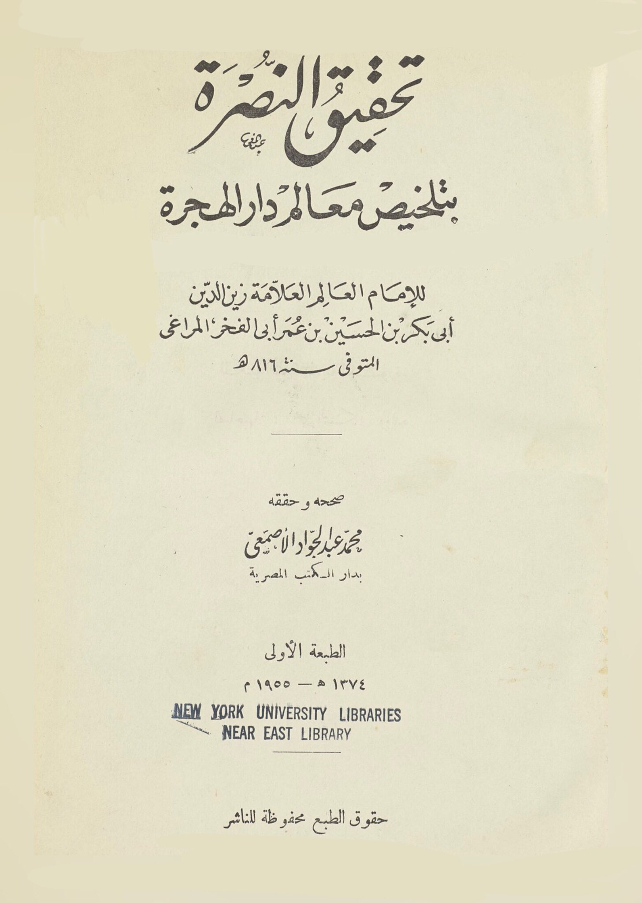
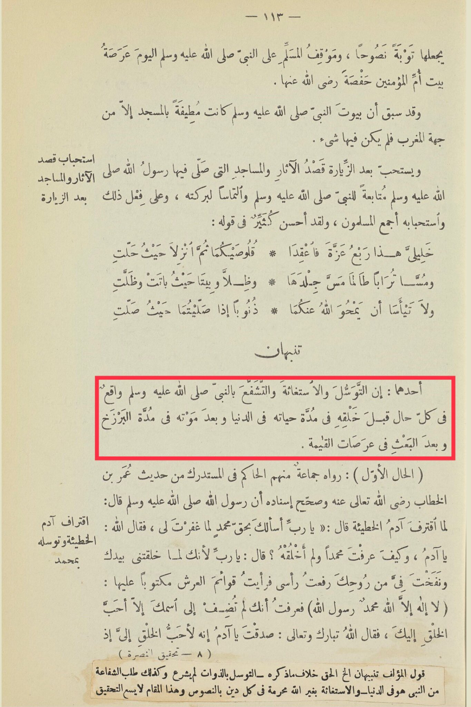

# al-Marāghī (d. 816)

It makes it a sincere repentance, and the position of the Muslim on the Prophet, peace be upon him, today is a visit to the house of the Mother of the Believers, Hafsah, may Allah be pleased with her. It was previously mentioned that the houses of the Prophet, peace be upon him, were connected to the mosque except for the western side, where there was nothing. It is recommended to visit and it is also recommended after the visit to visit the historical sites and mosques where the Messenger of Allah, peace and blessings be upon him, prayed. Visiting these historical sites and mosques is a way to follow the Prophet, peace be upon him, and seek his blessings. It is a recommended practice unanimously agreed upon by Muslims. Many have excelled in saying: "This is the quarter of honor, so hold on to it. Wherever it settles, it remains dust as long as it is from its skin. And it does not remain where it stays and becomes a place of sin if you pray where it prays. Do not despair that Allah will forgive you." Note that seeking intercession, seeking help, and seeking the Prophet's intercession, peace be upon him, are realities in all circumstances before his creation during his lifetime in this world, after his death in the period of the grave, and after resurrection in the stages of the Hereafter. The discourse approves of sin and seeking his intercession (the first case): Narrated by a group, including Al-Hakim in Al-Mustadrak, from the hadith of Umar bin Allah, may He be exalted, that the Messenger of Allah, peace be upon him, said: When Adam committed the sin, he said, "O Lord, I ask You by the right of Muhammad to forgive me." So Allah said, "Adam sinned, O Adam, how did you know Muhammad when I did not create him?" Adam said, "O Lord, when You created me with Your hand and blew into me from Your soul, I raised my head and saw the pillars of the Throne with 'There is no god but Allah, Muhammad is the Messenger of Allah' written on them. I knew that You did not write anything next to Your name except the dearest of creation to You." So Allah, glorified and exalted be He, said, "You have spoken the truth, O Adam. He is indeed the dearest of creation to Me." The author's statement emphasizes that seeking intercession through entities that have not been legislated and seeking intercession from the Prophet in this world, as well as seeking help from other than Allah, is prohibited in all religions by textual evidence, and this matter does not allow for investigation.

"<mark style="color:purple;">**The Victory of Support: Summarizing the Features of Dar Al-Hijra by the renowned scholar Imam Zain al-Din Abu Bakr ibn al-Hussein ibn Umar Abu al-Fakhr al-Maraghi, who passed away in the year 816 AH**</mark>"

<figure><figcaption></figcaption></figure> <figure><figcaption></figcaption></figure>

