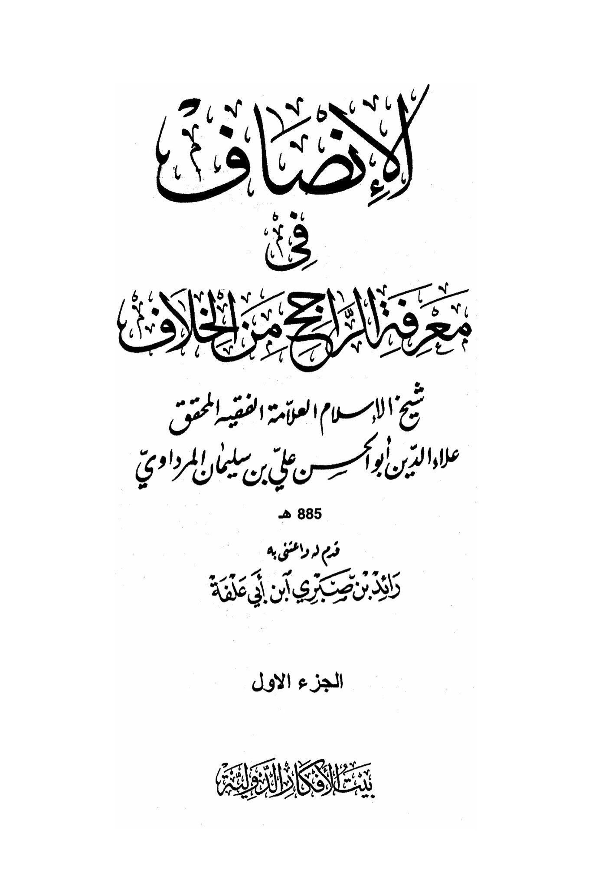
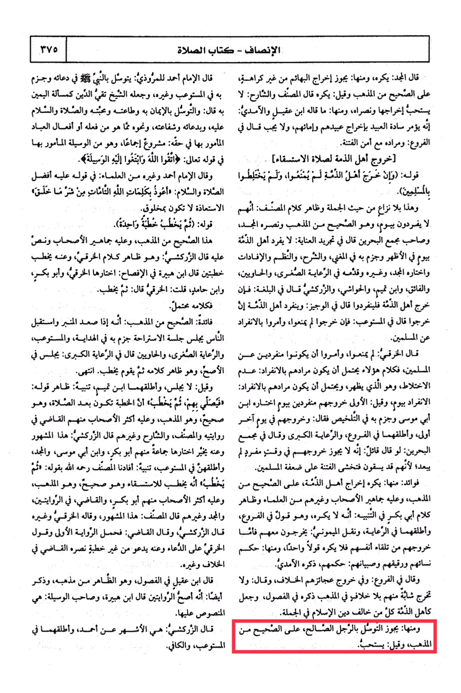

# al-Mardāwī (d. 885)

according to Al-Mustawib and others, and Shaykh Taqi al-Din made it a matter like swearing an oath, it is recommended to fulfill it and seek help. <mark style="color:red;">**Some have said what Ibn Aqeel and Al-Amidi said: seeking intercession through faith in Him, obedience to Him, love for Him, prayers, and peace**</mark>. ... He said in Al-Ra'ayah Al-Kubra: He sits among the Muslims, the speech of these scholars suggests that their intention in being alone is not the correct opinion, and this is the apparent speech of Al-Khurqi, then he stands to deliver the sermon. End. Mixing, which is what appears, and it is possible that their intention in being alone is to not sit, and it is said: do not sit, and Ibn Tamim mentioned both, a clear indication in his saying: being alone for a day, and it is said: it is preferable for them to go out alone on a day, chosen by Ibn Fayy, and he prays with them, then he delivers the sermon. It is stated that the sermon should be after the prayer, and this is the opinion of Abu Musa and it is affirmed in Al-Talkees, he said: and their going out on another day is correct, and it is the school of thought, and this is the opinion of the majority of the companions, the judge in the first, and he mentioned it in the branches, Al-Ra'ayah Al-Kubra. He said in his compilation of his narrations, the author, Al-Zarkashi said, and the judge said: The first narration carries the statement of their leaving of their own accord, so it is not disliked to say a single statement about it, such as the ruling of Al-Kharaqi on supplication, and he calls for it without a sermon, as mentioned by the judge in his book "Yab'ad Al-Khilaf" and others. Their women, slaves, and children: their rulings were mentioned by Al-Amidi. He also said in the branches: There is a difference of opinion regarding the departure of their elderly. Ibn Aqeel said in his chapters, which is apparent from his school of thought, and he mentioned the departure of a young woman from them without any disagreement in the school of thought, as mentioned in the chapters. Ibn Hubayra said that it is the most authentic of the two narrations. The author of Al-Wasilah said: They are like the people of the covenant, all those who differ from the religion of Islam in its entirety. <mark style="color:red;">**It is permissible to seek intercession through a righteous person, according to what Al-Zarkashi said is the most famous opinion attributed to Ahmad, and he mentioned them in the text. It is said that it is recommended according to Al-Mustaw'ib and Al-Kafi.**</mark>

"<mark style="color:purple;">**The addition of knowledge brings peace from conflict. The great scholar, jurist, and researcher Alaa al-Din Abu al-Hasan Ali ibn Suleiman al-Mardawi, known as Sheikh al-Islam, was born in 885 AH.**</mark>"

<figure><figcaption></figcaption></figure> <figure><figcaption></figcaption></figure>

