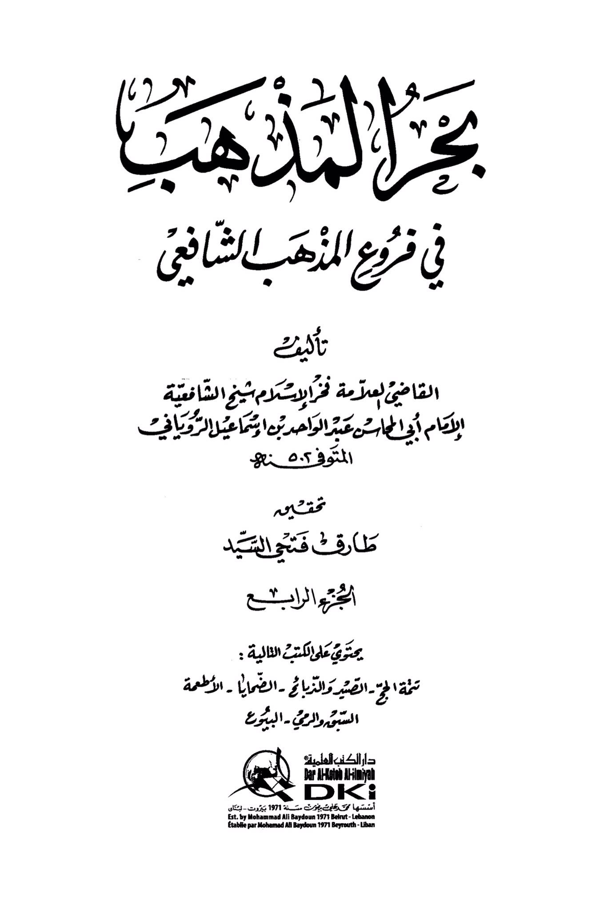
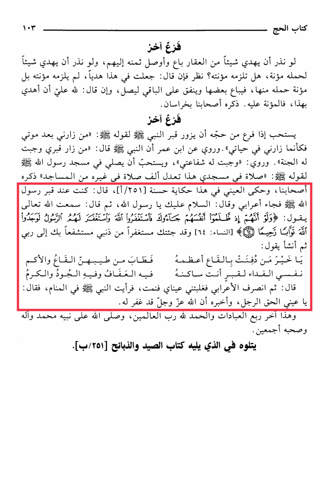

# al-Māwardī (d. 450)

<mark style="color:yellow;">An important Imām in the Shāfiʿī Madhhab</mark>, says in his huge Fiqh encyclopedia titled “al-Ḥāwī” that visiting the grave of the Messenger is recommended, then mentions the narration of al-ʿUtbī in which a man sought intercession from the Messenger.

It is recommended that when someone performs Hajj, they visit the Prophet's grave, for his saying, "<mark style="color:red;">**Whoever visits me after my death is as if he visited me during my lifetime**</mark>." It is narrated from Ibn Umar that the Prophet said, "Whoever visits my grave, Paradise is guaranteed for him." <mark style="color:red;">**It is also narrated that my intercession is guaranteed for him**</mark>. It is recommended to pray in the Mosque of the Prophet, for his saying, "A prayer in my mosque is equivalent to a thousand prayers in other mosques," as mentioned by our companions. Al-Ayni narrated a good story in this regard: "<mark style="color:red;">**I was at the Prophet's grave when a Bedouin came and said, 'Peace be upon you, O Messenger of Allah**</mark>.' Then he said, 'I heard Allah say, 'If they had only, when they were unjust to themselves, come to you and asked Allah's forgiveness, and the Messenger had asked forgiveness for them, they would have found Allah indeed Oft-Returning, Most Merciful.' (Quran 4:64). <mark style="color:red;">**I have come to you seeking forgiveness for my sins, seeking your intercession with my Lord**</mark>.' Then he recited, 'O best of those buried in the earth, the most fragrant of fragrances emanate from your grave. My soul is the ransom for the grave where you reside, in it is chastity, generosity, and kindness.' Then the Bedouin left, and my eyes closed, and I slept. I saw the Prophet in my dream, and he said, 'O truthful man, inform him that Allah has forgiven him.' This concludes the last quarter of worship, and all praise is due to Allah, the Lord of all worlds. May Allah bless His Prophet Muhammad and his family and all his companions. This is followed by the book of hunting and slaughtering in the next section.&#x20;

"<mark style="color:purple;">**The Summary of the Shafi'i School in the Branches of the Shafi'i School, authored by the esteemed judge, the pride of Islam, the Sheikh of the Shafi'i school, Imam Abu Al-Mu'ash Abdul Wahid bin Ismail Al-Ruwayani**</mark>"

<figure><figcaption></figcaption></figure> <figure><figcaption></figcaption></figure>

Commentary:

#### 1. **Misapplication of Quran 4:64**:

The narration of al-ʿUtbī and its use of Quran 4:64 misrepresents the verse’s meaning. In the Quran, 4:64 clearly refers to a scenario where people seek forgiveness **from God** during the **lifetime** of the Prophet, and the Prophet, on his own volition, asks for their forgiveness. Nowhere does the verse suggest that people should or can approach the Prophet **after** his death to intercede for them. This misunderstanding stretches the text beyond its original context.

* **Context of 4:64**: As per the Arabic wording, the verse discusses individuals who "come to you" (i.e., the Prophet) while he is alive, with the messenger acting to pray for their forgiveness. This mirrors how **angels** pray for believers (40:7), an act of advocacy that occurs only during the Prophet’s lifetime. Once the Prophet dies, the verse no longer applies, as confirmed by Quran 5:109-111, which shows the Prophet having no knowledge of events on earth after his death.

#### 2. **Theological Flaw in Posthumous Intercession**:

The narration claims that a man went to the Prophet’s grave, recited Quran 4:64, and was forgiven after seeing the Prophet in a dream. However, this belief in posthumous intercession contradicts several Quranic principles:

* **5:109-111**: These verses emphasize that on the Day of Resurrection, the messengers will be questioned, and they will respond that they have no knowledge of the current state of their people since their passing. This demonstrates that the Prophet, after death, cannot intercede for or communicate with people on earth, as he no longer has access to worldly events.
* **35:14**: This verse explicitly states that those who are called upon after their death cannot hear the prayers of the living, and even if they did hear, they could not respond. This negates the very premise of seeking posthumous intercession at a grave, as the Prophet would be unaware of such pleas.

#### 3. **Distortion of the Hadith**:

The hadith quoted in *al-Ḥāwī*—"Whoever visits me after my death, it is as if he visited me during my lifetime" and "Whoever visits my grave, Paradise is guaranteed for him"—are weak (da’if) or fabricated (mawdu’). Islamic scholars across the schools of thought, including the Shāfiʿī madhhab, have debated the authenticity of these narrations. The weakness of these reports undermines the theological basis for visiting the grave with the expectation of receiving the Prophet’s intercession.

* **Scriptural Evidence**: Nowhere in the authentic hadith collections does the Prophet suggest that visiting his grave guarantees Paradise. It's definitely not in the Quran.

4\. **Distorted Practice of Visiting the Grave**:

While visiting the Prophet’s mosque and grave is a common practice for pilgrims performing Hajj, turning it into an act that guarantees forgiveness and entry into Paradise distorts Islamic teachings. Such actions divert attention from the true means of seeking God’s mercy—through prayer, repentance, and good deeds as outlined in the Quran.

* **Focus on God, not the Messenger**: As Quran 4:64 and 40:7 illustrate, forgiveness is sought **from God**. The messenger’s role was to pray for the believers, just as angels pray for the believers. This is a function that ceases once the messenger has passed away. The Quran repeatedly emphasizes that it is God alone who forgives sins, and turning to graves for such intercession undermines monotheism (tawhid).

#### Conclusion:

The arguments presented in *al-Ḥāwī* and the story of al-ʿUtbī represent a misapplication of Quran 4:64 and weak or fabricated hadiths. The belief in posthumous intercession and the emphasis on visiting the Prophet’s grave for forgiveness do not align with Quranic principles or authentic Islamic teachings. God alone is the forgiver of sins, and the role of a messenger in asking for forgiveness was limited to the lifetime of the messenger (including past and future messengers). Seeking intercession from the dead distorts the central tenets of Islam and misguiding believers from the direct and clear path of repentance through God alone.
