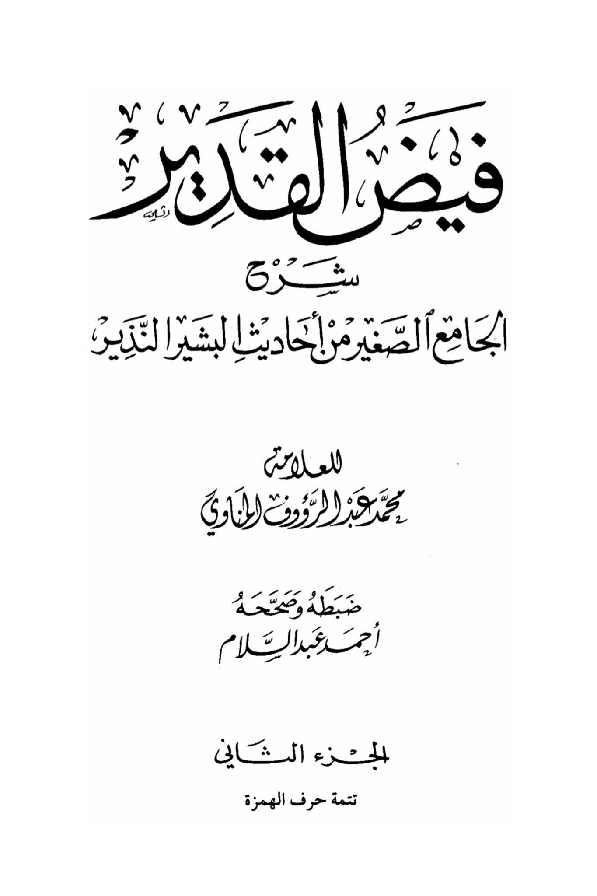
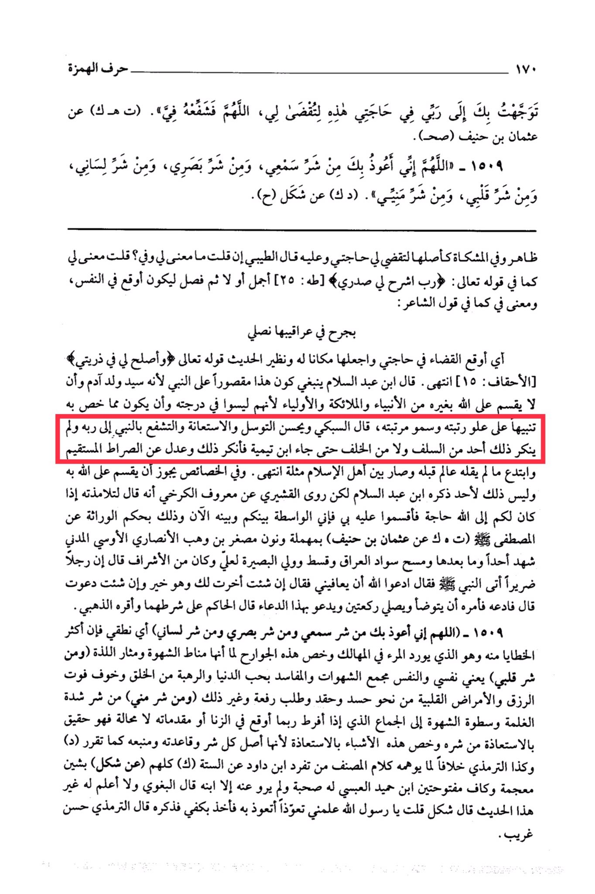

# al-Munāwī (d. 1031)

As-Sabki said: <mark style="color:red;">**It is good to seek intercession and assistance through the Prophet to reach Allah, and none of the predecessors or successors objected to this until Ibn Taymiyyah rejected it and deviated from the straight path**</mark>, <mark style="color:red;">**introducing something that no scholar before him had said, causing a division among the people of Islam**</mark>. End. In specific characteristics, it is permissible to seek intercession through him to Allah, as Ibn Abdul-Salam mentioned, but Al-Qushayri narrated from Ma'ruf al-Karkhi that he said to his students: <mark style="color:red;">**"If you have a need to Allah, then swear by me, for I am the intermediary between you and Him now."**</mark> This is based on the inheritance from the Chosen One (T.K narrated by Uthman ibn Haneef) with a missing letter "n" and a small "b" by Wahb al-Ansari al-Ousi al-Madani, who witnessed Uhud and beyond, and spread Islam in Iraq, and was appointed as the guardian and the one with insight for Ali, and he was from the nobility. He said: A blind man came to the Prophet (peace be upon him) and said: "Pray to Allah to cure me." The Prophet said: "If you wish, I will delay it for you, and it is better, or if you wish, I will pray for you." The man said: "Then pray for me." So the Prophet ordered him to perform ablution, pray two units of prayer, and make this supplication. Al-Hakim authenticated it according to their conditions, and Adh-Dhahabi agreed. "O Allah, I seek refuge in You from the evil of my hearing, the evil of my sight, and the evil of my speech," meaning my utterance, as most sins come from it, and it leads a person to destruction. These limbs are singled out because they are the sources of desire and pleasure. "And from the evil of my heart," meaning my soul, which is the gathering place of desires and corruptions due to the love of the world, fear of creation, fear of losing sustenance, and heart diseases like envy, hatred, and seeking superiority, and others. "And from the evil of my semen," from the evil of intense desire and the dominance of lust leading to fornication or its precursors inevitably, so it is right to seek refuge from its evil. These limbs are singled out for seeking refuge because they are the root of all evil and its foundation, as confirmed by (D) and also At-Tirmidhi, contrary to what the author's words may suggest about Ibn Dawood's uniqueness among the six narrators (K) all of them (from Shakal) with a "sh" and a "k" with a fatha. Ibn Humaid al-Abasi had the company of the Prophet and only his son narrated from him. Al-Baghawi said: I do not know any other hadith from him. Shakal said: O Messenger of Allah, teach me a supplication to seek refuge. He took my hand and mentioned it. At-Tirmidhi classified it as Hasan Gharib.

"<mark style="color:purple;">**The Overflow of the Mighty - The Joy of the Small Mosque: Selected Hadiths of the Bearer of Glad Tidings and Warner by the scholar Muhammad Abdul Raouf Al-Minawi, edited and authenticated by Ahmed Abdul Salam**</mark>"

<figure><figcaption></figcaption></figure> <figure><figcaption></figcaption></figure>

