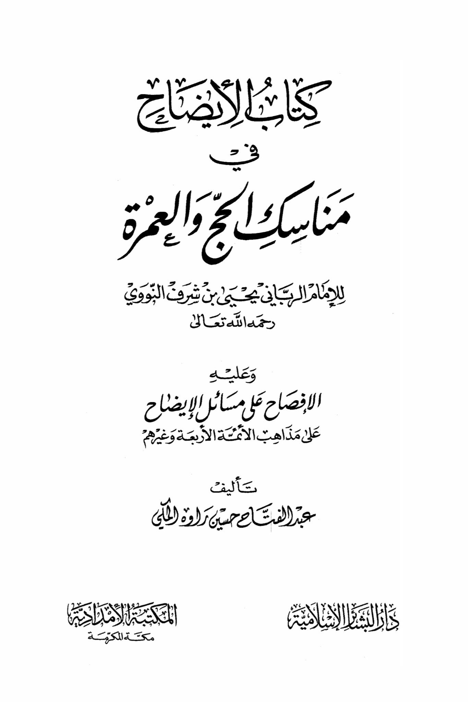
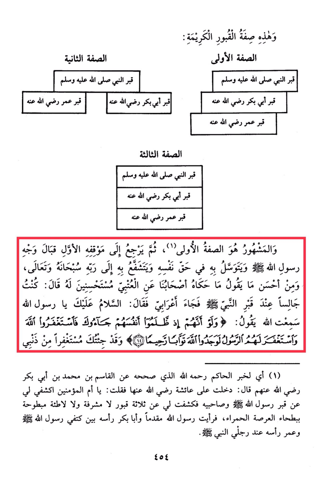
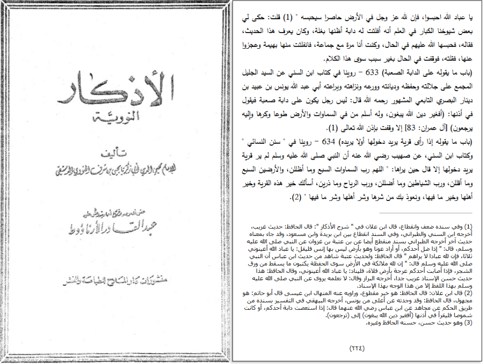

# al-Nawawī (d. 676)

<mark style="color:red;">**Then, one should return to his initial position facing the face of the Messenger of Allah**</mark> (peace be upon him) <mark style="color:red;">**and seek his intercession and mediation with his Lord, the Most High**</mark>. One of the best things to say is what our companions narrated from Al-Utbi, who said: "I was sitting by the Prophet's grave when a Bedouin came and said, 'Peace be upon you, O Messenger of Allah. I heard Allah say: 'And if they had come to you, when they wronged themselves, and asked forgiveness of Allah, and the Messenger also asked forgiveness for them, they would have found Allah Accepting of repentance and Merciful.' So I have come to you seeking forgiveness for my sins." This is in reference to the narration of Al-Hakim, may Allah have mercy on him, who authenticated it from Al-Qasim ibn Muhammad ibn Abu Bakr, may Allah be pleased with him, who said: "I entered upon Aisha, may Allah be pleased with her, and said, 'O Mother of the Believers, show me the graves of the Messenger of Allah and his two companions.' She showed me three graves that were not elevated or depressed, but were level with the red gravel of Al-Ar·ah. I saw the Messenger of Allah in front, with Abu Bakr's head between his shoulders, and Umar's head by the Prophet's feet."

"<mark style="color:purple;">**The book "Al-Ansah" on the rituals of Hajj and Umrah by the spiritual leader Imam Yahya bin Sharaf al-Nawawi**</mark>"

<figure><figcaption></figcaption></figure> <figure><figcaption></figcaption></figure>

"<mark style="background-color:red;">**O servants of Allah, hold back, for Allah, the Almighty and Majestic, has a restraining force on the earth that will hold it back**</mark>." I was told by some of our senior scholars that a beast of his, which I believe was a mule, ran away, and he knew this hadith, so he said it, and Allah immediately restrained it for them. <mark style="color:red;">**I was once with a group, and an animal escaped from them, and they were unable to catch it, so I recited this, and it immediately stopped without any reason other than this statement.**</mark>

<figure><figcaption></figcaption></figure>
