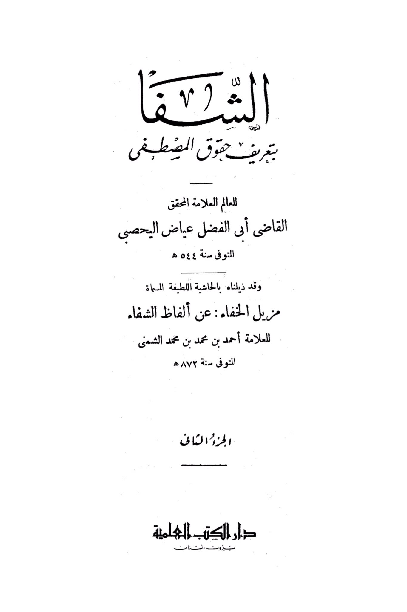
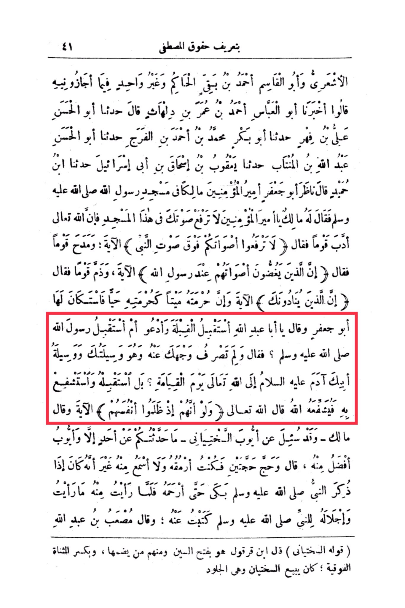

# al-Qāḍī ʿIyāḍ (d. 544)

The definition of the rights of Al-Mustafa 41 Al-Ash'ari and Abu Al-Qasim Ahmad ibn Baq Al-Hakim and others in it, they said: Abu Al-Abbas Ahmad ibn Umar ibn Dilhath informed us, he said: Abu Al-Hasan Ali ibn Fuhar informed us, he said: Abu Bakr Muhammad ibn Ahmad ibn Al-Faraj informed us, he said: Abu Al-Hasan Abdullah ibn Al-Muntab informed us, he said: Ya'qub ibn Ishaq ibn Abi Israel informed us, he said: Ibn Humayd said: Abu Ja'far, the Commander of the Believers, <mark style="color:red;">**Malik, looked at him in the mosque of the Messenger of Allah, peace be upon him, and said to him, "What is wrong with you, O Commander of the Believers, do not raise your voice in this mosque, for Allah has disciplined a people.**</mark>" So he said, "Do not raise your voices above the voice of the Prophet," the verse. And he praised a group and said, "Indeed, those who lower their voices in the presence of the Messenger of Allah," the verse, and he criticized a group and said, "Indeed, those who call you," the verse, and if his sanctity is violated like his sanctity when alive, Abu Ja'far apologized to her and said, "O Abu Abdullah, should I face the Qibla and supplicate, or should I face the Messenger of Allah, peace be upon him?" So he said, "Why do you turn your face away from him when he is your means and intercessor to your father Adam, peace be upon him, on the Day of Resurrection?" <mark style="color:red;">**Rather, face him and intercede with him, and Allah will intercede for him.**</mark> Allah, the Almighty, said, "And if, when they wronged themselves," the verse, and he said, "What is wrong with you, and he was asked about Ayyub's betrayal, I have not spoken to you about anyone except that Ayyub is better than him." He said, "And I performed Hajj twice, and I used to stare at him and not hear from him except that when the Prophet was mentioned, he would cry until he was merciful to him. When I saw from him what I saw and his reverence for the Prophet, peace be upon him, I wrote about him." And Mus'ab ibn Abdullah said, "His name is Al-Sakhtiyani," Ibn Qarqul said with a fathah on the sin, and some of them pronounce it with a dammah, and with a kasrah on the upper alif; he used to sell Sakhtiyans, which are hides.

"<mark style="color:purple;">**The book "Al-Shifa" by the eminent scholar and researcher Judge Abu Al-Fadl 'Iyad Al-Yahsubi, who passed away in the year 544 AH, is a description of the rights of the Prophet to the world. We have appended to it the delightful commentary called "Muzil Al-Khafa" on the words of "Al-Shifa" by the scholar Ahmad bin Muhammad bin Muhammad Al-Sha'nawi, who passed away in the year 872 AH, Part Two, Dar Al-Kutub Al-Ilmiyah, Beirut, Lebanon**</mark>."

<figure><figcaption></figcaption></figure> <figure><figcaption></figcaption></figure>

