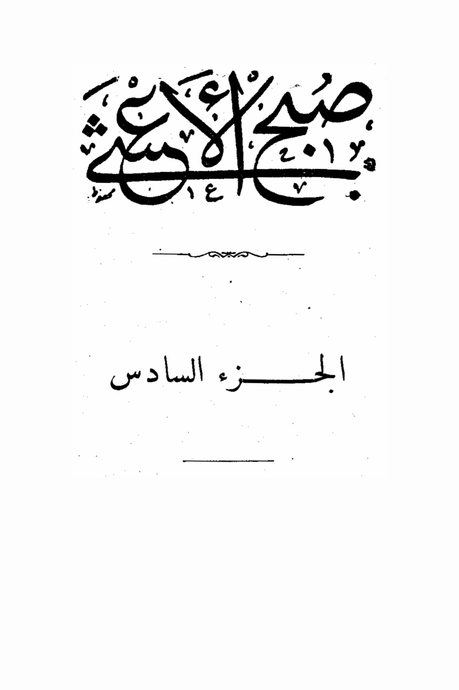
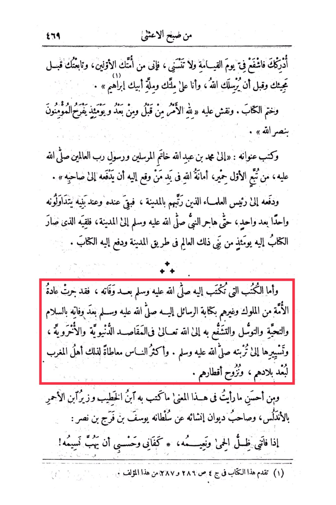

# al-Qalqashandī (d. 821)

Since the morning of the night of 469, I have recognized you, so intercede for me on the Day of Resurrection and do not forget me, for I am from your early followers, and I followed you before your coming and before Allah sent you, and I am under the dominion and the kingdom of your father Ibrahim." And the book was sealed, and it was inscribed on it, "By Allah, the matter was decreed before and after, and on that day the believers will rejoice in the victory of Allah." And its title was written: "To Muhammad son of Abdullah, the Seal of the Messengers and the Messenger of the Lord of the Worlds, may Allah's peace and blessings be upon him, from the follower of the first batch, entrusted by Allah to the one who receives it to deliver it to its owner... and deliver it to the chief of the scholars who were arranged in the city, so it remained with him and his sons passed it on to each other, until the Prophet, may Allah's peace and blessings be upon him, emigrated to the city, and he met the one to whom the book was delivered that day from the children of that scholar on the way to the city and handed over the book to him. <mark style="color:red;">**As for the letters that were written to him, may Allah's peace and blessings be upon him, after his death, it was the custom of the nation of kings and others to write letters to him, may Allah's peace and blessings be upon him, after his death, with greetings, salutations, and seeking intercession with Allah the Almighty in worldly and otherworldly matters, and sending them to his grave.**</mark> Most people who do this are the people of Morocco due to the distance of their lands and the migration of their regions. Among the best things I have seen in this regard is what was written by the son of the Khateeb, the minister of Ibn al-Ahmar in Andalusia, and the author of the collection about his sultan Yusuf bin Faraj bin Nasr: "If I miss the shade of the fever and its bliss, it is enough for me to feel the breeze of it!" (\*This book is mentioned in Volume 4, pages 286 and 287 of this author.)

<figure><figcaption></figcaption></figure> <figure><figcaption></figcaption></figure>

