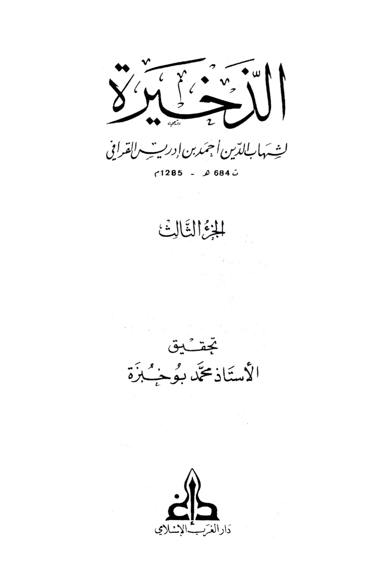
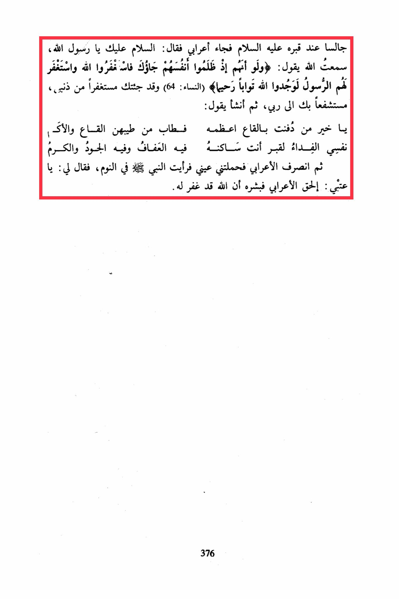

# al-Qarāfī (d. 684)

Sitting by his grave, peace be upon him, an Arab man came and said: "Peace be upon you, O Messenger of Allah. I heard Allah say: 'And if, when they wronged themselves, they had come to you, \[O Muhammad], and asked forgiveness of Allah, and the Messenger had asked forgiveness for them, they would have found Allah Accepting of repentance and Merciful.' (Quran, An-Nisa: 64) I have come to you seeking forgiveness for my sins, seeking your intercession with my Lord." Then he began to say: "Buried in the depths, the greatest of them all, O best of those whose fragrance is sweeter than the fragrance of the depths and the valleys. My soul is the ransom for the grave where you reside, in it is chastity, generosity, and nobility." Then the Arab man left, and my eyes carried me to see the Prophet (peace be upon him) in a dream. He said to me: "O 'Atbi, catch up with the Arab man and give him the good news that Allah has forgiven him."

"<mark style="color:purple;">**The latest work of Shahab al-Din Ahmad ibn Idris al-Qarafi, died in 684 AH - 1285 AD, the third volume edited by Professor Mohamed Boukhebza, Dar al-Gharb al-Islami.**</mark>"

<figure><figcaption></figcaption></figure> <figure><figcaption></figcaption></figure>

