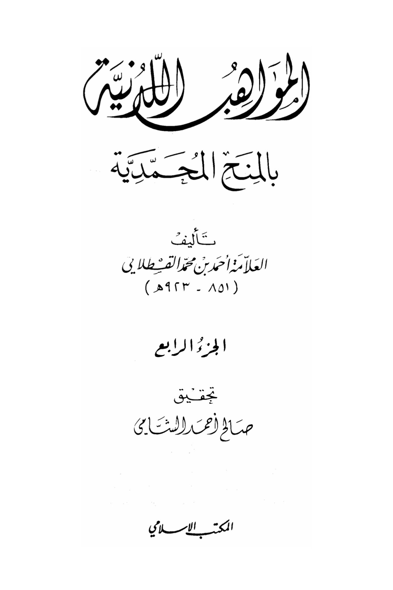
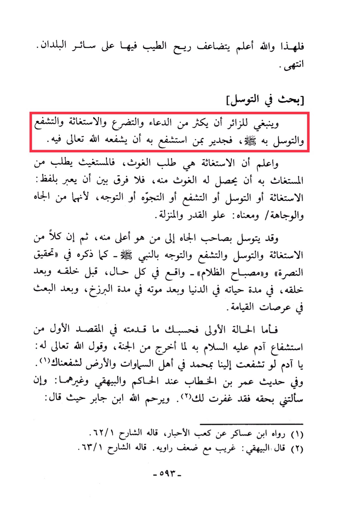

# al-Qasṭallānī (d. 923)

Therefore, and Allah knows best, the fragrance of goodness in it multiplies over all other countries. End of discussion. \[A study on seeking intercession]. <mark style="color:red;">**It is fitting for the visitor to increase in supplication, imploring, seeking help, interceding, and seeking intercession through it, for it is worthy that the one who intercedes for him, Allah Almighty will intercede for him.**</mark> And know that seeking help is seeking assistance, so the one seeking help asks the one sought for help to grant him assistance, so <mark style="color:red;">**there is no difference between seeking help, seeking intercession, interceding, imploring, or directing oneself, because they all involve prestige and importance, meaning high status and rank**</mark>. *<mark style="color:red;">**One may seek intercession from someone of prestige to someone higher than him, then both seeking help and seeking intercession and interceding and directing oneself through the Prophet**</mark>* · - as mentioned in "Achieving Victory" and "The Lamp of Darkness" - are realities in all situations, before his creation and after his creation, during his life in this world and after his death in the period of the intermediary realm, and after resurrection in the stages of the Day of Judgment. As for the first scenario, consider what was presented in the first purpose of intercession by Adam, peace be upon him, when he was expelled from Paradise, and Allah Almighty said to him: "O Adam, if you were to intercede with Us through Muhammad for the inhabitants of the heavens and the earth, We would have granted you intercession." And in the hadith of Umar ibn al-Khattab reported by al-Hakim, al-Bayhaqi, and others: "If you ask me by his right, I have forgiven you." May Allah have mercy on Ibn Jabir where he said: (1) Narrated by Ibn Asakir from Ka'b al-Ahbar, as explained by the commentator 62/1. (2) Al-Bayhaqi said: Strange with a weak narrator. As explained by the commentator 63/1. - 593 -

"<mark style="color:purple;">**The Ladinian Talents in the Muhammadan Grants, authored by the scholar Ahmad ibn Muhammad al-Qastallani (095-101), Part Four, edited by Saleh Ahmed al-Shaabi, Islamic Office.**</mark>"

<figure><figcaption></figcaption></figure> <figure><figcaption></figcaption></figure>

