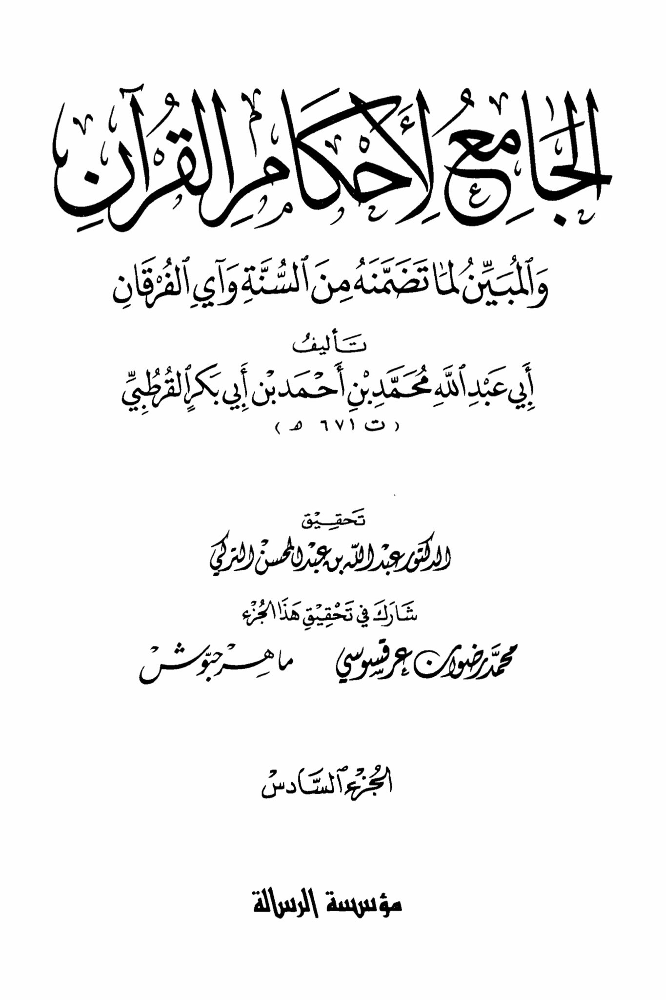
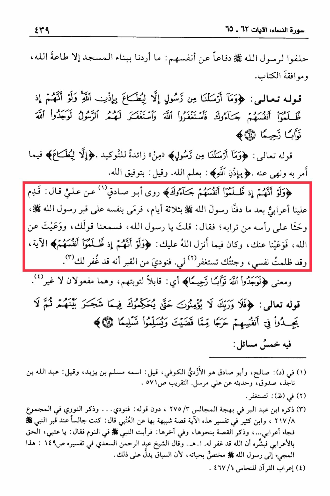

# al-Qurṭubī (d. 671)

&#x20;They swore by Allah's Messenger (peace be upon him) in defense of themselves: We did not intend by building the mosque except obedience to Allah and compliance with the Book. Allah, the Exalted, says: "And We did not send any messenger except to be obeyed by permission of Allah. And if, when they wronged themselves, they had come to you, \[O Muhammad], and asked forgiveness of Allah, and the Messenger had asked forgiveness for them, they would have found Allah Accepting of repentance and Merciful." The command in the saying of Allah, the Exalted: "And We did not send any messenger except to be obeyed in what he commands and what he forbids by permission of Allah." By the knowledge of Allah. And it is said: by the guidance of Allah. "And if, when they wronged themselves, they had come to you," Abu Sadiq narrated from Ali who said: An Arab came to us three days after we buried the Messenger of Allah, and he threw himself on the grave of the Messenger of Allah, and wept over it, saying: <mark style="color:red;">**O Messenger of Allah, we heard your words and obeyed you, and you fulfilled your duty to Allah, so we fulfilled our duty to you**</mark>. And what was revealed to you by Allah was: "And if, when they wronged themselves," and I have wronged myself, and I have come to you seeking forgiveness. So a voice from the grave was heard saying that forgiveness had been granted to you. The meaning of "they would have found Allah Accepting of repentance and Merciful" is that they were capable of repenting, and they are both objects. The saying of Allah, the Exalted: "But no, by your Lord, they will not \[truly] believe until they make you, \[O Muhammad], judge concerning that over which they dispute among themselves and then find within themselves no discomfort from what you have judged and submit in \[full, willing] submission." In it are five issues: (1) In (d): Salih, and Abu Sadiq is Al-Azdi Al-Kufi, it is said: his name is Muslim ibn Yazid, and it is said: Abdullah ibn Najdah, truthful, and his hadith from Ali is Mursal. At-Taqrib p. 571 (2) In (dh): to seek forgiveness. (3) Mentioned by Ibn Abd al-Barr in al-Bahjah al-Majalis 2753, without his saying: So a voice was heard... and An-Nawawi mentioned in al-Majmu' 217/8, and Ibn Kathir in the explanation of this verse a similar story about Al-Utbi said: I was sitting by the Prophet's grave when an Arab came... and he mentioned the story in a similar way, and at the end, I saw the Prophet in a dream saying: O Utbi, tell the Arab good news that Allah has forgiven him... End. And Sheikh Abdul Rahman Al-Saadi said in his interpretation p. 149: This coming to the Messenger of Allah is specific to his lifetime, because the context indicates that. (4) The grammar of the Quran by An-Nahhas 467/1.

"<mark style="color:purple;">**The comprehensive collection of the judgments of the Quran and the elucidation of what it contains from the Sunnah and which criteria it follows, authored by Abu Abdullah Muhammad ibn Ahmad ibn Abi Bakr al-Qurtubi, died 671 AH**</mark>"

<figure><figcaption></figcaption></figure> <figure><figcaption></figcaption></figure>

