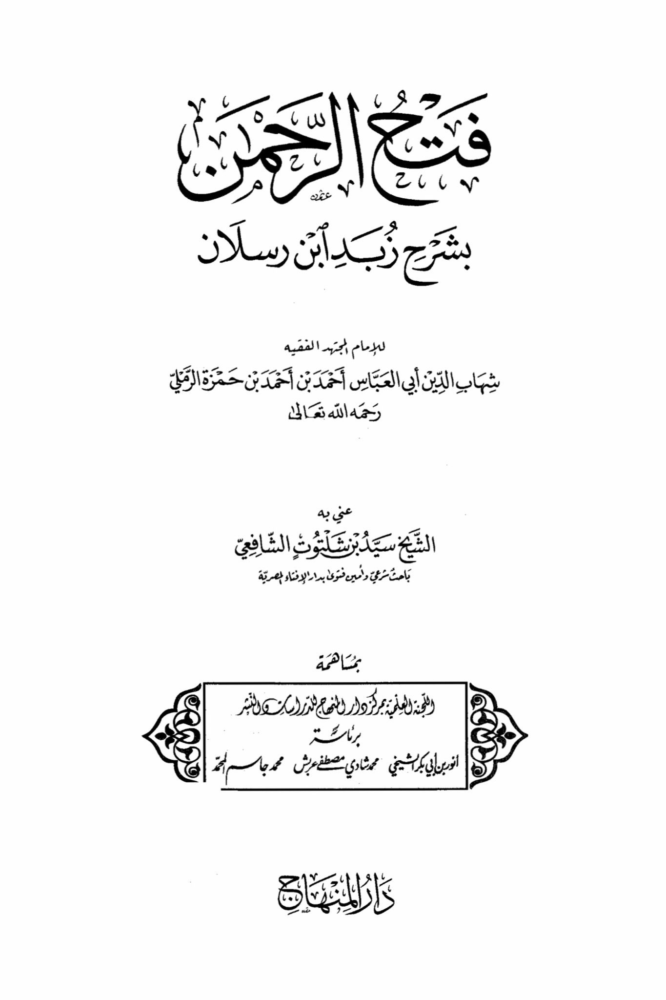
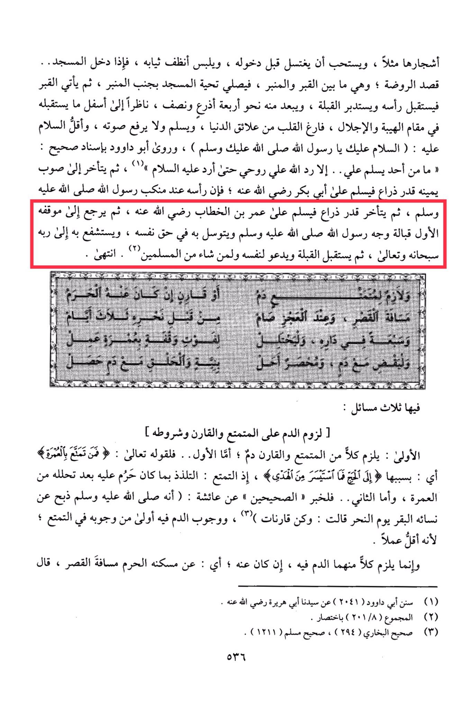

# al-Ramlī al-Kabīr (d. 957)

One should offer the greeting of the mosque next to the pulpit, then approach the grave, facing its head and turning towards the qibla, standing about four and a half arms' length away, looking down in a manner that reflects reverence and awe, with a heart empty of worldly distractions. <mark style="color:red;">**One should offer greetings without raising their voice, with the minimum greeting being: "Peace be upon you, O Messenger of Allah, may Allah's peace and blessings be upon you.**</mark>" Abu Dawood narrated with an authentic chain of transmission: "Whenever anyone greets me, Allah returns my soul to me so that I may return the greeting to them." <mark style="color:red;">**Then one should move to their right by about an arm's length to offer greetings to Abu Bakr, may Allah be pleased with him, with his head at the shoulder of the Messenger of Allah. Then move back by an arm's length to offer greetings to Umar ibn al-Khattab, may Allah be pleased with him**</mark>. Finally, return to the original position <mark style="color:red;">**facing the face of the Messenger of Allah and supplicate through him for one's own sake, interceding with Allah, the Most High, and then turn towards the qibla,**</mark> making supplications for oneself and for whoever among the Muslims one wishes. This concludes the procedure.

"<mark style="color:purple;">**The opening of Al-Hamman with the explanation of Zobad by Ibn Ruslan for the diligent scholar and jurist Shihab al-Din Abu al-Abbas Ahmad ibn Ahmad ibn Hamza al-Ramli**</mark>"

<figure><figcaption></figcaption></figure> <figure><figcaption></figcaption></figure>

