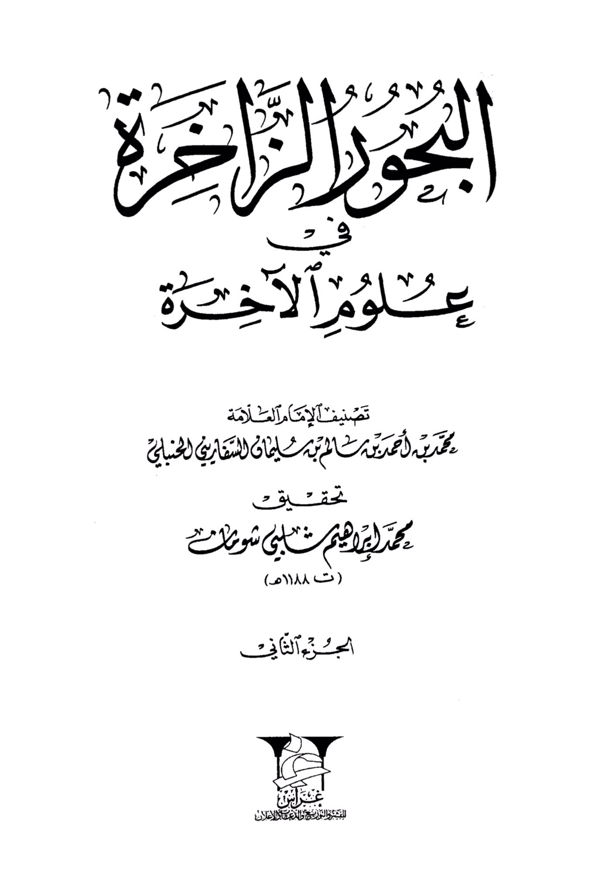
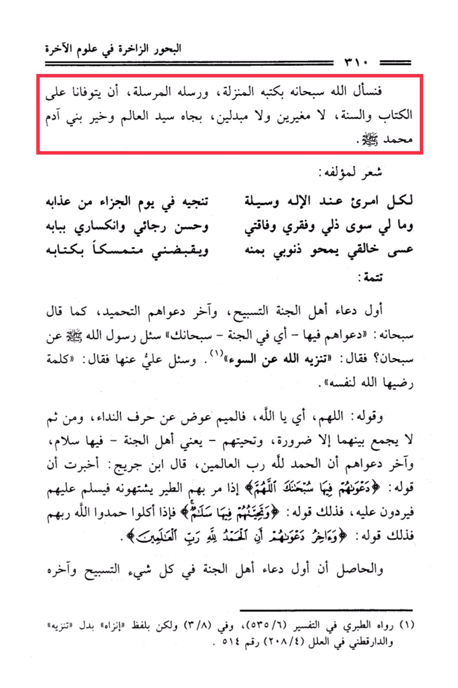

# al-Saffārīnī (d. 1188)

The vast oceans in the sciences of the Hereafter, so we ask Allah, glorified be He, by His revealed books and His sent messengers, to grant us success in adhering to the Book and the Sunnah, without changing or substituting, by the status of the Master of the Universe and the best of mankind, Muhammad. A poem by its author: "For every person, with God, there is a means to save him on the Day of Judgment from his punishment, and I have nothing but my humility, poverty, shortcomings, and good hopes in my submission. Perhaps my Creator will erase my sins with His grace and take me while holding onto His book." Continuation: The first supplication of the people of Paradise is glorification, and their last supplication is praise, as He, glorified be He, said: "Their call therein will be, 'Exalted are You, O Allah.'" The Messenger of Allah · was asked about "Subhan," and he said: "It is Allah's purity from evil." Ali was asked about it and he said: "A word that Allah is pleased with for Himself." And His saying: "O Allah" - the "Meem" is a replacement for the vocative particle, and then they are combined except for necessity, and their greeting - meaning the people of Paradise - therein is peace, and their last supplication is that all praise is due to Allah, the Lord of the worlds. Ibn Jurayj said: I was informed that when the birds pass by them, they desire them, so they greet them and they respond, and that is what His saying means: "And their greeting therein will be, 'Peace.' And the last of their call will be, 'Praise to Allah, the Lord of the worlds.'" Their Lord. The conclusion is that the first supplication of the people of Paradise in all matters is glorification, and its end. Narrated by al-Tabari in his Tafsir (6/535), and in (3/8) but with the wording "Inzah" instead of "Tanzih," and al-Darqutni in al-·Ilal (4/208) number 514.

"<mark style="color:purple;">**The rich seas of the sciences of the Hereafter, classified by the Imam, the knowledgeable scholar, Muhammad bin Ahmed bin Salim bin Al-Yamani Al-Safarini Al-Hanbati, verified by Muhammad Ibrahim Al-Bay Sumat (died 1188 AH)**</mark>"

<figure><figcaption></figcaption></figure> <figure><figcaption></figcaption></figure>

