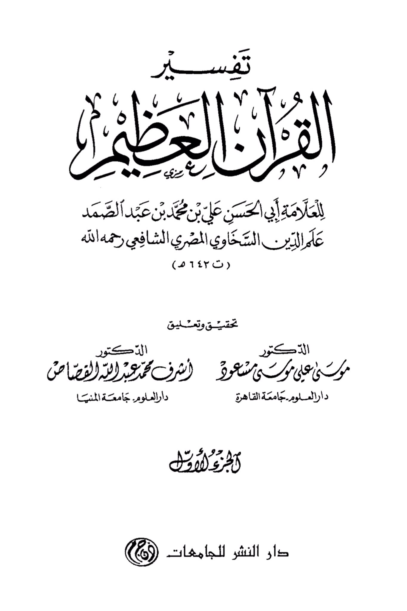
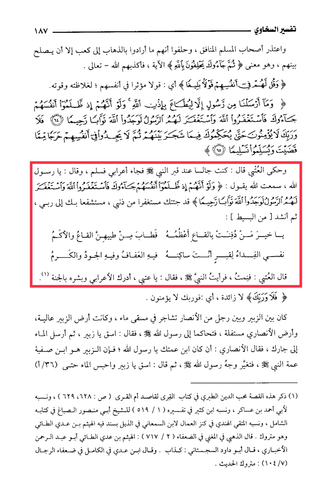

# al-Sakhāwī, ʿAlam al-Dīn (d. 642)

The interpretation of Al-Sakhawi 187, the companions of the hypocrite Muslim apologized, and swore that they did not intend to go to Ka'b except to reconcile between them, which is the meaning of "Then they came to you swearing by Allah" \[Quran verse]. So Allah - the Most High - exposed their lies. And say to them a powerful saying in themselves; a saying that affects them due to its harshness and strength. "And We sent not a messenger except to be obeyed by the permission of Allah. And if, when they wronged themselves, they had come to you, \[O Muhammad], and asked forgiveness of Allah, and the Messenger had asked forgiveness for them, they would have found Allah Accepting of repentance and Merciful." \[Quran verse]. "But no, by your Lord, they will not \[truly] believe until they make you, \[O Muhammad], judge concerning that over which they dispute among themselves and then find within themselves no discomfort from what you have judged and submit in \[full, willing] submission." \[Quran verse]. Al-'Atbi narrated: I was sitting by the Prophet's grave when a Bedouin came and greeted, saying, "O Messenger of Allah, I heard Allah say: 'And if, when they wronged themselves, they had come to you, \[O Muhammad], and asked forgiveness of Allah, and the Messenger had asked forgiveness for them, they would have found Allah Accepting of repentance and Merciful.' I have come to you seeking forgiveness for my sins, seeking your intercession with my Lord." Then he recited: "O best of those buried in the depths, the most honored of them, The depths and the hills are sweetened by his fragrance, The ransom for the grave where you reside, in it is chastity, generosity, and nobility." Al-'Atbi said: I died, and I saw the Prophet, peace be upon him, who said to me, "O 'Atbi, inform the Bedouin and give him glad tidings of Paradise." "But no, by your Lord, they will not \[truly] believe." \[Quran verse]. There was a dispute between Zubair and a man from the Ansar at a water source. Zubair's land was higher, and the Ansari's land was lower. They presented their case to the Messenger of Allah, who said, "Give water, O Zubair, and then send the water to your neighbor." The Ansari said, "If he is your cousin, O Messenger of Allah." Zubair was the son of Safiyya, the Prophet's paternal aunt. The Messenger of Allah's face changed, and he said, "Give water, O Zubair, and hold the water until..." This story was mentioned by Muhibb al-Din al-Tabari in his book "Al-Qurra" for Qasid Umm al-Qurra, and he attributed it to Abu Ahmad ibn 'Asakir. Ibn Kathir also mentioned it in his tafsir. Al-Sibagh attributed it to al-Hindi in "Kanz al-'Amal" to Ibn al-Sam'ani in the appendix with a chain that includes al-Haytham ibn 'Adi al-Tayyi, who is considered unreliable. Al-Dhahabi mentioned in "Al-Mughni" in the weak narrators: "Al-Haytham ibn 'Adi al-Tayyi, Abu 'Abd al-Rahman al-Akhbari, Abu Dawud al-Sajistani: a liar." Ibn 'Adi mentioned in "Al-Kamil" in the weak narrators of men: "The hadith is considered unreliable."

"<mark style="color:purple;">**The interpretation of the Great Quran by the scholar Abu al-Hasan Ali ibn Muhammad ibn Abd al-Samad, Al-Alamah Al-Din Al-Sakhawi,**</mark>"

<figure><figcaption></figcaption></figure> <figure><figcaption></figcaption></figure>

