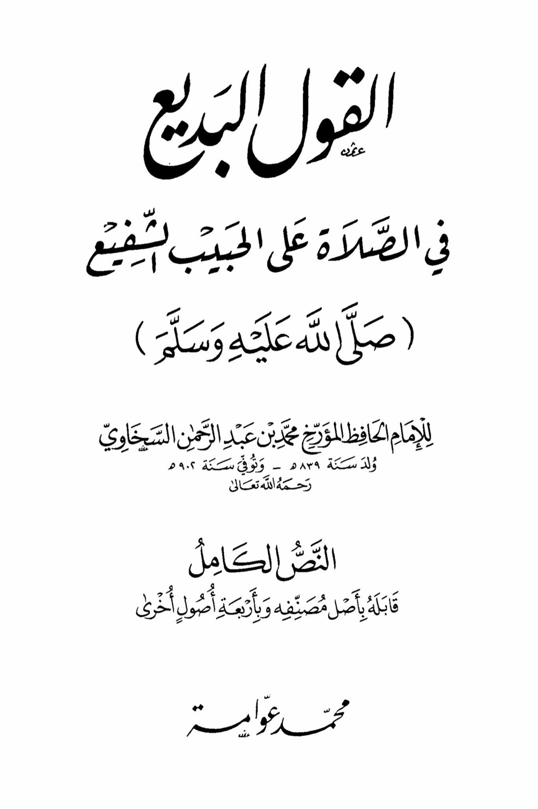
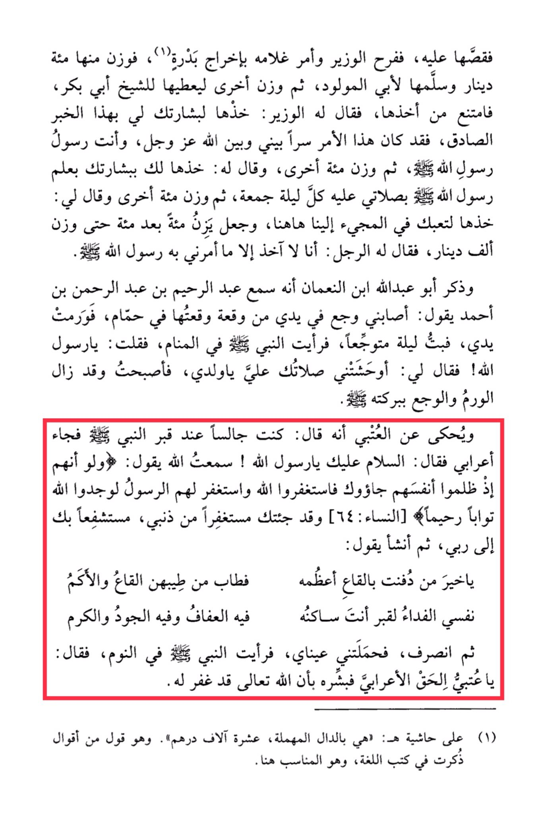

# al-Sakhāwī, Shams al-Dīn (d. 902)

He told him the story, and the minister was delighted and ordered his servant to bring a seed. He weighed out a hundred dinars from it and handed it to the father of the newborn, then weighed another to give to Sheikh Abu Bakr, who refused to take it. The minister said to him, "Take it as a sign for you with this true news, for this matter was a secret between me and Allah Almighty, and you are the messenger of the Messenger of Allah ·." Then he weighed another hundred and said to him, "Take it as a sign for you with the knowledge of the Messenger of Allah · of my prayers for him every Friday night." Then he weighed another hundred and said to me, "Take it for your effort in coming to us here," and he continued weighing a hundred after a hundred until he weighed a thousand dinars. The man said to him, "I will only take what the Messenger of Allah · has commanded me." Abu Abdullah ibn al-Nu'man mentioned that he heard Abdul Rahim ibn Abdul Rahman ibn Ahmad saying, "I had a pain in my hand from an injury I got in a bath, and my hand swelled. I spent a painful night, and I saw the Prophet · in a dream. I said, 'O Messenger of Allah!' He said to me, 'Your prayers for me have pleased me, my son,' and I woke up and the swelling and pain had disappeared by his blessing." It is narrated about Al-'Atbi that he said, "I was sitting by the Prophet's grave · when a Bedouin came and said, 'Peace be upon you, O Messenger of Allah! I heard Allah saying: 'And if, when they wronged themselves, they had come to you, \[O Muhammad], and asked forgiveness of Allah, and the Messenger had asked forgiveness for them, they would have found Allah Accepting of repentance and Merciful' \[Quran 4:64]. I have come to you seeking forgiveness for my sins, seeking your intercession with my Lord.' Then he began to say, 'O best of those buried in the valleys, the most noble of them, the fragrance of the valleys and the mountains, the ransom for the grave where you reside in it is chastity, generosity, and kindness. My soul, then he left. My eyes carried me and I saw the Prophet · in my sleep, saying, 'O 'Atbi, the truthful Bedouin, give him the good news that Allah has forgiven him.' (1) On the margin: It is with the omitted "dal," ten thousand dirhams." This is a saying among the sayings mentioned in language books, and it is appropriate here.

"<mark style="color:red;">**The exquisite expression in sending blessings upon the beloved intercessor**</mark>**&#x20;**<mark style="color:purple;">**(may Allah bless him and grant him peace) by the Imam, the Hafiz, the historian Muhammad ibn Abd al-Rahman al-Sakhawi, born in the year 839 AH,**</mark>"

<figure><figcaption></figcaption></figure> <figure><figcaption></figcaption></figure>

