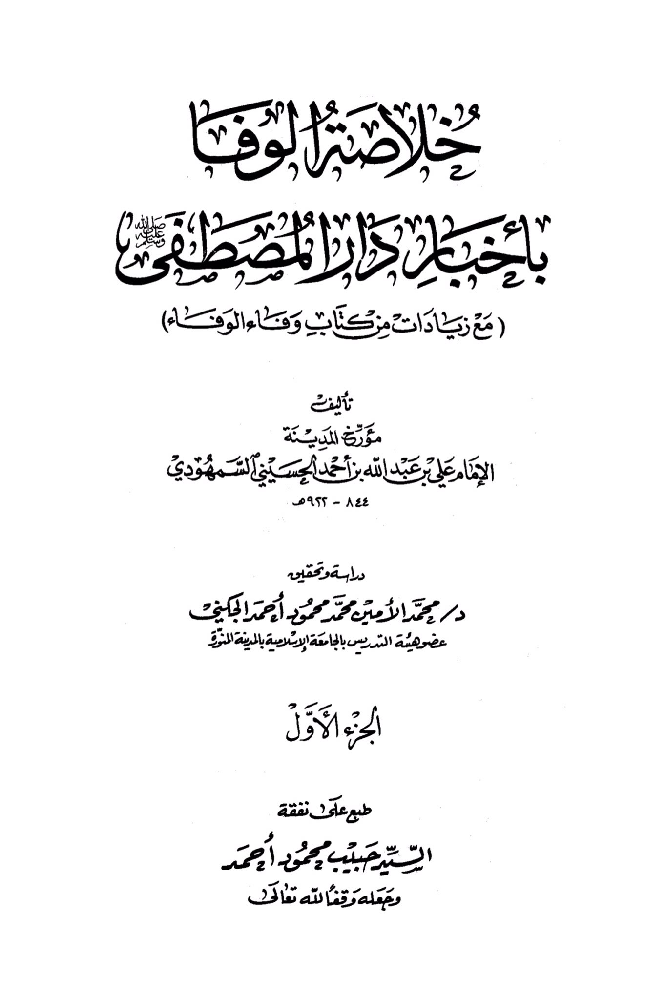
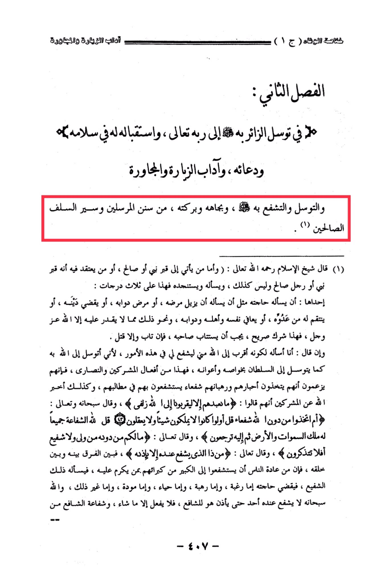

# al-Samhūdī (d. 922)

&#x20;The importance of the visitor seeking through it to his Lord, receiving him in peace and supplicating for him, and the etiquette of visiting, socializing, <mark style="color:red;">**seeking intercession through him,**</mark> and seeking blessings through him, from the traditions of the messengers and the ways of the righteous predecessors. Shaykh al-Islam, may Allah have mercy on him, said: <mark style="color:yellow;">**"As for one who comes to the grave of a prophet or a righteous person, or one who believes that it is the grave of a prophet or a righteous man when it is not, and asks him and seeks his help, this falls into three categories:**</mark> One of them is asking him for his needs, such as asking him to cure his illness, or the illness of his animals, or to settle his debts, or to avenge him from his enemy, or to protect himself, his family, and his animals, and similar matters that only Allah can do. <mark style="color:yellow;">**This is clear shirk, and its perpetrator must be called to repentance. If he repents, that is good; if not, he should be killed. He may claim that he is asking him because he is closer to Allah than him, so that he may intercede for him in these matters, as he seeks to Allah through him as one seeks to a king through his special envoys and aides. This is the practice of the polytheists and the Christians, as they claim that their monks and priests are intercessors who intercede for them in their requests.**</mark> Allah has refuted the polytheists by saying that they worship them only to bring them closer to Allah. And Allah, exalted be He, says: Do they take for intercessors besides Allah? Say: Even if they have no power nor understanding. Say: To Allah belongs all intercession. His is the sovereignty of the heavens and the earth, then to Him you shall be brought back. And Allah says: You have no protector or intercessor besides Him. Will you not then remember? And Allah says: Who is it that can intercede with Him except by His permission? <mark style="color:red;">**So, the difference between this and the common practice of people seeking intercession from their dignitaries through someone who has favor with them, asking that intercessor, who then fulfills their needs out of desire, fear, respect, love, or other reasons, is that Allah has no one who can intercede without His permission. He is the one who grants permission to the intercessor, who can only act as He wills. The intercession of the intercessor is from His creation**</mark>."

"<mark style="color:purple;">**The essence of loyalty is in loving the chosen abode (with additional notes of loyalty) by the historian of the city, Imam Ali ibn Ahmad al-Husayni al-Samhudi 844-922 AH**</mark>"

<figure><figcaption></figcaption></figure> <figure><figcaption></figcaption></figure>

