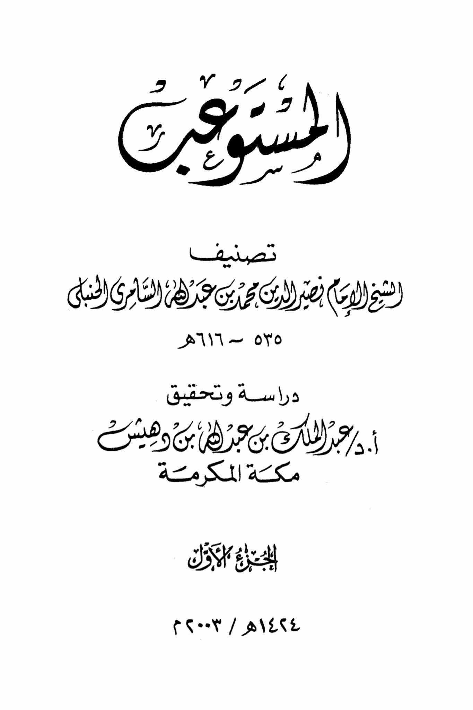
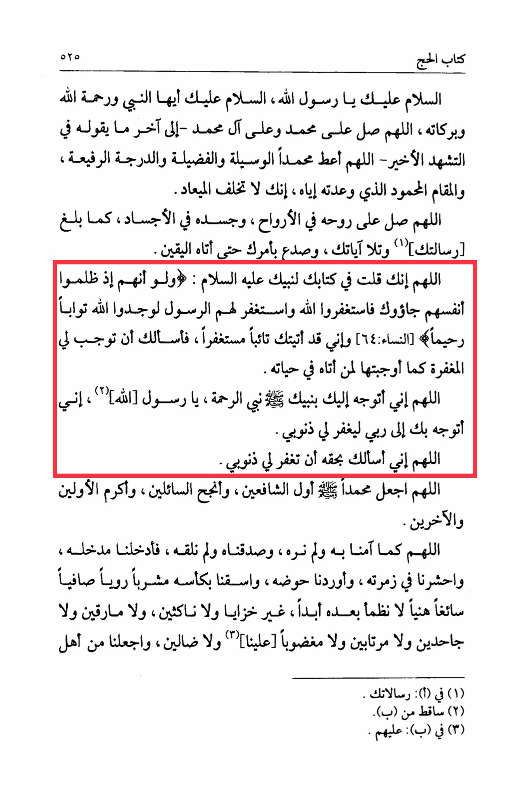

# al-Sāmirī (d. 616)

al-Sāmirī (d. 616), another Ḥanbalī Faqīh, tells us to say “O Allāh, I turn to You through Your Prophet, the Prophet of Mercy. O Messenger, I turn to my Lord through you, seeking His forgiveness for my sins. O Allāh, I ask You by his right, to forgive me.”

Book of Hajj 525: Peace be upon you, O Messenger of Allah, peace be upon you, O Prophet, and the mercy and blessings of Allah. O Allah, send blessings upon Muhammad and the family of Muhammad - until the end of what is said in the final Tashahhud - O Allah, grant Muhammad the means, the virtue, and the high rank, and the praised station that You have promised him. You do not fail in Your promise. O Allah, send blessings upon his soul among the souls, and his body among the bodies, as he conveyed Your message and recited Your verses, and fulfilled Your command until certainty came to him. O Allah, You have said in Your Book to Your Prophet, peace be upon him: "And if, when they wronged themselves, they had come to you, \[O Muhammad], and asked forgiveness of Allah, and the Messenger had asked forgiveness for them, they would have found Allah Accepting of repentance and Merciful." (Quran, 4:64) And I have come to You repentant, seeking forgiveness, so I ask You to make forgiveness obligatory for me as You made it obligatory for those who came to him in his lifetime. O Allah, I turn to You through Your Prophet, the Prophet of Mercy, O Messenger of Allah, I turn to You through him to my Lord to forgive my sins. O Allah, I ask You by his right to forgive my sins. O Allah, make Muhammad the intercessor, the foremost among those who intercede, the most successful of those who ask, the most honorable of the first and the last. O Allah, as we believed in him without seeing him, and confirmed him without meeting him, so admit us through his intercession, gather us in his group, lead us to his pool, and give us to drink from his cup, a drink refreshing, pure, and delightful, never to thirst thereafter, without disgrace, nor insatiable, nor intoxicated, nor doubting, nor deserving of wrath, nor astray. Make us among the people who...

"<mark style="color:purple;">**The Achievers: The Classification of Sheikh Imam Nasir al-Din Muhammad ibn Abdaha al-Samiri al-Tanbani**</mark>"

<figure><figcaption></figcaption></figure> <figure><figcaption></figcaption></figure>

