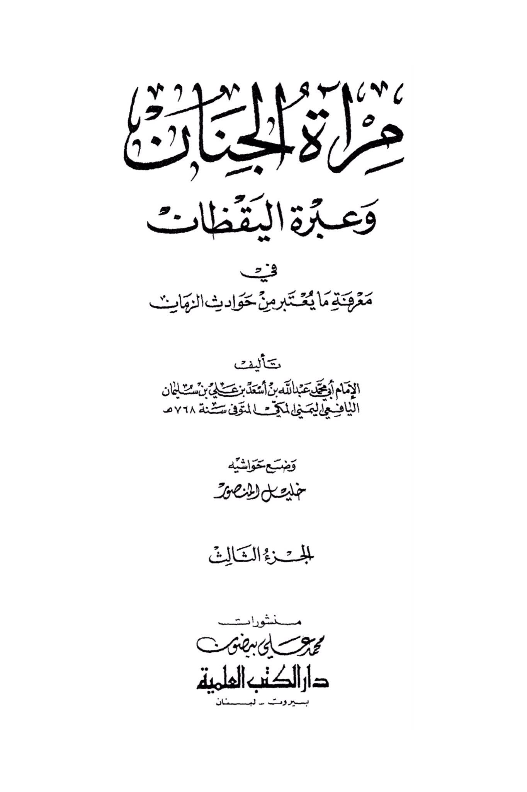
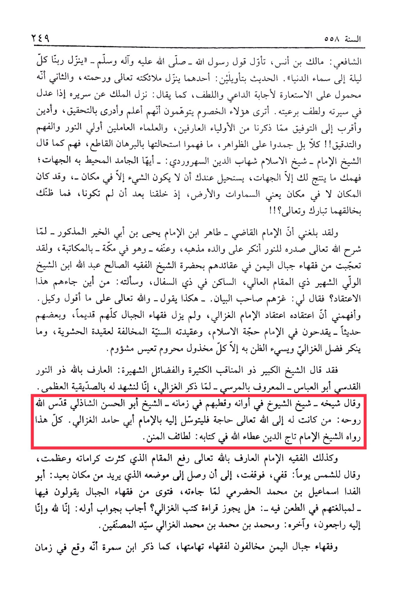

# al-Shādhilī (d. 656)

In the year 558 AH, Shafi'i: Malik ibn Anas interpreted the saying of the Messenger of Allah - peace and blessings be upon him - that our Lord descends every night to the lowest heaven. The hadith can be interpreted in two ways: one is that His angels and mercy descend, and the other is metaphorical, in response to the supplicant and with gentleness, as in the saying: "The king descends from his throne when he rectifies his conduct and is gentle with his subjects." Do these opponents think that they are more knowledgeable and discerning in investigation, more devout and closer to success than the saints who are knowledgeable and the scholars who are diligent in seeking enlightenment, understanding, and scrutiny?! No, rather they have frozen on the surface without understanding its impossibility with conclusive evidence. They are as the eminent scholar, Shaykh al-Islam Shihab al-Din al-Suhrawardi, said: "O you who are confined by directions; your understanding only produces directions for you, it is impossible for you to conceive that a thing can exist in a non-place, as the heavens and the earth were created after they did not exist. So, what do you think of their Creator, blessed and exalted be He?!" It has reached me that when the Imam al-Qadi - Tahir ibn Imam Yahya ibn Abi al-Khair, mentioned earlier - clarified his heart to the light, he rejected his father's doctrine and vehemently opposed it, even while in Mecca, through correspondence. I was astonished by the scholars of the mountains of Yemen in their beliefs in the presence of the righteous scholar Shaykh Abdullah ibn the famous Wali residing in Dhi al-Safal, and I asked him: Where did they get this belief from? He said to me: The author of the statement misled them. - This is what he says - and Allah is witness to what I say. He informed me that their belief is the belief of Imam al-Ghazali, and all the scholars of the mountains, old and some recent, criticize the Imam, the Proof of Islam, and his Sunni creed that opposes the Hashwiyya creed. Only the wretched and deprived reject al-Ghazali's virtues and hold a bad opinion of him. The great Shaykh, the one with many virtues and renowned merits, the knower of Allah, Abu al-Abbas - known as al-Marsi - when he mentioned al-Ghazali, he testified to his great veracity. And his teacher, the Shaykh of Shaykhs in his time and their pole, Shaykh Abu al-Hasan al-Shadhili, may Allah sanctify his soul, said: Whoever has a need to Allah, let him seek intercession with Imam Abu Hamid al-Ghazali. All of this was narrated by the Shaykh Imam Taj al-Din Ataullah in his book: "Lata'if al-Minan." Likewise, the jurist, the Imam, the knower of Allah, who elevated his status with numerous miracles and greatness, said to the sun one day, "Stop," and it stopped until it reached the distant place he intended: Abu al-Fida Ismail ibn Muhammad al-Hadrami, when he received a fatwa from the scholars of the mountains saying that they were exaggerating in their criticism of him - "Is it permissible to read the books of al-Ghazali?" He replied with the beginning of his answer: "To Allah we belong and to Him we shall return," and the end, "Muhammad ibn Muhammad ibn Muhammad al-Ghazali, the master of authors." The scholars of the mountains of Yemen are in opposition to the scholars of its plains, as Ibn Samara mentioned that it happened in a certain time.

"<mark style="color:purple;">**The woman of tenderness and the lesson of vigilance: Knowing what is considered from the incidents of calamities. Written by Imam Abu Muhammad Abdullah bin Asad bin Ali bin Suleiman Al-Yafei Al-Yemeni Al-Makki,**</mark>"

<figure><figcaption></figcaption></figure> <figure><figcaption></figcaption></figure>

